# Interactive Media: Evolution, Prevalence & Enterprise Applications

## 7-Hour Self-Paced Lesson Plan

!!! info "Learning Intentions"
    By the end of these lessons, you will be able to:
    
    - Investigate how interactive media and the user experience (UX) is used to communicate information to an audience
    - Research the evolution of interactive media
    - Understand the prevalence of blogs, online video and digital radio
    - Describe the contribution of interactive media systems to a range of enterprises

---

## Lesson 1: What is Interactive Media? (1.5 hours)

!!! abstract "Lesson Overview"
    This lesson introduces interactive media, explains what makes it different from traditional media, and explores the main types you use every day.

### Part A: Understanding Interactive Media (30 mins)

#### What Makes Media "Interactive"?

**Traditional Media** delivers information in one direction:

- You watch TV → can't change what happens
- You read a newspaper → can't respond directly
- You listen to radio → can't choose what plays next

**Interactive Media** creates a two-way conversation:

- You choose what to watch and when
- You can comment, like, share, create
- Content responds to your actions
- You control the experience

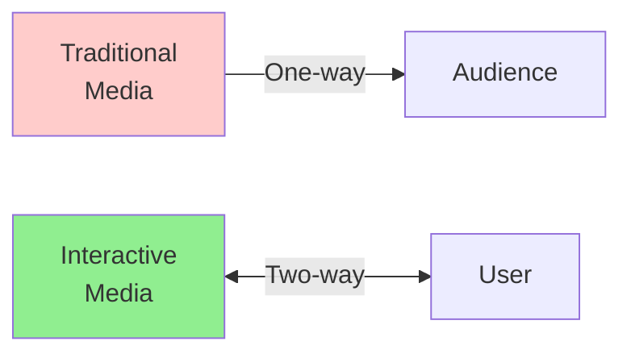

**Key Characteristics of Interactive Media:**

1. **User Control** - You decide what to see and when
2. **Immediate Response** - Actions produce instant results
3. **Non-linear** - Multiple paths through content
4. **Participation** - You can contribute, not just consume

---

#### Types of Interactive Media

**1. Blogs**

A blog (short for "weblog") is an online platform where people publish written content.

**Interactive Features:**

- **Author publishes** articles, thoughts, tutorials
- **Readers comment** and discuss
- **Sharing** across social media
- **Links** to related content
- **Multimedia** - images, videos, audio embedded

**How blogs communicate information:**

- Personal experiences and opinions
- Tutorials and how-to guides
- News and commentary
- Business updates and announcements
- Educational content

**Example:** A cooking blog publishes a recipe. You can comment with questions, the author responds, and other readers share their modifications.

---

**2. Online Video**

Video content delivered over the internet that users can control and interact with.

**Interactive Features:**

- **Playback control** - play, pause, skip, rewind, speed adjustment
- **Engagement** - like, dislike, comment
- **Subscribe** to creators for updates
- **Playlists** - organise videos
- **Sharing** with others
- **Captions/subtitles** - accessibility options

**How online video communicates information:**

- Visual demonstrations (tutorials, how-tos)
- Entertainment and storytelling
- Educational content
- News and documentaries
- Product reviews and unboxing
- Live streaming events

**Platforms:** YouTube, Vimeo, TikTok, Instagram Reels

**Example:** You watch a guitar tutorial on YouTube. You can pause to practice, replay difficult parts, read comments from other learners, and ask the creator questions.

---

**3. Digital Radio/Podcasts**

Audio content delivered digitally that users access on-demand.

**Interactive Features:**

- **On-demand listening** - choose when to listen
- **Playback control** - skip, replay, speed up
- **Playlists** - organise episodes
- **Subscribe** to shows
- **Download** for offline listening
- **Rate and review**
- **Chapter markers** - jump to sections

**How digital radio/podcasts communicate information:**

- In-depth discussions and interviews
- Educational content (language learning, history, science)
- News and current events
- Storytelling and narrative journalism
- Commentary and analysis

**Platforms:** Spotify, Apple Podcasts, Google Podcasts

**Example:** You subscribe to a history podcast. You can listen during your commute, skip episodes that don't interest you, speed up to 1.5x to save time, and download episodes for the plane.

---

**4. Social Media**

Platforms where users create, share, and interact with content and each other.

**Interactive Features:**

- **Create content** - posts, photos, videos
- **Engage** - like, comment, share
- **Follow** people and topics
- **Direct messaging**
- **Groups and communities**
- **Live streaming**
- **Stories** - temporary content

**How social media communicates information:**

- Personal updates and life events
- News sharing and discussion
- Business announcements and marketing
- Community building
- Customer service
- Real-time event coverage

**Platforms:** Instagram, Twitter/X, Facebook, LinkedIn, TikTok

**Example:** A company announces a new product on Twitter. Customers can ask questions in replies, share the announcement, and provide feedback directly.

---

**5. Streaming Services**

Platforms delivering video or audio content over the internet on-demand.

**Interactive Features:**

- **On-demand access** - watch/listen anytime
- **Recommendations** - personalized suggestions
- **Profiles** - multiple users, watch history
- **Playlists and queues**
- **Continue watching** from where you left off
- **Download** for offline
- **Ratings** - influence recommendations

**How streaming services communicate information:**

- Entertainment (movies, TV shows, music)
- Documentaries and educational content
- Live events
- Original productions

**Platforms:** Netflix, Disney+, Stan, Spotify

---

### Part B: How Interactive Media Communicates Information to Audiences (30 mins)

#### Communication Methods Unique to Interactive Media

**1. Personalisation**

Interactive media adapts to individual users.

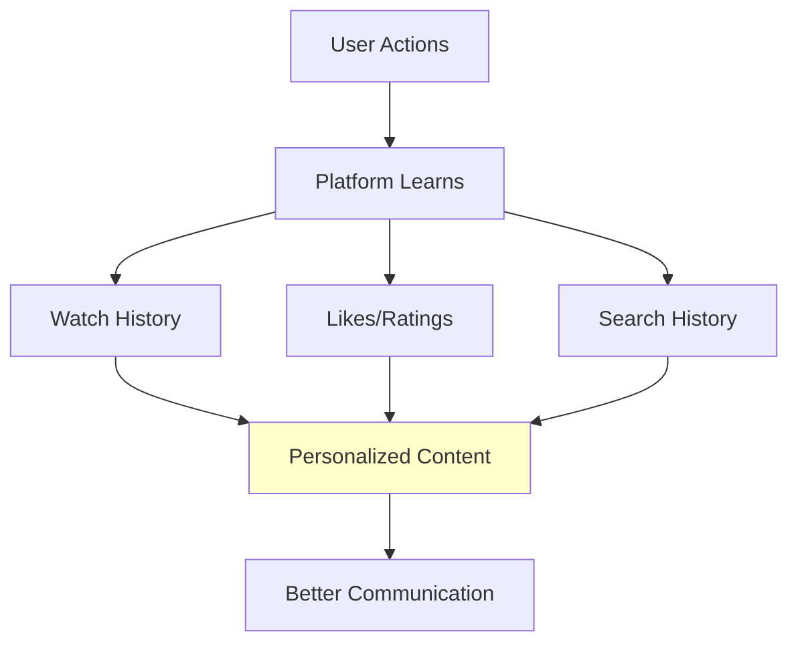

**Examples:**

- Netflix recommends shows based on what you've watched
- YouTube suggests videos similar to your interests
- Spotify creates playlists matching your music taste
- News apps prioritise topics you read most

**Why this matters for communication:**

- Information reaches the right audience
- Users get relevant content
- Less information overload
- Higher engagement

---

**2. Engagement and Feedback**

Unlike traditional media, interactive media lets audiences respond.

**Two-way communication:**

- Blog comments create discussions
- YouTube comments help creators understand their audience
- Podcast reviews guide future episodes
- Social media polls gather opinions

**Real-time feedback:**

- Live stream chat during events
- Twitter reactions to news as it happens
- Instagram stories with question stickers
- Gaming platforms with voice chat

**Why this matters:**

- Creators learn what works
- Audiences feel heard
- Content evolves based on feedback
- Communities form around shared interests

---

**3. User-Generated Content (UGC)**

Audiences become creators, not just consumers.

**Examples:**

- Comments and reviews
- Social media posts
- YouTube videos
- Blog responses
- Podcast listener questions featured in episodes
- TikTok duets and stitches

**Why this matters for communication:**

- Multiple perspectives on topics
- Authentic, peer-to-peer information sharing
- Diverse voices and experiences
- Content creation democratised

---

**4. Non-linear Access**

Users choose their path through information.

**Traditional media path:**
TV broadcast → You watch in order, at scheduled time

**Interactive media path:**
Streaming service → You choose what to watch, in any order, anytime

**Examples:**

- Skip podcast episodes that don't interest you
- Watch YouTube tutorials for specific problems
- Read blog posts by topic, not chronologically
- Create custom playlists of songs or videos

**Why this matters:**

- Users access only relevant information
- Self-paced learning
- Efficient information gathering
- Better retention (interested users)

---

**5. Multimedia Integration**

Interactive media combines multiple formats in one place.

**Example blog post might include:**

- Written article
- Embedded video demonstration
- Audio interview
- Infographics
- Links to resources
- Interactive charts
- Comment discussion

**Why this matters:**

- Accommodates different learning styles
- Visual, auditory, and reading learners all served
- Complex information explained multiple ways
- Richer, more complete communication

---

### 📝 Activity 1: Interactive Media Communication Analysis (30 mins)

!!! tip "Practical Task"
    Explore how different interactive media types communicate information

**Instructions:**

**Step 1:** Choose THREE different platforms from different categories:

- One blog or blog post
- One video (YouTube, TikTok, etc.)
- One podcast or digital radio show
- One social media account (brand or creator)
- One streaming service

**Step 2:** For each platform, analyze how it communicates information:

**Platform 1: _________________** (Type: _________)

1. **What information is being communicated?**
   
_Your answer:_

2. **How can users interact with this content?** (List all ways)
   
_Your answer:_

3. **How does the platform personalise or adapt content to users?**
   
_Your answer:_

4. **What makes this more effective than traditional media for this purpose?**
   
_Your answer:_

5. **Give this platform a UX rating (1-5) and explain why:**
   
Rating: ___/5
   
Reason: _________________

---

**Repeat for Platforms 2 and 3**

---

**Step 3:** Comparison

**Which platform communicated information most effectively? Why?**

_Your answer:_

**Which had the best user experience? What made it good?**

_Your answer:_

---

### ✅ Self-Check Questions

Before moving on, ensure you can answer:

!!! question "Knowledge Check"
    1. What is the main difference between traditional media and interactive media?
    2. Name three interactive features of blogs
    3. How do streaming services use personalisation to communicate information?
    4. What is user-generated content and why is it important?
    5. Give an example of two-way communication in interactive media

??? success "Answers"
    1. Traditional media = one-way; Interactive media = two-way communication with user control
    2. Comments, sharing, links, multimedia embedding, author-reader discussion (any 3)
    3. Streaming services track viewing/listening history to recommend relevant content to each user
    4. Content created by users (comments, posts, videos); important because it democratises content creation and provides diverse perspectives
    5. Any valid example: blog comments, live stream chat, YouTube comments, social media replies

---

## Lesson 2: Evolution of Interactive Media (1.5 hours)

!!! abstract "Lesson Overview"
    This lesson traces how interactive media evolved from static websites to today's dynamic platforms, focusing on blogs, online video, and digital radio.

### Part A: From Static to Interactive (30 mins)

#### The Transformation Timeline

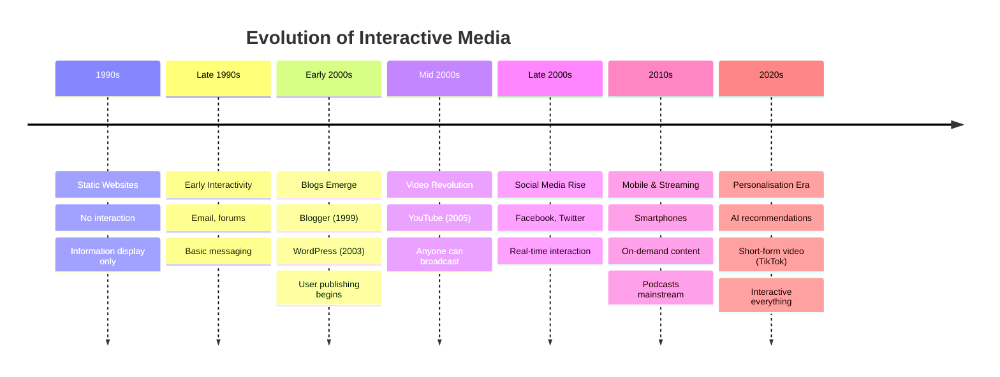

---

#### Stage 1: Static Web (1990s)

**Characteristics:**

- Basic HTML websites
- Read-only information
- No user accounts or personalisation
- Limited multimedia (slow internet)
- One-way communication

**What you could do:**

- Read text
- View images
- Click links to other pages
- That's it

**Example:** Company websites were like online brochures - just information, no interaction.

---

#### Stage 2: Early Interactivity (Late 1990s)

**New capabilities:**

- Email integration
- Forums and message boards
- Guest books
- Basic search functions
- User registration

**What changed:**

- Users could leave messages
- Asynchronous communication (post and check back later)
- Communities forming around topics
- Still mostly text-based

**Example:** Forums where people discussed hobbies - you post a question, come back tomorrow for answers.

---

#### Stage 3: Web 2.0 - User-Generated Content (Early-Mid 2000s)

**Major shift:** From consumers to creators

**Key developments:**

- Blogs become mainstream
- Wikis (Wikipedia, 2001)
- Social networking begins (Friendster, MySpace)
- Photo sharing (Flickr)
- Faster internet enables more media

**Why this mattered:**

- Anyone could publish content
- No technical skills required
- Democratisation of media
- Voice given to millions

---

### Part B: Evolution of Blogs (25 mins)

#### The Blog Revolution

**Pre-Blog Era (Pre-1999)**

- Only tech-savvy people could create websites
- Required HTML knowledge
- Expensive hosting
- Time-consuming updates

**1999: Blogger Launches**

- Free blogging platform
- No coding required
- Simple interface
- Anyone could start a blog in minutes

**Impact:**

- Millions of people started blogging
- Personal diaries online
- Citizen journalism emerged
- New voices in media

---

**2003: WordPress Created**

- More customization options
- Better design templates
- Plugin ecosystem
- Became the dominant platform

**Impact:**

- Blogs became more professional
- Businesses started blogging
- Bloggers became influencers
- New career paths emerged

---

**Mid-Late 2000s: Blog Evolution**

- **Monetisation** - ads, sponsored content
- **Multimedia** - photos, videos embedded
- **Social integration** - share to Facebook, Twitter
- **Mobile access** - read and write on phones
- **Commenting systems** improved
- **SEO** - blogs became searchable (Search engine optimisation)

---

**2010s: Blogs Adapt**

- **Competition** from social media
- Shift to **niche topics**
- **Professional blogging** as career
- **Video blogs (vlogs)** emerge
- Integration with YouTube
- **Microblogging** (Twitter, Tumblr)

---

**Today: Blogs in 2020s**

- **Over 600 million blogs** worldwide
- **Newsletter revival** (Substack, Medium)
- **Hybrid formats** - text + video + audio
- **AI-assisted writing** tools
- Still relevant for long-form content
- SEO remains important for businesses

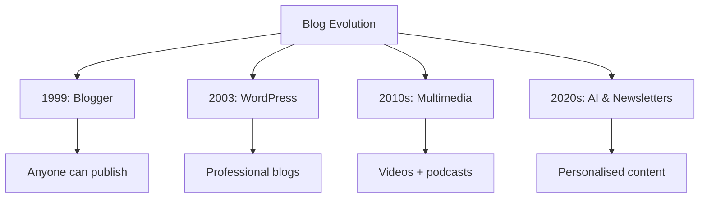

---

### Part C: Evolution of Online Video (25 mins)

#### The Video Revolution

**Pre-YouTube (Before 2005)**

- **Expensive equipment** needed for video production
- **Broadcasting** required TV networks
- **Distribution** was limited and costly
- Only professionals could create video content
- Video online was low quality, slow loading

---

**2005: YouTube Launches**

**What changed:**

- Upload videos from any camera
- Free hosting and distribution
- Global audience instantly
- No broadcasting license needed
- Built-in community (comments, subscriptions)

**Impact:**

- **Democratised video creation**
- Amateur creators reached millions
- New content types emerged (tutorials, vlogs, reviews)
- **"YouTuber" became a career**
- Traditional media disrupted

---

**2006-2010: Video Platforms Multiply**

- **Vimeo** (2004, grew in popularity) - higher quality, creative focus
- **Live streaming** platforms emerge
- **Mobile video** becomes possible
- HD video supported
- Monetisation for creators (ads, partnerships)

---

**2010s: Mobile Video Explosion**

**Key developments:**

- Smartphones with HD cameras
- 4G internet enables streaming
- **Instagram** (2010) adds video
- **Vine** (2013-2017) - 6-second looping videos
- **Periscope** (2015) - live streaming
- **Instagram Stories** (2016) - vertical, temporary video
- **Musical.ly** → **TikTok** (2018) - short-form, algorithm-driven

**Shift in behaviour:**

- Vertical video becomes normal
- Shorter content preferred
- Mobile-first creation and consumption
- Real-time interaction

---

**Late 2010s-2020s: Short-Form Dominance**

**TikTok changes everything:**

- 15-60 second videos
- Algorithm shows content (not just subscriptions)
- Easy editing tools built-in
- Music integration
- Duets and stitches (interactive features)

**Other platforms adapt:**

- **YouTube Shorts**
- **Instagram Reels**
- **Facebook Reels**

**Current state of online video:**

- **2.7+ billion** YouTube users
- **500 hours** uploaded to YouTube every minute
- Short-form video preferred by younger audiences
- Live streaming mainstream (Twitch, YouTube Live)
- Interactive features standard (polls, Q&A)
- AI-powered editing and recommendations

---

### Part D: Evolution of Digital Radio/Podcasts (20 mins)

#### From Radio to Podcasts

**Traditional Radio Era**

- Scheduled programming
- Listen or miss it
- Limited stations based on location
- No control over content
- Advertising interruptions

---

**Early Digital Radio (2000s)**

- **Internet radio** - streams from anywhere
- More station choices
- Still live, still scheduled
- Required constant internet connection

---

**2004-2005: Podcasting Invented**

**What is a podcast?**

- Pre-recorded audio you download or stream
- Listen anytime, anywhere
- Subscribe to series
- Named after iPod + broadcast

**2005: iTunes adds podcasts**

- Easy discovery and downloading
- Automatic updates for subscriptions
- Free content
- Simple for creators to publish

**Early podcasts:**

- Mostly hobbyists
- Tech enthusiasts
- Talk shows and commentary
- Audio quality varied

---

**2010s: Podcast Growth**

**Smartphone impact:**

- Always have podcast player with you
- Listen during commute, exercise, chores
- Easy to discover new shows
- Share episodes with friends

**Professional podcasts emerge:**

- **Serial** (2014) - 80+ million downloads
- Podcasts become mainstream
- Traditional radio hosts start podcasts
- Businesses create branded podcasts
- News organizations launch podcast versions

**Platforms multiply:**

- Apple Podcasts (formerly iTunes)
- Spotify enters podcasting (2015+)
- Google Podcasts
- Stitcher
- Many others

---

**Late 2010s-2020s: Podcast Boom**

**Growth explosion:**

- **2019**: 700,000 podcasts
- **2023**: 5+ million podcasts
- **464+ million listeners** globally
- **62% growth** in listening since 2020

**Why podcasts grew:**

- Pandemic increased audio consumption
- Commuting and driving time
- Multitasking friendly (listen while working)
- Intimate format (feels personal)
- Niche content for every interest
- Free to access

**Evolution of features:**

- **Transcripts** for accessibility and SEO
- **Chapter markers** to skip sections
- **Video podcasts** (YouTube podcasts)
- **Interactive elements** (polls, Q&A)
- **Dynamic ads** personalized by location
- **Premium content** (Spotify exclusives, Patreon)

**Current state:**

- Spotify dominates podcast listening
- Anyone can start a podcast easily
- Professional production quality expected
- Monetisation through ads, sponsorships, subscriptions
- Used for education, entertainment, marketing, storytelling

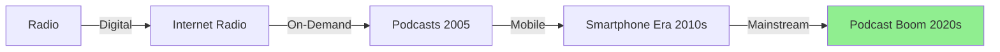

---

### 📝 Activity 2: Evolution Timeline Analysis (20 mins)

!!! tip "Research Task"
    Create your own detailed timeline for ONE type of interactive media

**Instructions:**

**Choose ONE:**

- Blogs
- Online Video
- Digital Radio/Podcasts

**Research and create a detailed timeline showing:**

| Year | Development | Impact on Users | Impact on Content Creators |
|------|-------------|----------------|---------------------------|
| Example: 2005 | YouTube launches | Can watch any video anytime | Anyone can upload and reach global audience |
| | | | |
| | | | |
| | | | |

**Include at least 6 major developments**

**Reflection Questions:**

1. **What was the most significant change in your chosen media type?**
   
   _Your answer:_

2. **How did technology improvements (internet speed, smartphones) influence evolution?**
   
   _Your answer:_

3. **How did user behavior change as the platform evolved?**
   
   _Your answer:_

---

### ✅ Self-Check Questions

!!! question "Knowledge Check"
    1. What characterised the "static web" era of the 1990s?
    2. When did blogs become mainstream and what platforms drove this?
    3. Why was YouTube's launch in 2005 revolutionary?
    4. What is the difference between traditional radio and podcasts?
    5. How did smartphones influence the evolution of interactive media?

??? success "Answers"
    1. One-way information display, no user interaction, read-only, limited multimedia
    2. Early 2000s; Blogger (1999) and WordPress (2003) made blogging accessible to everyone
    3. It allowed anyone to upload and share video globally for free, democratising video content creation
    4. Traditional radio is scheduled, live broadcasts; podcasts are on-demand, you choose when to listen
    5. Smartphones enabled mobile access, creation, and consumption of content anywhere, anytime, driving massive growth

---

## Lesson 3: Prevalence of Interactive Media Today (1.5 hours)

!!! abstract "Lesson Overview"
    This lesson examines how widespread blogs, online video, and digital radio have become and their impact on society.

### Part A: Prevalence of Blogs (25 mins)

#### How Common Are Blogs?

**Global Statistics:**

- **600+ million blogs** exist worldwide
- **6-7 million blog posts** published daily
- **77% of internet users** read blogs regularly
- **Blog posts** drive 67% more leads than companies without blogs
- WordPress powers **43% of all websites**

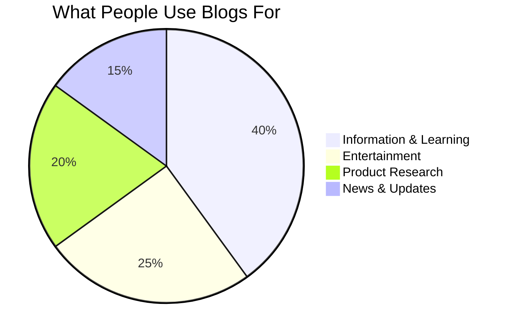

---

#### Types of Blogs Today

**1. Personal Blogs**

- **Purpose:** Share experiences, thoughts, life updates
- **Audience:** Friends, family, like-minded people
- **Examples:** Travel blogs, parenting blogs, hobby blogs
- **Prevalence:** Millions, though declining with social media rise

**2. Professional/Business Blogs**

- **Purpose:** Marketing, SEO, thought leadership
- **Audience:** Potential customers, industry professionals
- **Examples:** Company news, how-to guides, industry insights
- **Prevalence:** Most businesses have blogs

**3. Niche Blogs**

- **Purpose:** Deep expertise on specific topics
- **Audience:** Enthusiasts, hobbyists, learners
- **Examples:** Coding tutorials, gardening tips, finance advice
- **Prevalence:** Huge growth in specialised content

**4. News/Media Blogs**

- **Purpose:** Journalism, commentary, analysis
- **Audience:** News consumers
- **Examples:** TechCrunch, HuffPost started as blogs
- **Prevalence:** Many major media outlets started as blogs

---

#### Why Blogs Remain Prevalent

Despite social media competition:

**Advantages of blogs:**

- **Long-form content** - detailed explanations
- **Permanent** - posts don't disappear
- **Searchable** - Google finds them years later
- **Ownership** - your content, your platform
- **Monetisation** - ads, affiliate marketing, products
- **Credibility** - professional platform

**Use cases blogs excel at:**

- Tutorials and guides
- In-depth analysis
- Documentation
- Professional portfolios
- SEO for businesses

**Modern blog features:**

- Newsletter integration (Substack, Medium)
- Social sharing
- Multimedia embedding
- Comment communities
- Mobile responsive design

---

### Part B: Prevalence of Online Video (30 mins)

#### How Dominant Is Online Video?

**Staggering Statistics:**

**YouTube:**

- **2.7+ billion users** (over 1/3 of internet users)
- **500+ hours of video** uploaded every minute
- **1 billion hours** watched daily
- **2nd most visited website** globally (after Google)
- Available in **100+ countries**, 80+ languages

**TikTok:**

- **1+ billion monthly users**
- **167 million downloads** in 2023 alone
- Average user spends **95 minutes/day** on app
- **Content creation boom** - millions of creators

**Other Platforms:**

- Instagram Reels, Facebook Videos, Snapchat
- Billions more consuming video content

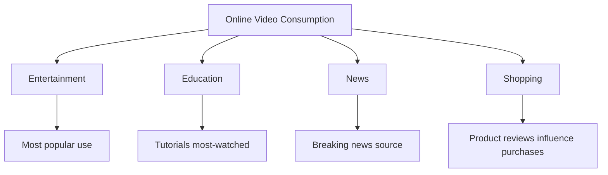

---

#### Video Content Types and Prevalence

**1. Entertainment**

- **Music videos** - billions of views
- **Comedy sketches** and skits
- **Gaming content** - Let's Plays, esports
- **Vlogs** - daily life documentation

**Prevalence:** Dominates watch time

---

**2. Educational Content**

- **Tutorials** - how-to for everything
- **Courses** - Khan Academy, Crash Course
- **Explanations** - science, history, current events
- **Language learning**

**Prevalence:** Primary learning source for many students

- 86% of users watch YouTube to learn new things
- Educational channels have millions of subscribers

---

**3. Product Reviews & Unboxing**

- **Tech reviews** (phones, laptops, gadgets)
- **Beauty and fashion** (makeup, clothing)
- **Toys** (hugely popular with kids)
- **Unboxing experiences**

**Prevalence:** Influences 90% of purchase decisions

- People watch reviews before buying
- Creates new influencer economy

---

**4. News and Current Events**

- **Breaking news** posted immediately
- **Commentary and analysis**
- **Citizen journalism**
- **Live event coverage**

**Prevalence:** Primary news source for under-30 demographic

- YouTube is 2nd most popular news source

---

**5. Short-Form Video**

- **TikTok format** - 15-60 seconds
- **Instagram Reels**
- **YouTube Shorts**

**Prevalence:** Fastest growing video format

- Especially dominant with Gen Z
- Billions of views daily

---

#### Impact on Society

**How online video changed communication:**

**Information Access:**

- Learn anything free
- Visual demonstrations available
- Multiple perspectives on every topic

**Entertainment:**

- Infinite content choices
- No broadcast schedules
- Personalized recommendations

**Careers:**

- Content creation as profession
- Influencer marketing industry
- New media companies

**Attention Economy:**

- Short attention spans
- Algorithm-driven discovery
- Binge-watching culture

---

### Part C: Prevalence of Digital Radio/Podcasts (25 mins)

#### Podcast Explosion

**Global Reach:**

- **5+ million podcasts** exist
- **70+ million episodes** available
- **464+ million podcast listeners** worldwide
- **120 million listeners** in the US alone (42% of population)
- **62% growth** in listening since 2020

**Australia-specific:**
- **41% of Australians** listen to podcasts monthly
- **3+ million weekly** podcast listeners
- Growth across all age groups

---

#### Why Podcasts Are So Prevalent

**Consumption Benefits:**

- **Multitasking friendly** - listen while driving, exercising, working
- **No screen time** - audio only
- **Commute companion** - fills travel time
- **Intimate format** - feels like conversation
- **Free access** - most podcasts free

**Content Benefits:**

- **Niche topics** - podcast for every interest
- **Long-form discussion** - depth impossible on TV
- **Authentic** - less polished than traditional media
- **Diverse voices** - anyone can podcast
- **On-demand** - build up episodes, binge listen

---

#### Popular Podcast Categories

**Most Popular Genres:**

1. **News & Politics** (22% of listening)
2. **Comedy** (17%)
3. **True Crime** (15%)
4. **Education** (12%)
5. **Business** (10%)
6. **Sports** (8%)
7. **Health & Fitness** (7%)
8. **Science** (5%)
9. **Arts** (4%)

---

#### Podcast Use Cases

**1. Education & Learning**

- **Language learning** - daily lessons
- **History** - storytelling format
- **Science** - complex topics explained
- **Skills** - coding, writing, business

**Example:** "Stuff You Should Know" - 1 billion+ downloads

---

**2. News & Current Events**

- **Daily news** - morning briefings
- **Analysis** - deep dives into stories
- **Investigative** - Serial-style journalism

**Example:** "The Daily" (NY Times) - millions of daily listeners

---

**3. Entertainment**

- **Storytelling** - audio dramas
- **Comedy** - interviews and sketches
- **True crime** - mystery and investigation

**Example:** "My Favourite Murder" - huge fanbase

---

**4. Business & Professional**

- **Industry insights**
- **Interviews** with leaders
- **Career advice**
- **Marketing** for companies

**Example:** "How I Built This" - entrepreneur stories

---

#### Listening Habits

**When people listen:**

- **34%** while commuting
- **22%** while exercising
- **18%** while doing housework
- **15%** before bed
- **11%** during work

**How often:**

- **Weekly listeners**: 54%
- **Daily listeners**: 28%
- **Occasional**: 18%

**Average listening:**

- **6.4 hours** per week per listener
- **7 different podcasts** regularly
- **2.1x speed** common among regular listeners

---

### 📝 Activity 3: Prevalence Research Project (30 mins)

!!! tip "Investigation Task"
    Gather real data about the prevalence of interactive media

**Instructions:**

**Choose ONE platform to research in detail:**

- A specific blog platform (WordPress, Medium, Substack)
- A video platform (YouTube, TikTok, Instagram Reels)
- A podcast platform (Spotify, Apple Podcasts)

**Research and document:**

**Platform:** _________________

**1. User Statistics**

- Total number of users/listeners:
- Content uploaded/published (daily/monthly):
- Time spent per user:
- Geographic spread:

**Sources for your data:** (List websites you used)

---

**2. Growth Trends**

- How has this platform grown in the last 5 years?
- What age groups use it most?
- Is it growing or declining?

**Create a simple graph or chart showing growth**

---

**3. Real-World Impact**

Find and document **THREE examples** of how this platform has had real impact:

| Example | Description | Impact |
|---------|-------------|--------|
| 1. | | |
| 2. | | |
| 3. | | |

---

**4. Comparison**

How does this platform compare to traditional media (TV, radio, newspapers)?

| Factor | Traditional Media | Your Platform | Winner |
|--------|------------------|---------------|--------|
| Accessibility | | | |
| Content variety | | | |
| User control | | | |
| Barriers to entry | | | |

---

**5. Prediction**

Based on your research, will this platform become more or less prevalent in the next 5 years? Explain your reasoning.

_Your answer:_

---

### ✅ Self-Check Questions

!!! question "Knowledge Check"
    1. Approximately how many blogs exist worldwide?
    2. What percentage of internet users read blogs regularly?
    3. How many hours of video are uploaded to YouTube every minute?
    4. How many podcast listeners are there globally?
    5. What are the top three podcast genres?

??? success "Answers"
    1. 600+ million blogs
    2. 77% of internet users
    3. 500+ hours per minute
    4. 464+ million listeners
    5. News & Politics, Comedy, True Crime

---

## Lesson 4: Interactive Media in Enterprises (2 hours)

!!! abstract "Lesson Overview"
    This lesson explores how businesses and organizations use interactive media systems, focusing on specific technologies and applications.

### Part A: Training and Learning Solutions (35 mins)

#### How Enterprises Use Interactive Media for Training

Modern businesses face training challenges:

- Employees in multiple locations
- Expensive to train in-person
- Dangerous procedures to teach
- Need for consistent training quality
- Rapid skill updates required

**Interactive media solutions:**

---

#### 1. Simulation

**What it is:**
Computer-generated environments that replicate real-world scenarios for practice.

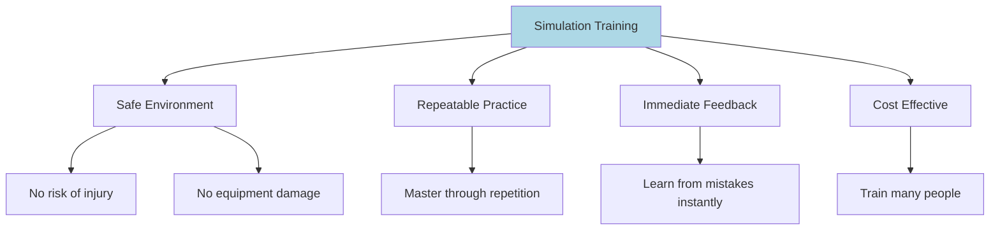

**Enterprise Use Cases:**

| Industry | Purpose | Benefits | Example |
|----------|---------|----------|---------|
| **Aviation - Flight Simulators** | Train pilots without using real aircraft | • Practice emergency scenarios safely • Save millions in fuel and aircraft wear • Train for rare situations • Consistent training standards | Commercial airline pilots must complete simulator hours annually |
| **Healthcare - Medical Simulations** | Practice procedures without risk to patients | • Surgical procedure practice • Emergency response training • Diagnosis skill development • Rare condition exposure | Virtual surgery simulators for medical students |
| **Manufacturing - Equipment Operation** | Learn to operate expensive/dangerous machinery | • No production downtime • No material waste • No injury risk • Faster skill development | Heavy machinery simulators for construction |
| **Military/Emergency - Crisis Training** | Prepare for high-stakes situations | • Practice dangerous scenarios • Team coordination training • Decision-making under pressure • Muscle memory development | Firefighter simulation for building fires |

---

#### 2. Gamification

**What it is:**
Applying game mechanics (points, badges, leaderboards, levels) to non-game activities to increase engagement.

**Key Elements:**

- **Points** - earn for completing tasks
- **Badges** - achievements for milestones
- **Leaderboards** - competition with peers
- **Levels** - progression system
- **Challenges** - time-limited goals
- **Rewards** - prizes or recognition

**Why it works psychologically:**

- **Motivation** - desire to progress and win
- **Recognition** - public acknowledgement
- **Competition** - drive to outperform peers
- **Achievement** - sense of accomplishment
- **Fun** - makes boring tasks engaging

---

**Enterprise Use Cases:**

| Use Case | Application | Gamification Elements | Benefits |
|----------|-------------|----------------------|----------|
| **Employee Onboarding** | New hires complete training modules for points | • Earn badges for completing each department introduction • Leaderboard shows fastest learners • Unlock new areas as you progress | • Higher completion rates (up to 90% vs. 20-30% traditional) • Faster onboarding • Better retention of information • Engaged new employees |
| **Sales Training** | Sales team learns products and techniques | • Points for completing product training • Leaderboard for top performers • Badges for mastering sales techniques • Team challenges | • Competitive motivation • Continuous learning culture • Performance tracking • Knowledge reinforcement |
| **Compliance Training** | Mandatory training (safety, regulations, ethics) | • Scenario-based challenges • Progress tracking • Time-limited refresher quizzes • Certificates as achievements | • Higher engagement with dry material • Better completion rates • Improved retention • Measurable results |
| **Customer Loyalty Programs** | Encourage repeat purchases | • Points per purchase • Tiered membership levels • Exclusive rewards • Challenges (buy 5, get 1 free) | • Increased customer retention • Higher purchase frequency • Brand loyalty • Customer data collection |

---

#### 3. Augmented Reality (AR)

**What it is:**
Technology that overlays digital information onto the real-world view, typically through glasses, headsets, or smartphone cameras.

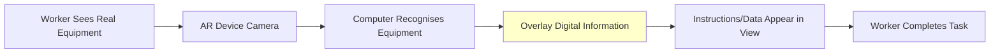

**Key Features:**

- **Real-time overlay** - information appears on physical objects
- **Hands-free** - see data while working
- **Context-aware** - shows relevant information for what you're looking at
- **Interactive** - can manipulate virtual objects

---

**Enterprise Use Cases:**

| Industry/Use Case | Application | AR Features | Benefits | Example |
|-------------------|-------------|-------------|----------|---------|
| **Manufacturing & Maintenance** | Repair and maintenance of complex equipment | • Step-by-step repair instructions overlaid on equipment • Highlight which part to work on • Show diagnostic information • Display torque specs, part numbers | • 32% faster task completion • 90% fewer errors • New technicians productive immediately • Remote expert assistance | Boeing uses AR glasses for aircraft wiring - 25% faster assembly |
| **Warehousing & Logistics** | Picking and packing orders | • Arrows guide workers to item locations • Highlights correct item on shelf • Shows quantity needed • Optimal route through warehouse | • 25% increase in productivity • Reduced picking errors • Faster training (days instead of weeks) • Hands-free operation | DHL uses AR glasses in warehouses globally |
| **Retail** | Customer service and product information | • Staff sees product details when looking at items • Inventory levels displayed • Customer preferences shown • Virtual product demonstrations | • Better customer service • Reduced training time • Upselling opportunities • Inventory accuracy | Retail staff using smart glasses for instant product info |
| **Remote Assistance** | Expert guides on-site worker | • Expert sees what worker sees • Expert draws annotations in worker's view • Both can point at specific parts • Share diagnostic tools | • Reduce travel costs • Faster problem resolution • Access to expertise globally • Knowledge transfer | Field technicians get real-time expert guidance |

---

### Part B: Entertainment Access (30 mins)

#### How Interactive Media Improves Entertainment Access

**Traditional Entertainment Barriers:**

- Scheduled programming - watch when broadcast
- Geographic limitations - content not available in your region
- Expensive - cable subscriptions, movie tickets
- Device-specific - need TV, radio, etc.
- Passive consumption - no control

**Interactive media removes these barriers:**

---

#### 1. Streaming Services

**What they are:**
Platforms delivering video or audio content over the internet on-demand.

**How they improve access:**

**Time Flexibility**

- Watch/listen anytime, not tied to broadcast schedule
- Pause and resume across devices
- Binge-watch entire seasons
- Example: Watch a show at 2am if you want

**Geographic Access**

- Content available globally (with some licensing restrictions)
- No local broadcast requirements
- Simultaneous worldwide releases
- Example: Australian viewers get new shows same day as US

**Device Flexibility**

- Watch on TV, computer, phone, tablet
- Start on one device, continue on another
- Multiple profiles per account
- Example: Watch on phone during commute, continue on TV at home

**Personalisation**

- Recommendations based on viewing history
- Multiple user profiles with separate recommendations
- Curated collections
- Example: Netflix suggests shows you'll likely enjoy

**Affordability**

- Single subscription for unlimited content
- No per-view costs
- Cheaper than cable TV
- Family sharing
- Example: $10-20/month for thousands of shows

**Content Discovery**

- Search entire catalog
- Browse by genre, mood, actor
- Trending and popular sections
- Example: Easy to find niche content

---

**Enterprise Streaming Examples:**

**Netflix**

- 230+ million subscribers
- Original content production
- Algorithm-driven recommendations
- Offline downloads

**Disney+**

- Entire Disney catalog
- Star Wars, Marvel content
- Family-friendly focus
- Bundled with Hulu, ESPN+

**Spotify/Apple Music**

- 70+ million songs
- Personalized playlists
- Podcast integration
- Social sharing features

---

#### 2. Gaming Platforms

**How gaming improves entertainment access:**

**Cloud Gaming**

- **What it is:** Games run on remote servers, streamed to your device
- **Access improvement:**
  - No expensive gaming PC/console needed
  - Play on phone, tablet, cheap laptop
  - Instant access - no downloads
  - Play anywhere with internet
- **Examples:** Xbox Cloud Gaming, Google Stadia (discontinued), NVIDIA GeForce Now

**Digital Distribution**

- **What it is:** Download games instead of buying physical copies
- **Access improvement:**
  - No travel to stores
  - Instant purchase and play
  - Sales and discounts frequent
  - Access your library anywhere
- **Examples:** Steam, Epic Games Store, PlayStation Store

**Cross-Platform Play**

- **What it is:** Play with friends on different devices
- **Access improvement:**
  - Don't need same console as friends
  - Larger player base
  - Play on your preferred device
- **Examples:** Fortnite, Minecraft, Rocket League

**Free-to-Play Models**

- **What it is:** Games free to download, optional purchases
- **Access improvement:**
  - No upfront cost barrier
  - Try before spending
  - Accessible to more people
- **Examples:** Fortnite, Apex Legends, League of Legends

**Accessibility Features**

- **What they are:** Options for players with disabilities
- **Access improvement:**
  - Colourblind modes
  - Subtitles and audio descriptions
  - Remappable controls
  - Difficulty adjustments
- **Examples:** The Last of Us Part II has 60+ accessibility options

---

#### 3. Virtual Reality (VR)

**What it is:**
Immersive technology that creates fully digital environments you can interact with.

**How VR improves entertainment access:**

| VR Application | Feature | Access Improvement | Examples |
|----------------|---------|-------------------|----------|
| **Immersive Experiences from Home** | Feel present in virtual space | • Attend concerts virtually • Visit museums globally • Watch sports from unique angles • Experience events without travel | VR concerts during pandemic |
| **Social VR Spaces** | Meet and interact with others in virtual worlds | • Connect with people globally • Social interaction for those with mobility limitations • Shared experiences remotely | VRChat, Horizon Worlds, Rec Room |
| **Virtual Tourism** | Explore places virtually | • Visit inaccessible locations • Experience travel without cost/time • Accessible for people with disabilities | Google Earth VR, travel company virtual tours |
| **VR Gaming** | Fully immersive gameplay | • New types of physical activity (VR fitness) • Presence and immersion impossible on screens • Social gaming in shared spaces | Beat Saber, Half-Life: Alyx |

---

### Part C: Specialist Apps for Business Operations (30 mins)

#### How Apps Support Enterprise Functions

Modern businesses rely on interactive media apps for core operations:

---

#### 1. Delivery Tracking Apps

**Purpose:**
Real-time monitoring and communication about shipments and services.

**Key Features:**
- **GPS tracking** - see delivery vehicle location
- **ETA updates** - estimated arrival time
- **Push notifications** - status changes
- **Proof of delivery** - photos, signatures
- **Direct communication** - message driver
- **Order history** - track past deliveries

**How they support enterprises:**

**Operational Efficiency**
- Optimize delivery routes automatically
- Monitor driver performance
- Reduce failed deliveries
- Fleet management
- Example: UberEats optimizes routes to deliver orders fastest

**Customer Service**
- Reduce "where's my order?" calls (saves staff time)
- Proactive updates reduce anxiety
- Self-service tracking
- Transparent process builds trust
- Example: Australia Post app lets customers track without calling

**Data & Analytics**
- Delivery time metrics
- Driver efficiency data
- Customer satisfaction feedback
- Problem identification (repeated issues with certain routes)
- Example: DoorDash analyzes data to improve operations

**Business Examples:**

**Food Delivery:**
- Uber Eats, DoorDash, Menulog
- Track from restaurant to door
- Real-time updates
- Rate delivery experience

**Postal Services:**
- Australia Post app
- Parcel tracking
- Delivery preferences
- Redelivery scheduling

**Ride Sharing:**
- Uber, Lyft
- Watch driver approach
- ETA updates
- Safety features (share trip)

---

#### 2. Advertising Apps

**Purpose:**
Enable businesses to create, manage, and measure targeted advertising campaigns.

**Key Features:**
- **Audience targeting** - demographics, interests, behaviors
- **Ad creation tools** - templates and design
- **Budget management** - set spending limits
- **Performance analytics** - measure results
- **A/B testing** - test different versions
- **Retargeting** - reach people who visited your site

**How they support enterprises:**

**Targeted Reach**
- Show ads only to relevant people
- Location-based advertising
- Interest-based targeting
- Lookalike audiences
- Example: Restaurant shows ads to people within 5km searching for food

**Cost Efficiency**
- Pay only for results (clicks, views, conversions)
- Set maximum budgets
- Stop underperforming ads automatically
- Example: Small business spends $10/day, only pays when someone clicks

**Measurable Results**
- Track every click, view, conversion
- ROI calculation
- Attribution (which ad led to sale)
- Real-time adjustment
- Example: See exactly how many sales came from each ad

**Business Examples:**

**Google Ads**
- Search advertising
- Display network
- YouTube ads
- Shopping ads
- Used by: Businesses of all sizes

**Facebook/Instagram Ads Manager**
- Social media advertising
- Visual content focus
- Detailed targeting options
- Instagram shopping integration
- Used by: Retail, e-commerce, local businesses

**TikTok Ads**
- Short-form video ads
- Younger demographic reach
- Creative tools
- Trend integration
- Used by: Brands targeting Gen Z

---

#### 3. Communication Apps

**Purpose:**
Facilitate internal team communication and collaboration.

**Key Features:**
- **Instant messaging** - real-time text chat
- **Channels/Teams** - organized by topic/project
- **Video conferencing** - meetings without travel
- **File sharing** - documents, images, videos
- **Integration** - connects with other business tools
- **Search** - find past messages and files
- **Presence indicators** - see who's online/busy
- **Notifications** - stay updated

**How they support enterprises:**

**Speed & Efficiency**
- Faster than email for quick questions
- Reduce meeting time
- Instant information sharing
- Quick decision-making
- Example: Ask colleague a question, get answer in 30 seconds vs. waiting hours for email reply

**Remote Work Enablement**
- Connect distributed teams
- Work from anywhere
- Async communication across time zones
- Digital workplace
- Example: Team in Sydney collaborates with team in London

**Collaboration**
- Screen sharing during calls
- Co-edit documents
- Project channels keep conversations organized
- Thread discussions
- Example: Marketing team has dedicated channel for campaign planning

**Integration with Other Tools**
- Connect to project management (Trello, Asana)
- Calendar integration
- CRM connections
- Automate workflows
- Example: Slack notifies team when sale is made in CRM

**Business Examples:**

**Slack**
- Channel-based communication
- Extensive integrations (2,000+ apps)
- Search functionality
- Used by: Tech companies, startups, creative teams

**Microsoft Teams**
- Integrated with Office 365
- Video conferencing built-in
- SharePoint integration
- Used by: Enterprises, education, government

**Zoom**
- Video-first platform
- Webinars and large meetings
- Recording capabilities
- Used by: All sectors for meetings

**Discord (Business Use)**
- Originally for gaming
- Community building
- Voice channels
- Used by: Remote teams, communities, customer support

---

### 📝 Activity 4: Enterprise Application Case Study (25 mins)

!!! tip "Analysis Task"
    Investigate a real-world enterprise use of interactive media

**Choose ONE scenario:**

**Option A: Simulation Training**
Research a company using simulation for training (e.g., airline pilot training, medical training, manufacturing training)

**Option B: Gamification**
Research a company using gamification (e.g., Duolingo, sales team gamification, customer loyalty program)

**Option C: AR in Business**
Research a company using AR (e.g., IKEA Place app, warehouse AR, maintenance AR)

**Option D: Streaming/Gaming Service**
Research how a company uses streaming or gaming to reach customers (e.g., Netflix strategy, game platform)

**Option E: Business Apps**
Research how a specific delivery/advertising/communication app supports a business

---

**Complete this analysis:**

**Company/Example:** _________________

**Technology Used:** _________________

**1. What problem does this interactive media solve for the business?**

_Your answer:_

**2. How does it work? (Describe the interactive media system)**

_Your answer:_

**3. What specific interactive features make it effective?**

_Your answer:_

**4. What benefits does the business receive?** (List at least 3 with evidence if possible)

1.
2.
3.

**5. What challenges or limitations exist?**

_Your answer:_

**6. How does this compare to traditional methods?**

| Factor | Traditional Method | Interactive Media Solution | Winner & Why |
|--------|-------------------|---------------------------|--------------|
| Cost | | | |
| Speed | | | |
| Effectiveness | | | |
| Scalability | | | |

**7. Would you recommend this approach to other businesses in the same industry? Why or why not?**

_Your answer:_

---

### ✅ Self-Check Questions

!!! question "Knowledge Check"
    1. What is simulation and how does it help businesses train employees?
    2. Give two examples of gamification in business and explain why it works
    3. How does AR improve warehouse operations?
    4. List three ways streaming services improve access to entertainment
    5. How do delivery tracking apps benefit both businesses and customers?

??? success "Answers"
    1. Simulation creates computer-generated practice environments; helps by providing safe, repeatable, cost-effective training without real-world risks
    2. Examples: Sales leaderboards (competition motivates), training badges (recognition drives completion); works due to psychological motivation, achievement, and competition
    3. AR guides workers to exact item locations, highlights correct items, shows quantities needed, optimises routes - hands-free and faster
    4. Time flexibility (watch anytime), device flexibility (any screen), geographic access (global), personalisation (recommendations), affordability (unlimited content for one price) - any 3
    5. Business: reduces customer service calls, provides operational data, increases efficiency, improves satisfaction; Customer: transparency, peace of mind, accurate ETAs, ability to plan

---

## Lesson 5: Practical UX Critique & Design (2 hours)

!!! abstract "Lesson Overview"
    This hands-on lesson has you explore various interactive media platforms, critique their user experience, and apply UX principles.

### Part A: Understanding UX in Interactive Media (30 mins)

#### What is User Experience (UX)?

**Definition:**
User Experience (UX) is how a person feels when interacting with a system - including websites, apps, and interactive media.

**UX encompasses:**
- **Usability** - how easy it is to use
- **Efficiency** - how quickly you can accomplish tasks
- **Satisfaction** - how pleasant the experience is
- **Accessibility** - whether everyone can use it
- **Value** - whether it solves your problem

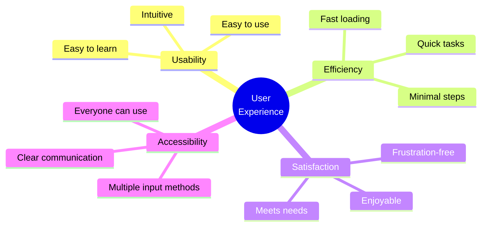

---

#### User Interface (UI) vs User Experience (UX)

**User Interface (UI):**
- What you see and interact with
- Buttons, colors, fonts, layout
- Visual design
- Interactive elements

**User Experience (UX):**
- How the entire system feels
- Includes UI plus everything else
- Overall satisfaction
- Emotion and perception

**Relationship:**
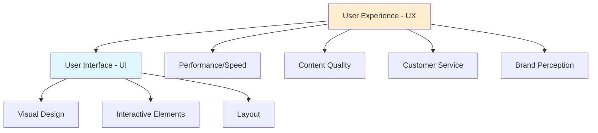

**Think of it like a restaurant:**
- **UI** = How the menu looks, table setting, decor
- **UX** = The entire dining experience (food quality, service, ambiance, value, how you felt)

Good UI doesn't guarantee good UX, but bad UI usually creates bad UX.

---

#### Key UX Principles for Interactive Media

**1. Clarity**
- Users should immediately understand what they can do
- Clear labels and instructions
- Obvious calls-to-action
- No confusion

**Good:** "Watch Now" button clearly visible
**Bad:** Unclear navigation, hidden features

---

**2. Consistency**
- Similar elements work the same way throughout
- Predictable behavior
- Uniform design patterns
- Reduces learning curve

**Good:** All buttons look and behave the same
**Bad:** Every page has different navigation

---

**3. Feedback**
- System responds to user actions
- Confirmation of actions
- Loading indicators
- Error messages that help

**Good:** "Video added to playlist" confirmation
**Bad:** Click button, nothing happens, unclear if it worked

---

**4. Efficiency**
- Minimize steps to accomplish tasks
- Fast loading
- Shortcuts for frequent actions
- Autofill and smart defaults

**Good:** Streaming service remembers where you left off
**Bad:** Have to re-login every time, start video from beginning

---

**5. User Control**
- Users can undo actions
- Skip, pause, go back
- Customize settings
- Exit when desired

**Good:** Can skip podcast intro, adjust speed
**Bad:** Forced to watch ads, can't pause

---

**6. Accessibility**
- Everyone can use it, including people with disabilities
- Captions for videos
- Text alternatives for images
- Keyboard navigation
- Sufficient contrast

**Good:** YouTube videos have captions
**Bad:** Video with no captions, tiny unreadable text

---

#### How to Evaluate UX

**Ask these questions:**

**First Impressions (5 seconds):**
- What can I do here?
- Where do I start?
- Is it visually appealing?

**Usability:**
- Can I accomplish my goal easily?
- Is it intuitive?
- Do I need instructions?

**Performance:**
- Is it fast?
- Does it respond immediately?
- Any lag or freezing?

**Satisfaction:**
- Do I enjoy using this?
- Would I come back?
- Any frustrating moments?

**Accessibility:**
- Can someone with a disability use this?
- Are there alternatives for different abilities?
- Is text readable?

---

### Part B: Platform Exploration & UX Critique (60 mins)

!!! tip "Hands-On Activity"
    Explore and critically evaluate multiple interactive media platforms

#### Activity Instructions

**You will explore FOUR different platforms, one from each category:**

1. **Blog Platform** (choose one):
   - WordPress.com blog
   - Medium article
   - Personal blog
   - Substack newsletter

2. **Video Platform** (choose one):
   - YouTube
   - TikTok
   - Instagram Reels
   - Vimeo

3. **Podcast/Audio Platform** (choose one):
   - Spotify (podcast section)
   - Apple Podcasts
   - YouTube podcasts
   - Google Podcasts

4. **Social Media/Streaming** (choose one):
   - Instagram
   - Netflix
   - Twitter/X
   - LinkedIn

---

#### For EACH platform, complete this evaluation:

**Platform Name:** _________________
**Category:** _________________
**Time Spent Exploring:** _______ mins

---

**Part 1: First Impressions (2 minutes of exploring)**

When you first open the platform:

1. **What catches your attention first?**
   
   _Your answer:_

2. **Is it immediately clear what you can do here?** (Yes/No)
   
   Explain: _________________

3. **Rate the visual appeal** (1-5): _____
   
   Why this rating? _________________

---

**Part 2: Navigation & Usability (5 minutes of use)**

Try to accomplish a simple task (watch a video, read an article, find a podcast, etc.)

4. **How easy was it to find what you wanted?** (1-5): _____
   
   1 = very difficult, 5 = very easy

5. **List the steps you took:**
   
   Step 1:
   Step 2:
   Step 3:

6. **Could these steps be simplified? How?**
   
   _Your answer:_

---

**Part 3: Interactive Features (10 minutes of exploration)**

Explore the interactive capabilities:

7. **List ALL ways you can interact with content** (minimum 5):
   
   1.
   2.
   3.
   4.
   5.

8. **Which interactive feature is most useful? Why?**
   
   _Your answer:_

9. **Are there any interactive features that seem unnecessary or confusing?**
   
   _Your answer:_

---

**Part 4: UX Principles Evaluation**

Rate how well the platform implements each principle (1-5):

| UX Principle | Rating | Evidence/Example |
|--------------|--------|------------------|
| Clarity | /5 | |
| Consistency | /5 | |
| Feedback | /5 | |
| Efficiency | /5 | |
| User Control | /5 | |
| Accessibility | /5 | |

**Overall UX Score:** _____/30

---

**Part 5: Specific UX Analysis**

10. **Best UX Element:**
    
    What is it?
    Why does it work well?
    How does it improve your experience?

11. **Worst UX Element:**
    
    What is it?
    What's the problem?
    How would you fix it?

12. **How does this platform communicate information effectively?**
    
    _Your answer:_

13. **What makes this platform's UX different from traditional media?**
    
    _Your answer:_

---

**Part 6: Reflection**

14. **Would you recommend this platform to others?** (Yes/No)
    
    Why? _________________

15. **If you could change ONE thing about the UX, what would it be?**
    
    _Your answer:_

---

**REPEAT for all 4 platforms**

---

### Part C: Comparative Analysis (30 mins)

After evaluating all four platforms, complete this comparison:

#### Cross-Platform Comparison

**1. Rank your platforms by overall UX** (best to worst):

1. _________________ (Score: ___/30)
2. _________________ (Score: ___/30)
3. _________________ (Score: ___/30)
4. _________________ (Score: ___/30)

---

**2. Which platform had the best:**

| Aspect | Platform | Why? |
|--------|----------|------|
| First impression | | |
| Navigation | | |
| Interactive features | | |
| Visual design | | |
| Speed/Performance | | |
| Mobile experience | | |

---

**3. Common UX Patterns**

What UX elements did you see across multiple platforms?

Examples:
- Search bars in top right
- Profile icons in corner
- Share buttons
- Like/heart buttons

List common patterns you noticed:

1.
2.
3.
4.
5.

Why do you think these patterns are so common?

_Your answer:_

---

**4. Unique UX Features**

What unique features did each platform have that others didn't?

| Platform | Unique Feature | Why is it valuable? |
|----------|----------------|---------------------|
| | | |
| | | |
| | | |
| | | |

---

**5. UX and Information Communication**

How does good UX help communicate information more effectively?

Think about:
- Finding information quickly
- Understanding content
- Engaging with content
- Sharing information
- Remembering information

_Your answer (4-5 sentences):_

---

**6. Platform Purpose Match**

For each platform, evaluate how well the UX matches its purpose:

**Platform 1:** _________________

Purpose: _________________

Does UX support this purpose? _________________

How? _________________

---

**Repeat for remaining platforms**

---

### ✅ Self-Check Questions

!!! question "Knowledge Check"
    1. What is the difference between UI and UX?
    2. Why is consistency important in UX design?
    3. What does "feedback" mean in UX and why does it matter?
    4. How does good UX improve information communication?
    5. Name three ways to evaluate if a platform has good UX

??? success "Answers"
    1. UI = visual interface elements you interact with; UX = overall experience including UI, performance, satisfaction, and all interactions
    2. Consistency makes interfaces predictable, reduces learning time, prevents confusion, and builds user confidence
    3. Feedback = system responses to user actions (confirmations, errors, loading states); matters because users need to know their actions worked and what the system is doing
    4. Good UX helps users find information quickly, understand content clearly, engage effectively, and remember information better through intuitive design
    5. Test task completion ease, measure speed/efficiency, assess satisfaction, check accessibility, observe first impressions, get user feedback (any 3)

---

## Teacher Notes

??? notes "Formative Assessment Strategies"
    ### Formative Assessment Strategies

    **Knowledge Checks**

    - Self-check questions at end of each lesson part
    - Student self-assessment before moving forward
    - Identify gaps in understanding early

    **Practical Activities**

    - Activity 1: Interactive Media Exploration (observable engagement)
    - Activity 2: Evolution Timeline (demonstrates research skills)
    - Activity 3: Prevalence Research (data literacy)
    - Activity 4: Enterprise Case Study (analysis skills)
    - Activity 5: UX Critique (application of principles)

    **Observable Indicators:**

    - Completion of comparison tables
    - Quality of reflection responses
    - Depth of platform analysis
    - Evidence-based conclusions

    **Intervention Points:**

    - If students struggle with Activity 1, provide specific platform examples
    - If evolution timeline is incomplete, provide timeline template
    - If UX critique lacks depth, provide guiding questions
    - If case study analysis is shallow, model one example together

    **Assessment:**

    - All self-check answers provided
    - Activity completion indicates understanding
    - Written reflections show depth of thinking
    - Comparison tables demonstrate analysis skills

??? notes "Differentiation Strategies"
    ### Differentiation Strategies

    **For Students Who Need Support:**

    **Lesson Structure:**

    - Provide fill-in-the-blank notes
    - Pre-select platforms to explore (give specific URLs)
    - Offer sentence starters for reflection questions
    - Create checklist version of activities
    - Allow verbal responses recorded instead of written

    **Activities:**

    - Reduce number of platforms to evaluate (2 instead of 4)
    - Provide partially completed comparison tables
    - Offer word banks for technical terminology
    - Pair with peer mentor
    - Break activities into smaller chunks with check-ins

    **Assessment:**

    - Accept bullet points instead of paragraphs
    - Allow annotated screenshots instead of written descriptions
    - Provide rubric with clear examples
    - Focus on 2-3 key concepts instead of all content

    ---

    **For Students Who Need Extension:**

    **Deepening:**

    - Research historical examples of failed interactive media platforms (why they failed)
    - Create detailed wireframe/mockup of improved platform UX
    - Conduct user testing with peers and analyze results
    - Compare international versions of same platform
    - Investigate emerging interactive media (Web3, metaverse, AI-driven)

    **Activities:**

    - Evaluate 6+ platforms across more categories
    - Create video presentation of UX critique
    - Design original interactive media solution for real problem
    - Interview professionals in industry
    - Build prototype interactive media element

    **Assessment:**

    - Create comprehensive UX audit report with recommendations
    - Design presentation for business case study
    - Develop rubric for evaluating interactive media
    - Teach mini-lesson on one topic to peers

??? notes "Common Misconceptions"
    ### Common Misconceptions

    **Misconception 1: "Interactive = multimedia"**

    - **Reality:** Interactive means two-way communication and user control, not just combining media types
    - **Address:** Use comparison diagrams showing static multimedia vs. interactive single-media
    - **Example:** A static PDF with images and text is multimedia but not interactive; a text-only blog with comments IS interactive

    **Misconception 2: "UX and UI are the same thing"**

    - **Reality:** UI is visual/interface; UX is the entire experience
    - **Address:** Use restaurant analogy repeatedly; show examples of good UI with bad UX
    - **Example:** Beautiful website that loads slowly = good UI, bad UX

    **Misconception 3: "Blogs are dead/outdated"**

    - **Reality:** 600M+ blogs, 77% of users read them, businesses still rely on them
    - **Address:** Show current statistics; discuss blog evolution (newsletters, etc.)
    - **Example:** Major tech companies, news sites, all maintain active blogs

    **Misconception 4: "Podcasts are just radio shows"**

    - **Reality:** On-demand, user control, niche content, different consumption patterns
    - **Address:** Create comparison table of radio vs. podcasts
    - **Example:** Can't pause/rewind radio, can't binge past episodes, can't subscribe

    **Misconception 5: "Gamification = making everything a game"**

    - **Reality:** Gamification applies game mechanics to non-game contexts
    - **Address:** Show business examples (loyalty programs, training)
    - **Example:** Airline points programs aren't games, but use game mechanics

    **Misconception 6: "AR and VR are the same"**

    - **Reality:** AR overlays digital on real world; VR is fully digital environment
    - **Address:** Use clear definitions and distinct examples
    - **Example:** Pokémon Go (AR) vs. Beat Saber (VR)

    **Misconception 7: "Streaming services just replaced TV"**

    - **Reality:** Fundamentally different - on-demand, personalized, interactive features
    - **Address:** Compare control levels and user experience
    - **Example:** Can't rewind live TV, can't build playlist, can't watch across devices

    **Misconception 8: "If I can use it, it has good UX"**

    - **Reality:** UX considers all users, including those with disabilities
    - **Address:** Discuss accessibility; show how features help different users
    - **Example:** Captions help deaf users AND people watching without sound

    **Misconception 9: "More features = better UX"**

    - **Reality:** Simplicity and clarity often create better UX
    - **Address:** Show examples of feature bloat vs. minimalism
    - **Example:** Google search page vs. cluttered competitor

    **Misconception 10: "Social media is the only interactive media"**

    - **Reality:** Many types exist (blogs, video, podcasts, streaming, apps, etc.)
    - **Address:** Categorise all types clearly; show diverse examples
    - **Example:** YouTube, podcasts, blogs all interactive but different from social media

---

### Links to Bloom's Taxonomy

**Remember (Lowest Level):**

- Define interactive media
- List types of interactive media
- Recall evolution timeline dates
- State prevalence statistics

**Understand:**

- Explain difference between traditional and interactive media
- Describe how UX/UI relate
- Summarise evolution of blogs/video/podcasts
- Interpret prevalence data

**Apply:**

- Use platforms and identify interactive features
- Apply UX principles to evaluate platforms
- Demonstrate use of interactive media tools
- Complete platform exploration activities

**Analyse:**

- Compare multiple platforms
- Examine UX elements and their effects
- Investigate enterprise use cases
- Differentiate between UI and UX in real examples

**Evaluate:**

- Critique platform UX (Activities 4 & 5)
- Assess effectiveness of enterprise solutions
- Judge quality of information communication
- Rate platforms using UX principles

**Create (Highest Level):**

- Design improvements to existing platforms (extension)
- Develop UX recommendations
- Propose solutions to UX problems
- Construct original interactive media concepts (extension)

**This lesson plan progressively moves students up Bloom's taxonomy from basic knowledge to evaluation.**

---

### Pacing Notes

**If time is limited:**

- Reduce platforms evaluated in Activity 5 to 3
- Combine Lessons 2 & 3 (evolution + prevalence)
- Focus on fewer enterprise examples
- Shorten some reflection questions

**If students are ahead:**

- Add extension activities
- Deeper research on specific platforms
- Create presentations
- Peer teaching opportunities

**Check-in points:**

- End of Lesson 1 (basics clear?)
- After Activity 2 (evolution understood?)
- End of Lesson 3 (ready for enterprise applications?)
- After Activity 4 (analysis skills demonstrated?)
- End of Lesson 5 (can apply UX principles?)

---

### Additional Resources

**Platforms for Exploration:**

- [Medium.com](https://medium.com) (blog)
- [WordPress.com](https://WordPress.com) (blog platform)
- [YouTube.com](https://YouTube.com) (video)
- [Spotify.com](https://Spotify.com) (podcast/audio)
- [Netflix.com](https://Netflix.com) (streaming)

**Statistics Sources:**

- [Statista.com](https://Statista.com)
- [Pew Research Center](https://www.pewresearch.org/)
- Platform investor reports
- Industry reports

**UX Resources:**

- [Nielsen Norman Group](https://nngroup.com)
- UX Design principles
    - [7 fundamental user experience (UX) design principles](https://www.uxdesigninstitute.com/blog/ux-design-principles/)
    - [Seven essential UI design principles + how to use them](https://www.figma.com/resource-library/ui-design-principles/)
- [Web Content Accessibility Guidelines](https://www.w3.org/TR/WCAG21/) (WCAG)

**Success Criteria:**
Students successfully completing this plan should be able to independently:

- [ ] Define and identify interactive media
- [ ] Explain evolution from static to interactive
- [ ] Quote prevalence statistics accurately
- [ ] Describe multiple enterprise applications
- [ ] Evaluate platform UX using principles
- [ ] Communicate findings clearly with evidence

---