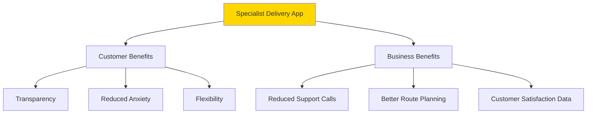
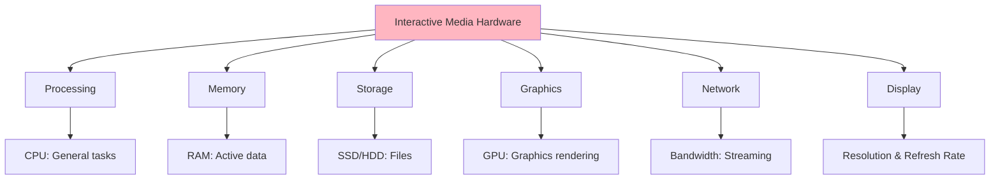
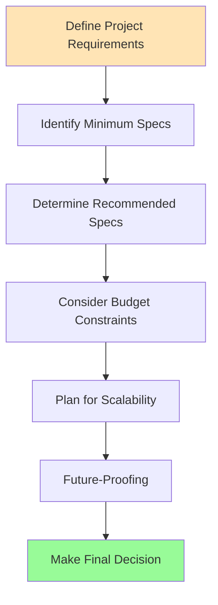
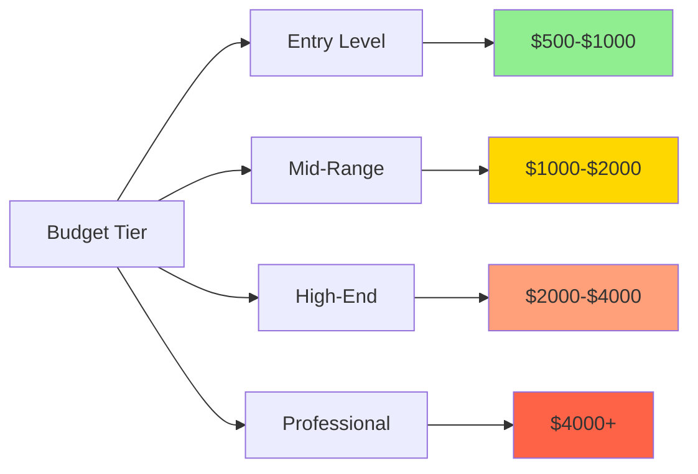

# Week 2: Interactive Media in Enterprise

## Lesson Overview

!!! info "Lesson Details"
    **Duration:** 90-120 minutes  
    **Focus:** Enterprise applications of interactive media and hardware requirements  
    **Mode:** Self-paced, independent study  
    **Prerequisites:** [Week 1 - Introduction to Interactive Media](./introduction_to_interactive_media.md)

---

## Learning Objectives

By the end of this lesson, you will be able to:

- **Describe** how simulation, gamification, and AR support online training and learning
- **Explain** how streaming services, gaming, and VR improve access to entertainment
- **Identify** how specialist apps support delivery tracking, advertising, and communication
- **Evaluate** the performance requirements of hardware for interactive media projects

!!! success "Success Criteria"

    By the end of this lesson, you should be able to:
    
    - [ ] **Provide specific examples** of gamification in at least **2 different industries** and explain how AR/VR enhances training with concrete benefits
    - [ ] **Describe 3 ways** streaming services, gaming platforms, or VR improve access to entertainment compared to traditional methods
    - [ ] **Explain** how specialist apps (delivery tracking, advertising, or communication) benefit enterprises with at least **3 specific advantages**
    - [ ] **List hardware requirements** for running different types of interactive media and **compare** needs for simple vs complex projects (e.g., web browsing vs VR gaming)
    - [ ] **Create appropriate hardware specifications** for at least 2 different use cases with clear justification of component choices

---

## Part 1: Interactive Media in Training & Learning

### Understanding Simulation, Gamification, and AR in Education

#### Simulation

Simulation recreates real-world scenarios in a safe, controlled digital environment. Think of it as a practice ground where mistakes don't have real consequences.

**Example - Flight Simulators:**
Pilots train using sophisticated flight simulators before ever flying a real aircraft. These systems replicate:

- Cockpit controls and instruments
- Weather conditions and emergencies
- Aircraft physics and handling
- Different airports and scenarios

This allows pilots to practise dangerous situations (engine failures, storms) safely and repeatedly.

**How Simulation Works in Enterprise Training:**

| Stage | Description | Why This Helps |
|-------|-------------|----------------|
| **Real-World Scenario** | Identify actual situations employees will face (e.g., engine failure in flight, emergency surgery) | Ensures training is relevant and applicable to the job |
| **Digital Recreation** | Build a realistic virtual version with accurate physics, controls, and consequences | Allows practice without real-world costs or dangers |
| **Safe Practice Environment** | Trainees can make mistakes, repeat scenarios, and experiment without harm | Builds confidence and allows learning from failure |
| **Skill Development** | Through repetition and feedback, trainees master techniques and decision-making | Creates muscle memory and improves response times |
| **Apply to Real World** | Transfer learned skills to actual job situations with greater competence | Reduces errors, increases safety, and improves performance |

---

#### Gamification

Gamification applies game design elements to non-game contexts to increase engagement and motivation.

**Example - Duolingo:**
The language learning app uses:

- **Points & XP:** Earn points for completing lessons
- **Streaks:** Consecutive days of practice
- **Levels:** Progress through difficulty tiers
- **Leaderboards:** Compete with friends
- **Badges:** Unlock achievements
- **Lives/Hearts:** Limited attempts to encourage focus

These game elements make learning feel less like work and more like play, increasing user engagement.

#### Augmented Reality (AR)

AR overlays digital information onto the real world, enhancing what we see with additional data or instructions.

**Example - Medical Training:**
Medical students can use AR applications like:

- **Anatomy visualisation:** Point a device at a patient mannequin and see internal organs overlaid
- **Surgical guidance:** Step-by-step instructions appear in the surgeon's field of view
- **Practice procedures:** Simulate injections or examinations with digital feedback

**Why Do Enterprises Use These Technologies?**

1. **Cost Reduction:** Training in simulation is cheaper than using real equipment
2. **Safety:** Learn dangerous procedures without risk
3. **Scalability:** Train many people simultaneously across locations
4. **Engagement:** Gamification increases completion rates
5. **Retention:** Interactive learning improves information retention by up to 75%

### 📝 Activity 1.1: Gamification Audit (15 minutes)

!!! note "Task: Explore and Analyse Gamification"
    
    **Instructions:**
    
    1. Choose ONE of these apps (or a similar educational/training app you use):
        - Duolingo (language learning)
        - Khan Academy (academic subjects)
        - Codecademy (programming)
        - Fitbit/MyFitnessPal (health tracking)
    
    2. Spend 5-10 minutes using the app and identify at least **5 game elements**
    
    3. Complete this table in your notes:
    
    | Game Element | Description | Purpose/Effect on User |
    |--------------|-------------|------------------------|
    | Example: Points | Earn XP for each lesson | Motivates completion, shows progress |
    | 1. | | |
    | 2. | | |
    | 3. | | |
    | 4. | | |
    | 5. | | |
    
    **Reflection Question:**  
    How do these game elements change your motivation compared to traditional learning methods?

### 📝 Activity 1.2: Simulation Benefits Analysis (10 minutes)

!!! note "Task: Compare Training Methods"
    
    Consider these three training scenarios. For each, explain why simulation or AR would be beneficial:
    
    ```
    **Scenario 1: Training new firefighters**  
    Traditional method: Textbooks and occasional controlled burns  
    With simulation/AR: ____
    
    **Scenario 2: Teaching surgery techniques to medical students**  
    Traditional method: Observe surgeries, practise on cadavers  
    With simulation/AR: ____
    
    **Scenario 3: Training retail staff on customer service**  
    Traditional method: Role-playing with colleagues  
    With simulation/AR: ____
    ```

    **Consider:** Cost, safety, repeatability, feedback quality, and realism.

---

## Part 2: Interactive Media in Entertainment

### Streaming Services: Transforming Entertainment Access

Streaming services like Netflix, Disney+, Spotify, and YouTube have revolutionised how we access entertainment.

**Traditional Entertainment vs Streaming:**

| Aspect | Traditional Entertainment | Streaming Services | Winner & Why |
|--------|--------------------------|-------------------|--------------|
| **Content Ownership** | ✅ You own it permanently, can resell or lend | ❌ Access only while subscribed, lose everything if cancelled | **Traditional** - Physical ownership has lasting value |
| **Internet Requirement** | ✅ No internet needed once purchased | ❌ Requires stable internet connection | **Traditional** - Works in areas with poor connectivity |
| **Cost for Light Users** | ✅ Pay only for what you watch (e.g., $7/movie) | ❌ Monthly fee even if watching little ($10-20/month) | **Traditional** - More economical if watching 1-2 items/month |
| **Selection & Discovery** | ❌ Limited to local stock, often outdated | ✅ Thousands of titles, personalised recommendations | **Streaming** - Vastly greater choice |
| **Convenience** | ❌ Must visit store or cinema, return items | ✅ Instant access from any device, anywhere | **Streaming** - Ultimate flexibility |
| **Cost for Frequent Users** | ❌ $5-7 per rental adds up quickly | ✅ Unlimited viewing for fixed monthly fee | **Streaming** - Better value for regular viewers |
| **Video Quality** | ✅ 4K Blu-ray offers best quality, no compression | ❌ Quality depends on internet speed, often compressed | **Traditional** - Superior quality for enthusiasts |
| **Availability of Content** | ❌ Popular titles often out of stock | ✅ Never "sold out", always available<br>❌ Multiple services needed to cover all content | **Streaming** - Guaranteed access |
| **Special Features** | ✅ Director commentaries, deleted scenes, behind-the-scenes | ❌ Often stripped of bonus content | **Traditional** - Richer experience for film enthusiasts |
| **Content Removal** | ✅ Content can't be taken away from you | ❌ Titles regularly removed due to licensing | **Traditional** - Permanent access to favourites |

**The Verdict:** Neither is objectively better - it depends on your situation:

- **Choose Traditional if:** You have limited/unreliable internet, watch infrequently, value ownership, or are a quality enthusiast
- **Choose Streaming if:** You have good internet, watch regularly, value convenience and variety, or prefer exploring new content

**Reality:** Most people use a hybrid approach - streaming for regular viewing, physical media for treasured favourites.

---

**How Streaming Improves Access:**

1. **Geographic Access:** Content available worldwide (subject to licensing)
2. **Temporal Access:** Watch anytime, pause, rewind, replay
3. **Device Flexibility:** Access on phone, tablet, TV, computer
4. **Cost Efficiency:** One subscription replaces multiple purchases
5. **Discovery:** Recommendation algorithms suggest content
6. **Accessibility Features:** Subtitles, audio descriptions, multiple languages

### Gaming Platforms: Expanding Entertainment Options

Modern gaming platforms (PlayStation, Xbox, Nintendo Switch, Steam, mobile gaming) have transformed gaming from a niche hobby to mainstream entertainment.

**Key Improvements:**

- **Digital Distribution:** Download games instantly, no physical store visit
- **Cross-Platform Play:** Play with friends regardless of device
- **Cloud Gaming:** Stream games without powerful hardware (Xbox Cloud Gaming, GeForce Now)
- **Social Integration:** Built-in chat, friends lists, shared experiences
- **Regular Updates:** Games evolve with patches and downloadable content but sometimes released before it is ready

### Virtual Reality: Immersive Entertainment

VR creates fully immersive digital environments where users feel present in another world.

**Popular VR Platforms:**

- **Meta Quest 3:** Standalone VR headset
- **PlayStation VR2:** Console-based VR
- **HTC Vive/Valve Index:** PC-based VR

**VR Applications in Entertainment:**

- **Gaming:** First-person experiences (Beat Saber, Half-Life: Alyx)
- **Virtual Tourism:** Explore locations worldwide from home
- **Social Spaces:** Virtual meeting rooms and events (VRChat, Horizon Worlds)
- **Fitness:** Immersive exercise experiences
- **Cinema:** 360° films and virtual cinemas

### Accessibility Improvements

Interactive media makes entertainment more accessible to people with disabilities:

- **Closed captions** for hearing impairments
- **Audio descriptions** for visual impairments
- **Customisable controls** for mobility impairments
- **Difficulty settings** for cognitive accessibility
- **Colour-blind modes** for visual processing differences

### 📝 Activity 2.1: Streaming Service Comparison (15 minutes)

!!! note "Task: Analyse Entertainment Access"
    
    Compare traditional entertainment methods with modern streaming/gaming:
    
    **Create a comparison table:**
    
    | Aspect | Traditional Method | Modern Interactive Media | Winner & Why |
    |--------|-------------------|-------------------------|--------------|
    | **Music Access** | CDs, radio | Spotify, Apple Music | |
    | **Film/TV Access** | DVD rental, cinema | Netflix, Disney+ | |
    | **Gaming Access** | Physical game stores | Digital downloads, cloud gaming | |
    | **Social Experience** | Local multiplayer only | Online multiplayer, streaming | |
    | **Cost (monthly)** | | | |
    
    **Reflection:**  
    What groups of people benefit most from these improvements? Consider: rural residents, people with disabilities, shift workers, students.

### 📝 Activity 2.2: VR Research Task (10 minutes)

!!! note "Task: Investigate VR Experiences"
    
    Choose ONE VR application from each category and research it briefly:

    **Gaming:** _[e.g., Beat Saber]_  

    - What makes it immersive?
    - What's the appeal over traditional gaming?
    
    **Social/Communication:** _[e.g., VRChat]_  

    - How does it differ from video calls?
    - What social opportunities does it create?
    
    **Education/Training:** _[e.g., virtual museum tours]_  

    - Who benefits from this?
    - What makes it better than traditional methods?

---

## Part 3: Specialist Apps in Enterprise

Modern enterprises rely heavily on specialist applications to streamline operations, reach customers, and facilitate communication.

### Delivery Tracking Apps

Apps like Uber Eats, Menulog, DoorDash, and Australia Post tracking transform how businesses manage logistics.

**Key Features:**

- **Real-Time GPS Tracking:** See delivery progress on a map
- **ETA Predictions:** Estimated arrival times using traffic data
- **Notifications:** Updates at key stages (prepared, picked up, nearby)
- **Two-Way Communication:** Message the driver
- **Proof of Delivery:** Photos and digital signatures

**Business Benefits:**



### Advertising Apps

Social media and advertising platforms (Instagram, Facebook Ads, Google Ads, TikTok, TheTradeDesk) allow targeted, measurable advertising.

**How They Work:**

- **User Profiling:** Collect data on interests, demographics, behaviour
- **Targeted Delivery:** Show ads only to relevant users
- **Performance Tracking:** Monitor clicks, conversions, return on investment
- **A/B Testing:** Compare different ad versions
- **Retargeting:** Show ads to people who visited your website

**Example - Instagram Advertising:**
A small Sydney cafe can target:

- Age: 18-35
- Location: Within 5km
- Interests: Coffee, breakfast, brunch
- Behaviour: Follows local food accounts

This precision targeting means advertising budget isn't wasted on irrelevant audiences.

### Communication Apps

Enterprise communication platforms (Slack, Microsoft Teams, Discord for gaming communities) revolutionise workplace collaboration.

**Features Comparison:**

| Feature | Traditional Email | Modern Communication Apps |
|---------|------------------|---------------------------|
| Speed | Delayed | Instant messaging |
| Organisation | Inbox clutter | Organised channels |
| Searchability | Limited | Advanced search, tags |
| Collaboration | Attachments only | Screen sharing, video calls, document collaboration |
| Integration | Minimal | Connects with other business tools |
| Notifications | All or nothing | Customisable per channel |

**Slack Example Features:**

- **Channels:** Organised conversations by topic/project
- **Direct Messages:** Private conversations
- **Threads:** Keep related messages together
- **Integrations:** Connect Google Drive, Trello, GitHub, etc.
- **Search:** Find any message, file, or conversation
- **Video/Voice Calls:** Built-in calling

**Enterprise Impact:**

These apps improve business operations by:

1. **Reducing Response Times:** Instant communication
2. **Improving Coordination:** Teams stay aligned
3. **Increasing Productivity:** Less time searching for information
4. **Enabling Remote Work:** Collaborate from anywhere
5. **Data-Driven Decisions:** Analytics on performance

### 📝 Activity 3.1: Specialist App Case Study (15 minutes)

!!! note "Task: Deep Dive into One Enterprise App"
    
    Choose ONE specialist app category and research a specific example:
    
    **Options:**

    - Delivery Tracking: Uber Eats, Menulog, Australia Post app
    - Advertising: Instagram Ads, Facebook Ads Manager, Google Ads, TheTradeDesk
    - Communication: Slack, Microsoft Teams, Discord
    
    **Research and answer:**
    
    1. **What specific problem does this app solve for businesses?**
    
    2. **List 5 key features that make it valuable:**
        - Feature 1:
        - Feature 2:
        - Feature 3:
        - Feature 4:
        - Feature 5:
    
    3. **Who are the primary users?** (customers, businesses, or both?)
    
    4. **What data does the app collect, and how is it used?**
    
    5. **What would businesses do without this app?** (How did they operate before?)

### 📝 Activity 3.2: Enterprise Impact Analysis (10 minutes)

!!! note "Task: Connect Apps to Business Outcomes"
    
    For each scenario, identify which specialist app(s) would help and explain how:
    ```
    **Scenario 1:**  
    A small Australian clothing brand wants to reach potential customers in Melbourne interested in sustainable fashion.  
    **App Type:** ____  
    **How it helps:** ____
    
    **Scenario 2:**  
    A software development team of 15 people works across Sydney, Brisbane, and remotely. They need to coordinate on multiple projects simultaneously.  
    **App Type:** ____  
    **How it helps:** ____
    
    **Scenario 3:**  
    A pizza restaurant wants to offer delivery and let customers know exactly when their order will arrive.  
    **App Type:** ____  
    **How it helps:** ____
    ```
---

## Part 4: Hardware Performance Requirements

Different interactive media projects require different hardware capabilities. Understanding these requirements is essential for project planning and budgeting.

### Key Hardware Components



#### 1. Processing Power (CPU - Central Processing Unit)

The CPU handles general computing tasks, logic, and calculations.

**Requirements by Activity:**

- **Basic web browsing/streaming:** Dual-core processor (e.g., Intel i3, AMD Ryzen 3)
- **Content creation (video editing, 3D modelling):** Quad-core or higher (Intel i5/i7, AMD Ryzen 5/7)
- **VR/Advanced gaming:** High-end multi-core (Intel i7/i9, AMD Ryzen 7/9)

#### 2. Graphics Processing (GPU - Graphics Processing Unit)

The GPU renders images, video, and 3D graphics.

**Requirements by Activity:**

- **Video streaming, basic apps:** Integrated graphics (built into CPU)
- **HD gaming, video editing:** Mid-range GPU (NVIDIA GTX 1660, AMD RX 6600)
- **4K gaming, VR, 3D rendering:** High-end GPU (NVIDIA RTX 4070+, AMD RX 7800 XT+)

#### 3. Memory (RAM - Random Access Memory)

RAM stores data that's actively being used.

**Requirements:**

- **Basic tasks (web, email):** 8GB
- **Multitasking, light gaming:** 16GB
- **Content creation, heavy gaming:** 32GB+
- **Professional work (video editing, 3D):** 64GB+

#### 4. Storage

Where files and applications are stored permanently.

**Types:**

- **HDD (Hard Disk Drive):** Cheaper, slower, higher capacity
- **SSD (Solid State Drive):** Faster, more expensive, more reliable
- **NVMe SSD:** Fastest, similar price to SSD, used in high-end systems

**Requirements:**

- **Basic users:** 256GB SSD
- **Gamers:** 1TB+ SSD, TripleA games can be 100GB+ each.
- **Content creators:** 1TB+ SSD + additional HDD for archives

#### 5. Internet Bandwidth

Critical for streaming, online gaming, and cloud applications.

**Requirements: (per user)**

- **SD streaming (480p):** 3-4 Mbps
- **HD streaming (1080p):** 5-8 Mbps
- **4K streaming (2160p):** 25+ Mbps
- **Online gaming:** 3-6 Mbps download, <50ms latency
- **VR streaming (e.g., VR cloud gaming):** 50+ Mbps, <20ms latency

#### 6. Display Quality

The screen affects user experience significantly.

**Considerations:**

- **Resolution:** 1080p (Full HD), 1440p (2K), 2160p (4K)
- **Refresh Rate:** 60Hz (standard), 120Hz+ (gaming/VR)
- **Colour Accuracy:** Important for design and photo/video work
- **Screen Size:** Larger for productivity, varies for gaming

### Hardware Requirements Comparison Table

| Interactive Media Type | Minimum CPU | Minimum GPU | RAM | Storage | Internet | Display |
|------------------------|-------------|-------------|-----|---------|----------|---------|
| **Video Streaming (1080p)** | Dual-core | Integrated | 4GB | 128GB | 8 Mbps | 1080p, 60Hz |
| **Video Streaming (4K)** | Quad-core | Integrated | 8GB | 256GB | 25 Mbps | 2160p, 60Hz |
| **Casual Gaming** | Quad-core | GTX 1650 | 8GB | 512GB | 5 Mbps | 1080p, 60Hz |
| **AAA Gaming (1080p)** | 6-core | RTX 3060 | 16GB | 1TB SSD | 5 Mbps | 1080p, 144Hz |
| **VR Gaming** | 6-core | RTX 3070+ | 16GB | 512GB SSD | 10 Mbps | VR headset (90Hz+) |
| **Basic AR Apps (Mobile)** | Mobile CPU | Mobile GPU | 4GB | 64GB | 4G/5G | Phone screen |
| **Professional AR (Tablet)** | Tablet CPU | Tablet GPU | 8GB | 256GB | 5G/Wi-Fi | Tablet screen |
| **Video Editing (1080p)** | 6-core | GTX 1660 | 16GB | 1TB SSD | N/A | 1080p+ IPS |
| **Video Editing (4K)** | 8-core | RTX 3070 | 32GB | 2TB SSD | N/A | 2160p IPS |
| **3D Modelling/Rendering** | 8-core | RTX 4070+ | 32GB+ | 1TB SSD | N/A | 1440p+ IPS |
| **Communication Apps (Slack)** | Dual-core | Integrated | 4GB | 128GB | 5 Mbps | 1080p |
| **Gamification Apps (Mobile)** | Mobile CPU | Mobile GPU | 3GB | 32GB | 4G | Phone screen |

### 📝 Activity 4.1: Hardware Specification Exercise (15 minutes)

!!! note "Task: Match Hardware to Requirements"
    
    Three people need to purchase devices for different purposes. Complete the table below with your hardware recommendations for each person:

    | Component | **Sarah - University Student** | **James - Content Creator** | **Alex - Gamer** |
    |-----------|--------------------------------|----------------------------|------------------|
    | **Primary Needs** | Web browsing, documents, Netflix, Zoom | 4K video editing, photo editing, YouTube streaming, graphic design | AAA gaming (high settings), VR gaming, Twitch streaming |
    | **Budget Level** | Low | High | Moderate |
    | | | | |
    | **CPU** | | | |
    | **GPU** | | | |
    | **RAM** | | | |
    | **Storage** | | | |
    | **Internet** | | | |
    | **Display** | | | |
    | | | | |
    | **Estimated Total Cost** | $ | $ | $ |
    | **Justification** | Why did you choose these specs? | Why did you choose these specs? | Why did you choose these specs? |

    **Reflection Questions:**

    1. Which person needs the most powerful hardware? Why?
    2. Where could each person save money without significantly impacting performance?
    3. What would happen if Sarah used Alex's gaming PC for her university work? Would it be worth the extra cost?

    ---

    !!! info
        [au.pcpartpicker.com](https://au.pcpartpicker.com/){target="_blank"} can help you select parts, check hardware compatibility and calculate a price.

### 📝 Activity 4.2: Mobile vs Desktop Hardware Analysis (10 minutes)

!!! note "Task: Compare Platform Capabilities"
    
    **Scenario:** A business wants to develop an AR training app for their staff.
    
    Compare developing this for:

    1. **Mobile devices** (smartphones/tablets)
    2. **Desktop/laptop computers**
    3. **Dedicated AR headsets** (e.g., Microsoft HoloLens)
    
    **Create a comparison:**
    
    | Factor | Mobile | Desktop | AR Headset |
    |--------|--------|---------|------------|
    | **Portability** | | | |
    | **Processing Power** | | | |
    | **Cost per Device** | | | |
    | **User Comfort** | | | |
    | **Immersion Level** | | | |
    | **Best Use Case** | | | |
    
    **Final Recommendation:**  
    Which platform would you recommend for this AR training app? Justify your answer considering cost, effectiveness, and practicality.

---

## Part 5: Evaluating Hardware for Projects

When planning an interactive media project, hardware evaluation involves balancing requirements, budget, scalability, and future-proofing.

### The Evaluation Process



#### Step 1: Define Project Requirements

Ask these questions:

- What type of interactive media? (streaming, gaming, AR/VR, content creation)
- Who is the target audience? (students, professionals, consumers)
- How many users simultaneously?
- What level of quality is expected? (basic, professional, high-end)
- Will it need to scale in the future?

#### Step 2: Minimum vs Recommended Specifications

Always define both:

- **Minimum specs:** Bare minimum to run the application
- **Recommended specs:** For optimal performance and user experience

**Example - VR Training Application:**

| Component | Minimum | Recommended |
|-----------|---------|-------------|
| CPU | Intel i5-9400 | Intel i7-11700K |
| GPU | NVIDIA GTX 1660 | NVIDIA RTX 3070 |
| RAM | 8GB | 16GB |
| Storage | 256GB SSD | 512GB SSD |
| Headset | Meta Quest 2 | Meta Quest 3 |

#### Step 3: Budget Considerations

Hardware costs vary significantly:



**Cost-Saving Strategies:**

1. **Cloud Computing:** Offload processing to remote servers (e.g., cloud gaming, cloud rendering)
2. **Mobile-First:** Develop for phones/tablets first, desktop later
3. **Gradual Upgrades:** Start with minimum specs, upgrade as needed
4. **Refurbished Hardware:** Consider certified refurbished for non-critical components
5. **Component Priorities:** Invest more in components that matter most for your use case

#### Step 4: Scalability Planning

Consider future growth:

- **User Base Growth:** Can the system handle 10x the users?
- **Feature Expansion:** Will new features require more power?
- **Technology Evolution:** Is the hardware upgradeable?
- **Content Growth:** Will storage needs increase significantly?

#### Step 5: Future-Proofing

Technologies to watch:

- **5G Networks:** Faster mobile connectivity enables better mobile interactive media
- **AI/ML Integration:** More applications using machine learning require better GPUs
- **Higher Resolution Standards:** 4K becoming standard, 8K emerging
- **WebGPU:** Browser-based GPU acceleration for web applications
- **Edge Computing:** Processing closer to users reduces latency

**Performance Bottleneck Identification**

Understanding where performance issues occur:

| Symptom | Likely Bottleneck | Solution |
|---------|------------------|----------|
| Lag in online games | Internet speed/latency | Upgrade connection, use wired ethernet |
| Slow video rendering | CPU/GPU | Upgrade processor or graphics card |
| Application crashes | Insufficient RAM | Add more memory |
| Long loading times | Slow storage | Upgrade to SSD |
| Low frame rates in games | Weak GPU | Upgrade graphics card |
| Stuttering video playback | CPU or internet | Check both, upgrade weaker component |

### 📝 Activity 5.1: Project Hardware Planning (20 minutes)

!!! note "Task: Plan Hardware for a Real Project"
    
    **Scenario:**  
    A secondary school in regional NSW wants to implement an interactive media project. Choose ONE from below and create a complete hardware plan:
    
    **Option A: VR History Lessons**

    - 30 students need to experience historical events in VR
    - Budget: $15,000
    - Must work in a classroom setting
    
    **Option B: Live Streaming Sports Events**

    - Stream school sports games to parents
    - Need: cameras, encoding, streaming to YouTube
    - Budget: $5,000
    
    **Option C: Esports/Gaming Club**

    - 10 gaming PCs for competitive gaming
    - Games: Fortnite, Valorant, Rocket League, LOL
    - Budget: $20,000
    
    **Your Hardware Plan Should Include:**
    
    1. **List all hardware needed with specifications:**
        - Item 1: [name] - [specs] - [quantity] - [estimated cost]
        - Item 2: ...
    
    2. **Justify each component choice:**
        - Why these specs?
        - Why this quantity?
    
    3. **Total cost breakdown:**
        - Hardware: $___
        - Accessories: $___
        - Contingency (10%): $___
        - Total: $___
    
    4. **Identify potential bottlenecks:**
        - What might cause performance issues?
        - How would you address them?
    
    5. **Scalability plan:**
        - How could this system grow in 2 years?
        - What would need upgrading first?

### 📝 Activity 5.2: Hardware Upgrade Decision (10 minutes)

!!! note "Task: Prioritise Upgrades"
    
    **Scenario:**  
    A content creator has this current system:
    
    - CPU: Intel i5-9400 (4 years old)
    - GPU: NVIDIA GTX 1060 6GB (4 years old)
    - RAM: 16GB DDR4
    - Storage: 512GB SSD
    - Internet: 50 Mbps NBN
    - Display: 1080p 60Hz monitor
    
    **Their problems:**

    - Video rendering takes hours for 4K videos
    - Gaming at high settings causes frame drops
    - Multitasking with multiple apps open causes slowdowns
    
    **Your budget for upgrades: $1,500**
    
    **Task:**

    1. Identify which components should be upgraded first (prioritise top 3)
    2. Explain why these are the priority
    3. Estimate costs for each upgrade
    4. Explain what performance improvements to expect
    
    **Your Upgrade Plan:**
    
    | Priority | Component | Upgrade To | Cost | Expected Improvement |
    |----------|-----------|------------|------|---------------------|
    | 1 | | | $ | |
    | 2 | | | $ | |
    | 3 | | | $ | |
    | **Total** | | | **$** | |
    
    **Justification:**  
    _[Explain your reasoning for these priorities]_

---

## Syllabus Alignment

!!! info "Enterprise Computing Syllabus Coverage"
    
    This lesson covers the following syllabus points from **Interactive Media and User Experience**:
    
    ✅ **Describe the contribution of interactive media systems to a range of enterprises**
    
    - Including: how simulation, gamification and augmented reality (AR) support online training and learning
    - Including: how streaming services, gaming and virtual reality (VR) improve access to entertainment
    - Including: how specialist apps support delivery tracking, advertising and communication
    
    ✅ **Evaluate the performance requirements of hardware for specific interactive media projects**

---

## Learning Checklist

!!! success "Self-Assessment: Can you do all of these?"
    
    Before moving to the next lesson, verify you can:
    
    **Training & Learning:**

    - [ ] Explain what simulation is and give a real-world example
    - [ ] Describe how gamification works and identify game elements in apps
    - [ ] Explain how AR enhances training with a specific example
    - [ ] Describe at least 3 benefits of using these technologies in enterprise training
    
    **Entertainment Access:**

    - [ ] Explain how streaming services improve access to entertainment
    - [ ] Describe 3 ways modern gaming platforms expand entertainment options
    - [ ] Explain what VR is and give examples of VR entertainment applications
    - [ ] Describe how interactive media improves accessibility for people with disabilities
    
    **Specialist Apps:**

    - [ ] Explain how delivery tracking apps benefit businesses and customers
    - [ ] Describe how advertising apps enable targeted marketing
    - [ ] Explain how communication apps improve enterprise collaboration
    - [ ] Provide specific examples of specialist apps in each category
    
    **Hardware Requirements:**

    - [ ] List the 6 key hardware components relevant to interactive media
    - [ ] Explain what each component does (CPU, GPU, RAM, storage, internet, display)
    - [ ] Compare minimum vs recommended specs for different interactive media types
    - [ ] Match hardware specifications to specific use cases
    
    **Hardware Evaluation:**

    - [ ] Create a hardware plan for an interactive media project
    - [ ] Justify hardware choices based on requirements and budget
    - [ ] Identify potential performance bottlenecks
    - [ ] Explain how to prioritise hardware upgrades
    - [ ] Plan for scalability and future-proofing

---

## Quiz

<quiz>
**Question 1: Which of the following is an example of gamification in enterprise training?**
- [ ] Using VR headsets to practice surgical procedures
- [x] Duolingo awarding points and badges for completing language lessons
- [ ] Flight simulators recreating cockpit controls and weather conditions
- [ ] Streaming training videos on Netflix
---
**Explanation**

Gamification applies game design elements (points, badges, levels, leaderboards) to non-game contexts. Duolingo uses these elements to make language learning more engaging.

- Option A is simulation, not gamification - it recreates real scenarios without game elements
- Option C is also simulation - realistic practice environments
- Option D is streaming technology, not gamification
</quiz>

<quiz>
**Question 2: How do streaming services like Netflix improve access to entertainment compared to traditional DVD rental?**
- [x] They offer on-demand access to thousands of titles from any device
- [ ] They provide better video quality than Blu-ray discs
- [ ] They allow you to own content permanently
- [ ] They work without requiring an internet connection
---
**Explanation**

Streaming services provide on-demand access to vast libraries from multiple devices (phones, tablets, TVs, laptops), which is a key advantage over physical media that required store visits and had limited selection.

- Option A is incorrect - 4K Blu-ray actually offers superior quality to compressed streaming
- Option B is incorrect - streaming provides access, not ownership; content can be removed
- Option D is incorrect - streaming requires internet connectivity (though some services allow downloads)
</quiz>

<quiz>
**Question 3: A delivery tracking app like Uber Eats benefits businesses by reducing customer support calls. Which app feature most directly contributes to this benefit?**
- [ ] Two-way messaging with the driver
- [x] Real-time GPS tracking with automatic status notifications
- [ ] Digital payment processing
- [ ] Customer review and rating systems
---
**Explanation**

Real-time GPS tracking with automatic notifications (order prepared, picked up, nearby, delivered) answers the most common customer question - "Where is my order?" - without requiring a phone call to support.

- Option A helps with specific issues but doesn't prevent most support calls
- Option C relates to payment, not tracking inquiries
- Option D collects feedback after delivery but doesn't reduce support calls during delivery
</quiz>

<quiz>
**Question 4: A school wants to run VR history lessons for 30 students simultaneously. The application requires minimum 8GB RAM and a GTX 1660 GPU.** 

They're considering three options:

- (Option A) 30 standalone VR headsets at $500 each
- (Option B) 15 gaming PCs at $1,500 each with shared VR headsets, or 
- (Option C) 10 high-end PCs at $2,500 each with students taking turns. Which option best balances cost, performance, and educational effectiveness?

---

- [x] Option A - all students can participate simultaneously within budget
- [ ] Option B - provides the most powerful hardware
- [ ] Option C - highest quality ensures best learning outcomes
- [ ] None are suitable - VR is too expensive for schools
---
**Explanation**

Option A ($15,000 total) allows all 30 students to participate simultaneously, which is essential for classroom lessons. Standalone VR headsets like Meta Quest 3 meet the minimum specifications and don't require expensive PCs. Simultaneous participation is more valuable educationally than having superior hardware that only serves 10-15 students at once.

- Option C ($25,000) exceeds budget and only serves 10 students, requiring rotation and wasted time
- Option B ($22,500) serves only 15 students simultaneously, still requiring rotation
- Option D is incorrect - the budget and technology are adequate for the use case
</quiz>

<quiz>
**Question 5: A content creator experiences slow 4K video rendering (taking hours), frame drops in games at high settings, and slowdowns when multitasking.**

Their current system has: 

- Intel i5-9400 CPU (4 years old)
- NVIDIA GTX 1060 6GB GPU (4 years old)
- 16GB RAM, 512GB SSD, 
- and 50 Mbps internet. 

With a $1,500 upgrade budget, which component should be prioritised FIRST and why?

---

- [ ] RAM upgrade to 32GB - multitasking slowdowns indicate insufficient memory
- [ ] Internet upgrade to 100 Mbps - faster uploads for YouTube
- [ ] CPU upgrade to i7-12700 - rendering is CPU-intensive
- [x] GPU upgrade to RTX 4060 or better - bottleneck for both rendering and gaming
---
**Explanation**

Modern GPUs accelerate both video rendering (via hardware encoding) and gaming performance. The GTX 1060 is severely outdated for 4K work and high-settings gaming. A GPU upgrade (~$400-600) provides the biggest performance improvement for both primary complaints. The CPU, while older, is still adequate for these tasks, and 16GB RAM is sufficient for most 4K editing workflows.

- Option A addresses multitasking but won't fix rendering or gaming issues; 16GB is usually adequate
- Option B won't affect rendering speed or gaming performance; 50 Mbps is sufficient for uploads
- Option D would help rendering but won't fix gaming frame drops, and modern GPUs handle much of the rendering load
</quiz>

<quiz>
**Question 6:** 

An enterprise is evaluating whether to implement AR training for equipment maintenance or continue with traditional video tutorials. 

- The AR solution costs $50,000 initially (hardware + development) plus $5,000/year maintenance. 
- Traditional videos cost $10,000 to produce with no ongoing costs. 
- AR training reduces errors by 40% (saving $15,000/year) and training time by 30% (saving $8,000/year in wages). 

**Evaluate whether the AR solution is cost-effective over a 3-year period, and identify the primary factor that justifies the investment.**

---

- [ ] No - the initial cost is too high compared to traditional videos
- [ ] Yes - but only because of the training time savings
- [x] Yes - total savings ($69,000) exceed total costs ($65,000), primarily due to error reduction
- [ ] No - the ongoing maintenance costs make it unsustainable long-term
---
**Explanation**

- **AR costs:** $50,000 initial + ($5,000 × 3 years) = $65,000 total
- **AR savings:** ($15,000 + $8,000) × 3 years = $69,000 total
- **Net benefit:** $69,000 - $65,000 = $4,000 positive over 3 years

The investment becomes profitable, with error reduction ($15,000/year) being the primary driver - it represents 65% of annual savings. This demonstrates how interactive media can provide ROI beyond immediate training efficiency.

- Option A fails to consider the substantial ongoing savings that offset initial costs
- Option B undervalues error reduction, which contributes more to savings than time reduction
- Option D is incorrect - maintenance costs are relatively small ($5,000/year) compared to savings ($23,000/year)
</quiz>

---

## Teaching Notes

??? note "Differentiation Strategies"

    **For Students Who Need Additional Support:**

    1. **Simplified Examples:**
        - Focus on familiar apps they already use (TikTok, Instagram, Netflix)
        - Use everyday language instead of technical jargon initially
        - Provide hardware comparison templates pre-filled with some examples

    2. **Scaffolded Activities:**
        - Break Activity 5.1 (Project Hardware Planning) into smaller steps with checkpoints
        - Provide a word bank of technical terms for hardware components
        - Offer hardware specification ranges instead of asking them to research exact specs

    3. **Visual Aids:**
        - Show photos/videos of hardware components
        - Use analogies (CPU = brain, RAM = desk space, Storage = filing cabinet)
        - Provide flowcharts for decision-making processes

    **For Advanced Students:**

    1. **Extension Tasks:**
        - Research emerging technologies (WebGPU, WebXR, cloud gaming infrastructure)
        - Analyse the business model of streaming services (CDN costs, subscription economics)
        - Investigate hardware requirements for cutting-edge applications (AI image generation, real-time ray tracing)
        - Design a complete enterprise solution with multiple interactive media components

    2. **Real-World Connections:**
        - Interview someone working in interactive media/IT
        - Analyse actual enterprise case studies (e.g., Qantas flight simulator training)
        - Compare Australian internet infrastructure to global standards
        - Research cost-benefit analysis of enterprise IT investments

    3. **Technical Deep Dives:**
        - Explore how GPUs accelerate parallel processing
        - Investigate network protocols for streaming (RTMP, WebRTC)
        - Research compression algorithms (H.264, H.265, VP9)
        - Study power consumption and thermal management in hardware

??? warning "Common Misconceptions"

    1. **"More expensive always means better"**
        - **Reality:** Hardware must match the use case. A $5000 gaming PC is wasted on basic office work.
        - **Correction:** Emphasise matching specifications to requirements, not just buying the most expensive option.

    2. **"Internet speed is the same as latency"**
        - **Reality:** High bandwidth (speed) doesn't guarantee low latency (responsiveness). Gaming needs low latency; streaming needs high bandwidth.
        - **Correction:** Use analogies: bandwidth = width of pipe, latency = length of pipe. Both matter but for different reasons.

    3. **"Mobile devices are always less powerful than desktops"**
        - **Reality:** Modern phones can outperform older desktops. It depends on the specific devices and when they were made.
        - **Correction:** Emphasise that hardware evolves, and mobile technology improves rapidly.

    4. **"Gamification means making everything a game"**
        - **Reality:** Gamification adds game elements (points, badges) to existing activities, not replacing them with games.
        - **Correction:** Show examples like Duolingo—it's still language learning, just with game mechanics to increase engagement.

    5. **"VR and AR are the same thing"**
        - **Reality:** VR = fully immersive virtual world. AR = digital overlay on real world.
        - **Correction:** Use clear examples: VR = Meta Quest gaming. AR = Pokémon GO, Snapchat filters.

    6. **"Cloud gaming means no hardware needed"**
        - **Reality:** Still need a device to display the stream, plus excellent internet connection.
        - **Correction:** Explain that processing happens remotely, but display and input devices are still essential.

    7. **"RAM and storage are the same"**
        - **Reality:** RAM = temporary, fast, volatile. Storage = permanent, slower, non-volatile.
        - **Correction:** Use study desk analogy: RAM = Your desk during study - The notes, textbooks, and laptop you have open right now. Limited space means you can only work on a few subjects at once. When you finish, you pack it away. Storage = Your bookshelf/wardrobe - All your textbooks, notes, and materials stored away. They stay there permanently until you choose to throw them out.

??? info "Formative Assessment Opportunities"

    **Throughout the Lesson:**

    1. **Activity 1.1 (Gamification Audit):**
        - **What to look for:** Can students identify game elements and explain their psychological effect?
        - **Feedback focus:** Recognition of motivation techniques, user engagement strategies
        - **Red flag:** Only identifying surface elements without understanding purpose

    2. **Activity 2.1 (Streaming Comparison):**
        - **What to look for:** Understanding of accessibility improvements, cost-benefit analysis
        - **Feedback focus:** Real-world impact on different user groups
        - **Red flag:** Only listing features without connecting to user benefits

    3. **Activity 3.1 (Specialist App Case Study):**
        - **What to look for:** Deep understanding of one app's enterprise value
        - **Feedback focus:** Connection between features and business outcomes
        - **Red flag:** Superficial descriptions without understanding business impact

    4. **Activity 4.1 (Hardware Specification Exercise):**
        - **What to look for:** Appropriate matching of specs to use cases, budget awareness
        - **Feedback focus:** Justification of choices, prioritisation of components
        - **Red flag:** Recommending inappropriate specs (e.g., gaming GPU for basic office work)

    5. **Activity 5.1 (Project Hardware Planning):**
        - **What to look for:** Comprehensive planning, realistic budgeting, scalability consideration
        - **Feedback focus:** Real-world feasibility, future-proofing strategies
        - **Red flag:** Incomplete plans, unrealistic costs, missing critical components

    **End of Lesson Assessment:**

    Review the Learning Checklist with students. For any items they can't confidently check off:

    - **Direct them to specific content sections** to review
    - **Provide additional examples** or analogies
    - **Suggest connecting with peers** who understood that concept for peer teaching
    - **Offer office hours or additional support** resources

    **Indicators of Strong Understanding:**

    - Student can explain concepts without jargon overload
    - Student connects hardware specs to real performance outcomes
    - Student considers multiple factors (cost, performance, scalability) in decisions
    - Student uses specific examples from research rather than vague descriptions
    - Student questions assumptions (e.g., "Is this the best solution, or just the most obvious?")

    **Indicators Needing Intervention:**

    - Confusion between similar concepts (RAM/storage, speed/latency, VR/AR)
    - Inability to justify hardware choices beyond "it's faster"
    - Focus only on one factor (e.g., only considering cost, ignoring performance)
    - Copying specifications without understanding what they mean
    - Cannot connect technologies to real-world use cases

??? tip "Extension Activities"

    - **Extension Research:** Emerging technologies (WebGPU, 8K streaming, haptic feedback)
    - **Real-World Investigation:** Research actual enterprise implementations in Australian companies
    - **Create Guides:** Develop hardware buying guides for specific purposes to share with class
    - **Peer Teaching:** Help struggling students with concepts they found challenging

## Additional Resources

**Recommended Websites:**

- PC Part Picker [au.pcpartpicker.com](https://au.pcpartpicker.com/){target="_blank"} - Hardware compatibility and pricing
- Speedtest.net - Test internet speed for streaming/gaming requirements
- Can You RUN It [systemrequirementslab.com](https://www.systemrequirementslab.com/cyri){target="_blank"} - Check hardware requirements for games
- Australian government digital skills resources

**Videos to Supplement (if available):**

- VR training demonstrations
- Hardware component explanations (Linus Tech Tips, Techquickie)
- Enterprise case studies from company websites

**Hands-On Opportunities (if accessible):**

- VR headset demonstration
- Comparing video quality at different resolutions/bitrates
- Benchmarking software to test hardware performance
- Network speed testing on different connections

---

**End of Lesson 2: Interactive Media in Enterprise**