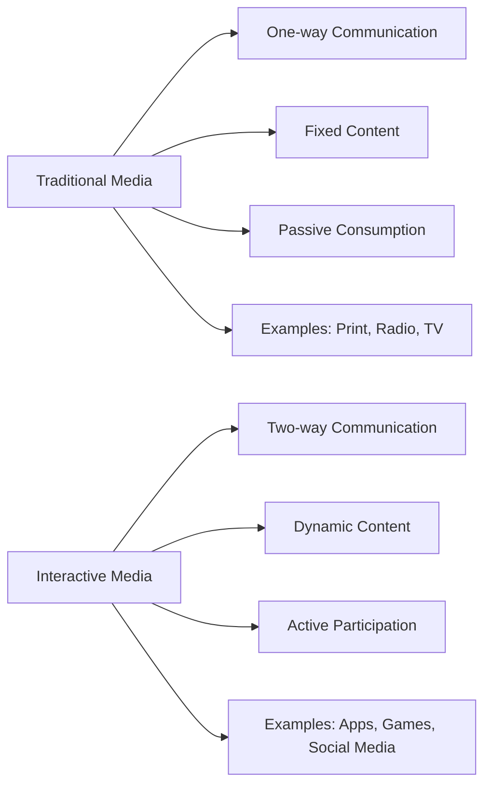
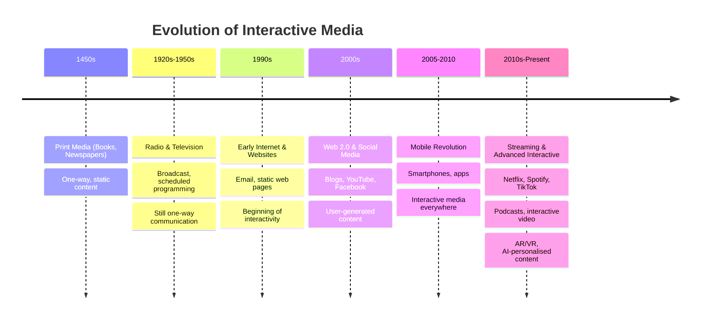
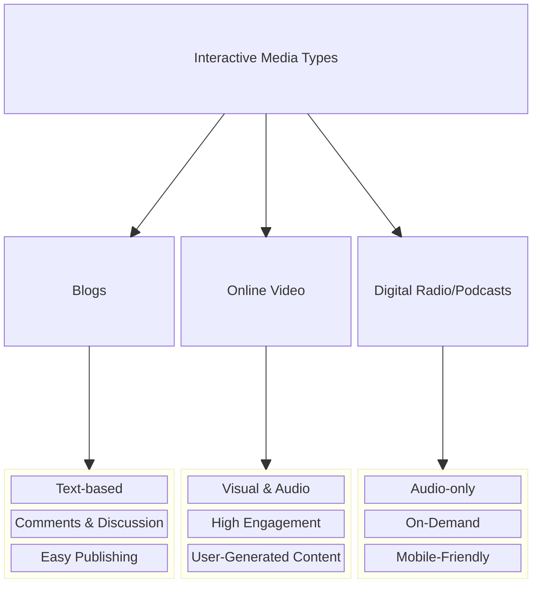
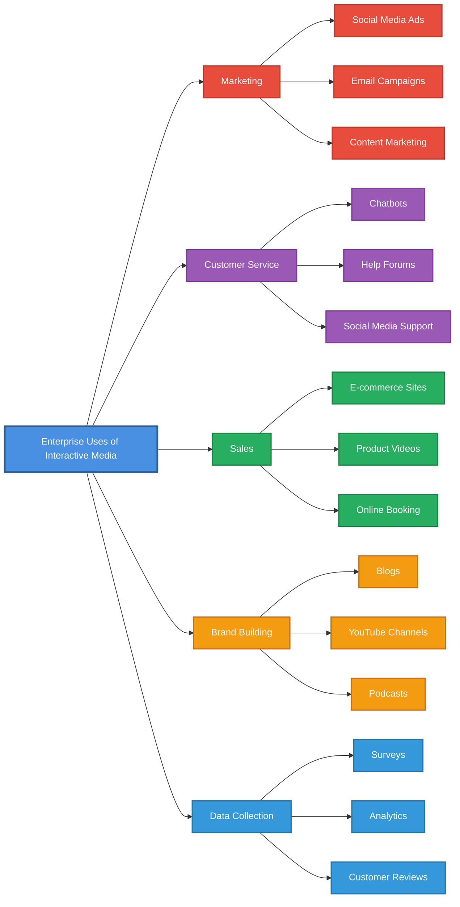
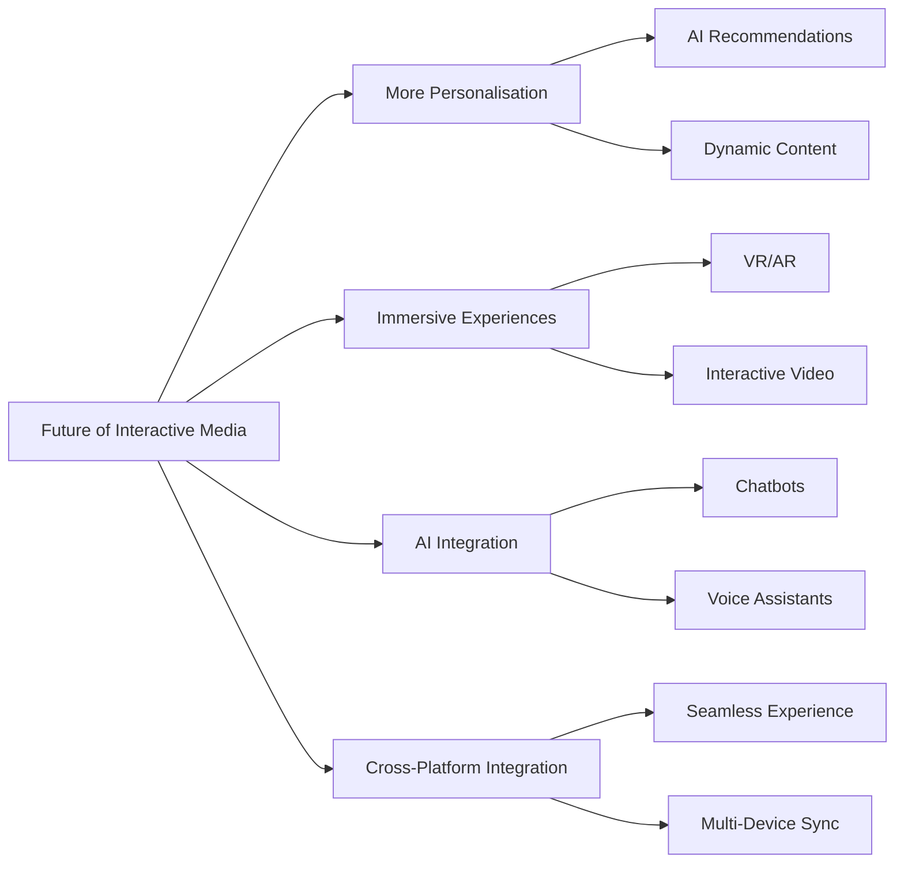

# Week 1: Introduction to Interactive Media

## Lesson Overview

!!! info "Lesson Details"
    **Duration:** 90-120 minutes  
    **Focus:** Understanding interactive media, its evolution, and its role in communication  
    **Mode:** Self-paced with guided activities  
    **Prerequisites:** None (assumed no prior learning)

## Learning Objectives

By the end of this lesson, you will be able to:

1. **Remember:** Define interactive media and identify its key characteristics
2. **Understand:** Explain the difference between interactive and traditional media
3. **Apply:** Categorise various forms of interactive media from everyday life
4. **Analyse:** Trace the evolution of interactive media from static to dynamic content
5. **Evaluate:** Assess how businesses use interactive media to communicate with audiences

!!! success "Success Criteria"
    - [ ] List and categorise at least 5 different types of interactive media
    - [ ] Explain the difference between interactive and non-interactive media with examples
    - [ ] Identify how businesses use interactive media to communicate with audiences
    - [ ] Create a timeline showing the evolution of at least 3 interactive media types

## Part 1: What is Interactive Media? (20-25 minutes)

### Understanding Interactive Media

**Interactive media** is any digital content that responds to user input in real-time, creating a two-way exchange of information between the user and the system.

**Key Characteristics:**

1. **User Input:** The user can control, manipulate, or influence the content
2. **Real-time Response:** The system reacts immediately to user actions
3. **Personalisation:** Content can adapt based on user preferences and behaviour
4. **Engagement:** Users actively participate rather than passively consume

**Traditional vs Interactive Media:**



**Examples of Interactive Media:**

- **Social Media Platforms:** Instagram, TikTok, Facebook (you post, comment, like, share)
- **Streaming Services:** Netflix, Spotify (you choose what to watch/listen, create playlists)
- **Blogs and Vlogs:** Medium, YouTube (you read/watch, comment, subscribe)
- **Online Games:** Fortnite, Minecraft (you control characters, make decisions)
- **Digital Radio/Podcasts:** Spotify podcasts (you select episodes, skip, rate)
- **Mobile Apps:** Food delivery apps, banking apps (you interact with buttons, forms, maps)

### Identifying Interactive Elements

Let's analyse a familiar platform together. Consider **YouTube**:

- **User Input:** Search queries, play/pause, skip, adjust volume, change quality
- **Real-time Response:** Video plays when you click, recommendations update, comments appear
- **Personalisation:** Recommended videos based on watch history, personalised homepage
- **Engagement:** Like, comment, subscribe, create playlists, share videos

!!! question "Think About It"
    What makes YouTube different from watching TV? Write down three specific differences.

### Interactive Media Scavenger Hunt

#### 📝 Activity 1: Finding Interactive Media in Your Daily Life

Complete the table below by identifying interactive media you've used today or this week. For each example, identify the interactive elements.

| Interactive Media | Type (App/Website/Game/etc.) | What can you do? (Interactive Elements) |
|-------------------|------------------------------|----------------------------------------|
| Example: Instagram | Social Media App | Post photos, like, comment, follow, message, create stories |
| 1. | | |
| 2. | | |
| 3. | | |
| 4. | | |
| 5. | | |
| 6. | | |
| 7. | | |
| 8. | | |
| 9. | | |
| 10. | | |

!!! tip "Helpful Hint"
    Look at your phone's apps, websites you visit, games you play, or streaming services you use. Remember, if you can click, tap, type, or control it, it's interactive!

#### 📝 Activity 2: Interactive vs Non-Interactive Sorting

Categorise the following media as either **Interactive (I)** or **Non-Interactive (NI)**:

1. Reading a printed newspaper: _____
2. Watching a live-streamed video where you can comment: _____
3. Listening to a radio broadcast: _____
4. Playing Spotify and creating a playlist: _____
5. Reading an e-book where you can highlight and add notes: _____
6. Watching a DVD movie: _____
7. Using a food delivery app to order dinner: _____
8. Reading a blog post and leaving a comment: _____
9. Watching broadcast television: _____
10. Using Google Maps to navigate: _____

??? success "Answers"
    1. NI (you can't interact with printed content)
    2. I (commenting creates interaction)
    3. NI (traditional radio is one-way)
    4. I (you control selection and organisation)
    5. I (annotations and highlights are user input)
    6. NI (fixed content, limited interaction beyond play/pause)
    7. I (selecting items, customising orders, tracking delivery)
    8. I (reading and commenting creates two-way exchange)
    9. NI (broadcast schedule, no user control)
    10. I (searching locations, choosing routes, real-time navigation)

---

## Part 2: The Evolution of Interactive Media (25-30 minutes)

### Tracing Media Evolution

Interactive media didn't appear overnight. It evolved through several stages as technology advanced:



**Key Milestones in Interactive Media Evolution:**

1. **Blogs (Late 1990s-2000s)**
    - Platforms like Blogger, WordPress emerged
    - Allowed anyone to publish content online
    - Readers could comment and engage
    - Evolution: Text blogs → Photo blogs → Video blogs (vlogs)

2. **Online Video (2005-Present)**
    - YouTube launched in 2005
    - Changed from one-way video consumption to interactive platform
    - Users could upload, comment, like, share, subscribe
    - Evolution: Desktop viewing → Mobile apps → Live streaming → Short-form video (TikTok)

3. **Digital Radio/Podcasts (2000s-Present)**
    - Transition from scheduled radio broadcasts to on-demand audio
    - iPod and iTunes popularised podcasts
    - Spotify, Apple Podcasts made discovery easier
    - Evolution: Downloaded episodes → Streaming → Interactive features (ratings, playlists, recommendations)

4. **Social Media (2006-Present)**
    - Platforms like Facebook (2004), Twitter (2006), Instagram (2010) launched
    - Changed from one-way communication to two-way interaction
    - Users became content creators, not just consumers
    - Real-time sharing and instant feedback became possible
    - Evolution: Desktop profiles → Mobile apps → Stories → Live streaming → Short-form video (Reels, TikTok)
    - Introduced concepts: hashtags, viral content, influencers, user-generated content

### Comparing Media Eras

Let's compare how people consumed news across different eras:

| Era | Medium | User Control | Interactivity | Personalisation |
|-----|--------|--------------|---------------|-----------------|
| 1950s | Newspaper | Choose which sections to read | None - can't respond or interact | None - same for everyone |
| 1980s | TV News | Choose which channel/time | None - broadcast schedule | None - same broadcast for all |
| 2000s | News Websites | Browse articles, search topics | Some - can comment on articles | Limited - basic recommendations |
| 2020s | News Apps/Social Media | Complete control over what/when | High - comment, share, react, discuss | High - personalised feed based on interests |

!!! question "Reflection Question"
    How has this evolution changed the way we understand and interact with news? What are the advantages and disadvantages?

    ??? success "Model Answer"
        **How news consumption has changed:**
        
        The evolution from newspapers to social media has fundamentally transformed news from a passive, scheduled activity into an active, on-demand experience. We've moved from receiving the same news as everyone else at set times (morning paper, 6pm bulletin) to accessing personalised news feeds instantly, whenever we want.
        
        **Advantages:**
        
        - **Instant Access:** Breaking news reaches us immediately, not the next morning or at 6pm
        - **Diverse Perspectives:** We can easily access multiple sources and viewpoints on the same story
        - **Engagement:** We can fact-check, discuss, and share news with others instantly
        - **Personalisation:** News feeds prioritise topics we're interested in, making information more relevant
        - **Multimedia:** News includes text, video, audio, and interactive graphics for better understanding
        - **Accessibility:** News is available anywhere via mobile devices, not just at home
        
        **Disadvantages:**
        
        - **Filter Bubbles:** Personalisation means we might only see news that confirms our existing beliefs
        - **Information Overload:** Constant news updates can be overwhelming and cause anxiety
        - **Misinformation:** Anyone can share "news" on social media, making it harder to verify accuracy
        - **Fragmented Understanding:** Reading only headlines or scrolling quickly means less deep understanding
        - **Echo Chambers:** We tend to interact with people who share our views, limiting exposure to different perspectives
        - **Loss of Shared Experience:** When everyone had the same news source, we had common ground for discussion; now we may be talking about completely different stories
        - **Reduced Context:** Short social media posts often lack the background and context traditional news provided
        
        **Overall Impact:** While we have unprecedented access to information and control over what we consume, we also need to be more critical consumers of news, actively seeking diverse sources and verifying information rather than relying on algorithms to inform us.

### Evolution Timeline Activity

#### 📝 Activity 3: Create Your Own Evolution Timeline

Choose **ONE** of the following media types and create a detailed timeline showing how it evolved:

- Music (from vinyl records to streaming)
- News (from newspapers to news apps)
- Entertainment (from cinema to streaming services)
- Education (from textbooks to online learning platforms)

**Your timeline should include:**

1. At least **5 stages** of evolution
2. **Approximate dates** for each stage
3. **Key technological changes** that enabled each evolution
4. **Changes in user interaction** at each stage

**Example Structure:**

```
Media Type: Music

Stage 1 (1950s-1970s): Vinyl Records
- Technology: Physical records, record players
- User Interaction: Buy albums, play in order, limited control

Stage 2 (1980s-1990s): ...

[Continue with remaining stages]
```

!!! tip "Research Tip"
    You may need to do a quick internet search to find exact dates and technological details. Focus on how user interaction changed at each stage.

---

## Part 3: Blogs, Online Video, and Digital Radio (20-25 minutes)

### Deep Dive into Three Key Interactive Media Types

| Aspect | Blogs | Online Video | Digital Radio/Podcasts |
|--------|-------|--------------|------------------------|
| **Definition** | Regularly updated websites featuring articles, thoughts, or commentary | Digital video content distributed over the internet | On-demand audio content available via internet streaming or download |
| **Prevalence** | Over 600 million blogs exist worldwide | YouTube has over 2 billion monthly users; TikTok has over 1 billion | Over 400 million podcast listeners worldwide |
| **Interactive Elements** | • Comments sections for reader feedback<br>• Social sharing buttons<br>• Subscribe/follow features<br>• Links to related content | • Play, pause, skip, speed controls<br>• Like, dislike, comment, share<br>• Subscribe to channels<br>• Create playlists<br>• Live chat during streams<br>• Choose video quality | • Choose episodes, skip sections<br>• Adjust playback speed<br>• Subscribe to shows<br>• Download for offline listening<br>• Rate and review<br>• Create playlists |
| **Examples** | Medium, WordPress blogs, company blogs, personal blogs | YouTube, TikTok, Vimeo, Instagram Reels, Twitch | Spotify, Apple Podcasts, Google Podcasts, internet radio stations |



### Analysing Interactive Features

Let's analyse a popular platform together. Consider **Spotify Podcasts**:

**Interactive Features:**

1. **Search & Discovery:** Find podcasts by topic, popularity, or recommendations
2. **Playback Controls:** Play, pause, rewind 15 seconds, fast-forward, adjust speed
3. **Subscription:** Follow your favourite podcasts for automatic updates
4. **Playlists:** Create custom collections of episodes
5. **Download:** Save episodes for offline listening
6. **Rating & Reviews:** Rate episodes and shows
7. **Sharing:** Send episodes to friends
8. **Personalised Recommendations:** Algorithm suggests new podcasts based on listening history

!!! question "Compare and Contrast"
    How is listening to a podcast on Spotify different from listening to traditional radio? List at least 4 differences.

    ??? success "Model Answer"
        **Key Differences Between Spotify Podcasts and Traditional Radio:**
        
        | Aspect | Traditional Radio | Spotify Podcasts |
        |--------|-------------------|------------------|
        | **1. Timing & Control** | Broadcasts at scheduled times - you must listen when it's on air | Complete control - listen anytime, pause, resume, and skip to any point |
        | **2. Content Selection** | Limited choice - whatever the station is broadcasting at that moment | Unlimited choice - millions of podcasts on any topic you're interested in |
        | **3. Personalisation** | Same content for all listeners in the broadcast area | Personalised recommendations based on your listening history and preferences |
        | **4. Interactivity** | One-way broadcast - no ability to respond or influence content | Two-way interaction - rate, review, subscribe, share, and save episodes |
        | **5. Portability** | Requires signal/reception - limited to certain geographical areas | Download for offline listening - take podcasts anywhere without internet |
        | **6. Discovery** | Limited to stations you know or can receive | Algorithm-driven discovery suggests new podcasts you might enjoy |
        
        **Additional Differences:**
        
        - **Playback Speed:** Spotify lets you speed up or slow down podcasts (1.5x, 2x speed); radio plays at normal speed only
        - **Episode Library:** Access entire back catalogues of shows; radio only broadcasts current content
        - **No Advertisements (with Premium):** Can pay to remove ads; radio always includes commercials
        - **Community Features:** Can see what friends are listening to and share recommendations; radio is isolated experience
        
        **Summary:** The biggest shift is from **passive, scheduled consumption** (traditional radio) to **active, on-demand control** (Spotify podcasts). You're no longer limited by broadcast schedules or geographical location - you have complete control over what, when, where, and how you listen.

### Media Analysis Activity

#### 📝 Activity 4: Comparing Interactive Media Platforms

Choose **ONE blog platform, ONE video platform, and ONE digital radio/podcast platform** that you're familiar with. Complete the comparison table:

| Platform Name | Type | Key Interactive Features (list at least 4) | What makes it engaging? | Who is the typical audience? |
|---------------|------|-------------------------------------------|------------------------|-------------------------|
| **Example:** Medium | Blog | Comment, clap (like), highlight text, follow writers | Quality long-form content, personalised recommendations | Adults interested in in-depth articles |
| | Blog | | | |
| | Video | | | |
| | Digital Radio/Podcast | | | |

#### 📝 Activity 5: Video Analysis

Watch one example from each category (spend about 5 minutes on each):

1. A **blog post** (written or video blog)
2. An **online video** (educational, entertainment, or news)
3. A **podcast episode** or **digital radio stream** (just a few minutes)

For each, answer:

- What interactive elements did you notice?
- How did you interact with the content?
- What made it engaging (or not engaging)?
- How is this different from traditional media (newspaper, TV, radio)?

---

## Part 4: Interactive Media in Enterprises (20-25 minutes)

### How Businesses Use Interactive Media

**Enterprises** (businesses and organisations) use interactive media to:

1. **Communicate with customers**
2. **Market products and services**
3. **Provide customer support**
4. **Build brand awareness**
5. **Gather customer feedback**
6. **Drive sales**

**Enterprise Applications of Interactive Media:**



**Real-World Examples:**

1. **Netflix (Streaming Service)**
    - **Communication:** Personalised recommendations, notifications about new content
    - **Engagement:** Rating system, profiles for family members, interactive content (Bandersnatch)
    - **Data:** Tracks viewing habits to improve recommendations and create targeted content

2. **Nike (Retail/Sports)**
    - **Marketing:** Instagram campaigns, YouTube videos featuring athletes
    - **Customer Service:** Nike app for product support and customisation
    - **Community:** Nike Run Club app creates engaged community of runners

3. **Qantas (Airlines)**
    - **Communication:** Social media updates about flights, blog posts about destinations
    - **Sales:** Online booking system, mobile app for check-in
    - **Loyalty:** Frequent Flyer app to track points and redeem rewards

4. **Woolworths (Supermarket)**
    - **Shopping:** App for online grocery ordering with delivery tracking
    - **Marketing:** Weekly catalogue on app, personalised offers
    - **Rewards:** Everyday Rewards program integrated into app

### Analysing a Business Example

Let's analyse how **Domino's Pizza** uses interactive media:

**Interactive Media Used:**

- **Mobile App:** Order customisation, delivery tracking in real-time, saved favourites
- **Website:** Pizza builder, online ordering, store locator
- **Social Media:** Facebook/Instagram for promotions, customer service via DMs
- **Email:** Personalised offers based on order history

**Benefits to the Business:**

- Increased sales through convenient ordering
- Customer data collection for personalisation
- Reduced phone orders (saves staff time)
- Direct marketing channel

**Benefits to Customers:**

- Convenience of ordering anytime
- Track delivery in real-time
- Save favourite orders
- Access to exclusive online deals

!!! question "Critical Thinking"
    Why would Domino's invest heavily in interactive media instead of just relying on phone orders? What advantages does it give them?

    ??? success "Model Answer"
        **Why Domino's Invests Heavily in Interactive Media:**
        
        **Business Advantages:**
        
        1. **Increased Efficiency & Cost Savings**
            - Automated ordering reduces staff needed to answer phones
            - Fewer mistakes from mishearing orders over the phone
            - Staff can focus on making pizzas rather than taking orders
            - One system handles thousands of orders simultaneously (phone lines are limited)
        
        2. **Higher Sales & Revenue**
            - Customers can order 24/7, even when stores are closed for phone orders
            - Visual pizza builder encourages customisation and upselling ("add extra toppings?")
            - Impulse ordering is easier - customers don't have to talk to someone
            - Saved favourites encourage repeat purchases with one-click reordering
        
        3. **Valuable Customer Data**
            - Track what customers order, when they order, and how often
            - Use data to send targeted promotions (e.g., "Your favourite pizza is on special!")
            - Identify popular items and trends to inform menu decisions
            - Build customer profiles for personalised marketing
        
        4. **Better Customer Experience**
            - Real-time tracking reduces "where's my pizza?" phone calls
            - Customers have complete control and transparency
            - Visual interface reduces ordering errors
            - Faster ordering process (no waiting on hold)
        
        5. **Competitive Advantage**
            - Stay competitive with other pizza chains offering similar technology
            - Appeal to younger, tech-savvy customers who prefer apps over phone calls
            - Brand positioning as modern and innovative
            - Customer loyalty through convenience
        
        6. **Scalability**
            - Phone orders limited by staff availability and phone lines
            - Interactive systems can handle unlimited simultaneous orders during busy periods
            - Easier to expand to new locations with consistent ordering system
        
        **Real-World Impact:**
        
        - Domino's reports that over **75% of orders** now come through digital channels (app/website), not phone
        - Digital customers typically spend **more per order** due to visual upselling
        - The famous "Pizza Tracker" feature reduced customer service calls by an estimated **30%**
        - Investment in technology helped Domino's become one of the most successful pizza chains globally
        
        **Summary:** Interactive media isn't just a "nice to have" - it's a fundamental business strategy that increases efficiency, revenue, and customer satisfaction while reducing costs. The initial investment in technology pays for itself many times over through increased sales and operational savings. Companies that don't adapt to interactive media risk losing customers to competitors who offer more convenient digital experiences.

### Enterprise Analysis Activity

#### 📝 Activity 6: Business Interactive Media Audit

Choose **TWO** businesses or organisations you're familiar with (can be local or international). For each, investigate and complete:

```
**Business Name:** _________________________

**Industry:** _________________________

**Interactive Media Used (list all you can find):**

1. Website: Yes / No - **What can users do on it?**
2. Mobile App: Yes / No - **What features does it have?**
3. Social Media: Yes / No - **Which platforms? How do they use them?**
4. Email/Newsletter: Yes / No - **What type of content?**
5. Blog/Video Content: Yes / No - **Where is it hosted? What topics?**
6. Other Interactive Media:

**How does this business communicate with customers through interactive media?**

**How does interactive media help this business achieve its goals?**

**What data might this business collect from users through these interactive media?**

```
Repeat for your second business choice.

!!! tip "Investigation Tips"
    - Visit the company's website
    - Check their social media profiles (Instagram, Facebook, TikTok, LinkedIn)
    - Look for their app in the App Store or Google Play
    - Think about how you or others interact with this business online

---

## Part 5: Real-World Impact and Future Directions (15-20 minutes)

### Understanding the Impact

**How Interactive Media Has Changed Communication:**

1. **From Broadcast to Conversation**
   - Old model: Company → Customer (one-way)
   - New model: Company ↔ Customer (two-way dialogue)

2. **Instant Feedback**
   - Businesses know immediately how customers respond
   - Customers can share experiences publicly (reviews, social media)

3. **Personalisation at Scale**
   - Content tailored to individual preferences
   - Marketing targeted to specific audiences

4. **Global Reach, Local Feel**
   - Small businesses can reach worldwide audiences
   - Large companies can personalise for local markets

5. **User-Generated Content**
   - Customers become content creators
   - Businesses can leverage customer creativity

**Emerging Trends:**

- **Interactive Video:** Choose-your-own-adventure style content
- **Voice Interaction:** Podcasts and audio content with smart speakers
- **Augmented Reality (AR):** Try-before-you-buy experiences
- **Live Streaming:** Real-time interaction between creators and audiences
- **AI-Powered Personalisation:** Even more tailored content recommendations



### Discussing Impact

Consider this scenario:

> **2010:** You want to listen to music. You buy a CD from a shop, take it home, and play it on your stereo. You listen to the album in the order the artist intended.

> **2024:** You open Spotify, search for a song you heard on TikTok, add it to your personalised playlist, share it with friends, see what they're listening to, and discover new artists through recommendations.

**What changed?**

- **Control:** Complete user control over what to listen to and when
- **Discovery:** Algorithm-driven recommendations vs. radio or friend suggestions
- **Social:** Shared playlists and seeing what friends listen to
- **Access:** Millions of songs instantly vs. purchasing individual albums
- **Data:** Spotify learns your preferences and improves recommendations *(does it?)*

### Synthesis and Reflection

#### 📝 Activity 7: Interview Someone from a Different Generation

Interview a parent, grandparent, or older family member (via phone/video call if needed) about how they consumed media when they were your age. Ask:

1. How did you listen to music?
2. How did you watch TV shows or movies?
3. How did you read news or magazines?
4. How did you communicate with friends?
5. What do you think is the biggest change in media since then?

**Compare their experiences to yours today. Write a short reflection (150-200 words) about:**

- What has changed the most?
- What benefits do we have today?
- What might have been better about media consumption in the past?
- How do you think interactive media will continue to evolve?

??? tip "How to Write a Reflection"
    
    **Use the 3-Part Structure:**
    
    1. **What?** - Describe what you learned or experienced
        - *"I discovered that interactive media has evolved from..."*
    
    2. **So What?** - Explain why it matters or surprised you
        - *"This is significant because..."*
        - *"This changed my understanding of..."*
    
    3. **Now What?** - Connect to your own life or future
        - *"This makes me think differently about..."*
        - *"I will now..."*

#### 📝 Activity 8: Future Prediction

Based on what you've learned about the evolution of interactive media, predict:

**What will interactive media look like in 2035 (10 years from now)?**

Consider:

- How will we consume video content?
- How will blogs/written content evolve?
- What will replace or enhance podcasts?
- How will businesses communicate with customers?
- What new technologies might emerge?

Write 3-5 specific predictions and explain your reasoning for each.

---

## Syllabus Alignment

!!! abstract "Interactive Media and User Experience"
    
    This lesson addresses the following syllabus dot points:
    
    **✓ Investigate how interactive media and the user experience (UX) is used to communicate information to an audience**
    
    - Covered in Content Parts 1, 4, and 5
    - Activities 1, 2, 6, and 7 directly address this
    
    **✓ Research the evolution of interactive media**
    
    - Covered comprehensively in Content Part 2
    - Activities 3 and 7 directly address this
    
    **✓ Including: prevalence of blogs, online video and digital radio**
    
    - Covered in detail in Content Part 3
    - Activities 4 and 5 directly address this
    
    **✓ Describe the contribution of interactive media systems to a range of enterprises**
    
    - Covered in Content Part 4
    - Activity 6 directly addresses this

---

## Knowledge Check

!!! question "Self-Assessment Checklist"
    
    Before moving on, ensure you can confidently answer YES to all of these:
    
    **Understanding Interactive Media:**

    - [ ] Can I explain what makes media "interactive"?
    - [ ] Can I identify the three key characteristics of interactive media?
    - [ ] Can I give at least 5 examples of interactive media from my daily life?
    
    **Evolution of Interactive Media:**

    - [ ] Can I describe how media has evolved from traditional to interactive?
    - [ ] Can I explain at least 3 major milestones in interactive media evolution?
    - [ ] Can I create a timeline showing how one type of media has evolved?
    
    **Blogs, Video, and Digital Radio:**

    - [ ] Can I describe what blogs, online video, and podcasts are?
    - [ ] Can I identify at least 4 interactive features for each type?
    - [ ] Can I explain how these differ from traditional newspaper, TV, and radio?
    
    **Enterprise Applications:**

    - [ ] Can I describe at least 4 ways businesses use interactive media?
    - [ ] Can I give real-world examples of businesses using interactive media?
    - [ ] Can I explain the benefits of interactive media for both businesses and customers?
    
    **Impact and Future:**

    - [ ] Can I explain how interactive media has changed communication?
    - [ ] Can I discuss the impact on individuals and society?
    - [ ] Can I make informed predictions about future developments?
    
    If you answered NO to any of these, review that section before continuing.

---

## Quiz

<quiz>
**Question 1: What are the three key characteristics that make media "interactive"?** (Remember)

- [ ] Digital, online, and modern
- [x] User input, real-time response, and personalisation
- [ ] Visual, audio, and text-based
- [ ] Free, accessible, and entertaining

---

**Explanation**

Interactive media must have three key characteristics: **user input** (the user can control or influence content), **real-time response** (the system reacts immediately), and **personalisation** (content adapts to user preferences).

- Option A describes general digital media qualities, not specifically interactivity
- Option C describes content formats, not interactive characteristics
- Option D describes access qualities, not what makes something interactive

</quiz>

<quiz>
**Question 2: Which of the following is an example of interactive media?** (Understand)

- [ ] Reading a printed newspaper
- [ ] Watching a DVD movie
- [x] Using Spotify to create a playlist
- [ ] Listening to a radio broadcast

---

**Explanation**

Spotify allows you to create playlists, which demonstrates **user input** (selecting songs), **real-time response** (playlist updates immediately), and **personalisation** (your custom collection). This makes it interactive media.

- Option A is non-interactive - you cannot change or respond to printed content
- Option B has limited interaction (only basic play/pause controls, fixed content)
- Option D is traditional one-way broadcast media with no user control over content

</quiz>

<quiz>
**Question 3: A student wants to analyse how interactive media has evolved. Which example best demonstrates the progression from non-interactive to interactive media?** (Apply)

- [ ] Books → E-books → Audio books
- [x] Radio broadcasts → Podcasts on Spotify → Interactive podcast apps with comments
- [ ] Letters → Emails → Text messages
- [ ] Cinema → DVDs → Blu-ray

---

**Explanation**

This example shows clear progression: **Radio** (one-way broadcast, no control) → **Podcasts on Spotify** (on-demand, user controls playback) → **Interactive podcast apps** (users can comment, rate, share, creating two-way interaction). Each stage adds more interactivity.

- Option A shows format changes but limited increase in interactivity
- Option C shows communication evolution but doesn't demonstrate the shift from passive to interactive media consumption
- Option D shows quality improvements in video but minimal increase in interactivity

</quiz>

<quiz>
**Question 4: A teacher notices students prefer watching YouTube tutorials over reading textbooks. Which statement best analyses why this shift has occurred?** (Analyse)

- [ ] YouTube is free while textbooks cost money, so economic factors drive this change. Students choose the platform that doesn't require purchasing expensive materials each semester.
- [x] YouTube provides visual demonstrations, user-controlled pacing, and diverse teaching styles that match individual learning preferences
- [ ] Students lack the attention span for reading and prefer passive video consumption. The decline in reading skills means they avoid text-based learning whenever possible.
- [ ] YouTube videos are shorter than textbook chapters, making them quicker to consume. Students can watch a 10-minute video instead of reading for an hour.

---

**Explanation**

This analysis correctly identifies the **interactive advantages**: visual learning (seeing demonstrations), user control (pause/replay at own pace), and personalisation (choosing teaching styles). These interactive elements fundamentally change learning engagement.

- Option A oversimplifies to cost without considering interactive experience differences
- Option C makes unfounded assumptions about attention span rather than analysing interactive media characteristics
- Option D focuses only on length, ignoring the interactive features that enhance learning

</quiz>

<quiz>
**Question 5: Three businesses adopt different interactive media strategies. Which business has made the best strategic decision for long-term success?** (Evaluate)

- [ ] Business A creates profiles on every available social media platform (Facebook, Instagram, TikTok, Twitter, LinkedIn, Snapchat, Pinterest) to maximise their online presence and reach all potential customers wherever they are.
- [ ] Business B built a professional website with all their information and contact details, believing that customers will find them through search engines when they need their services.
- [ ] Business C focuses exclusively on Instagram since their analytics show that 80% of current sales come from that platform, concentrating all their marketing budget and effort there.
- [x] Business D integrates their app, social media, and email with shared customer data to personalise experiences across platforms

---

**Explanation**

Business D demonstrates the best strategy because **integrated systems with shared data** enable consistent experiences, comprehensive customer understanding, and effective personalisation. Integration provides more value than platform quantity or single-channel focus.

- Option A spreads resources too thin without strategy - presence doesn't equal effectiveness
- Option B is too limited and ignores how customers want to interact with businesses
- Option C creates vulnerability - relying on one platform is risky if algorithms change

</quiz>

<quiz>
**Question 6: FitLife Gym's membership manager reports that 65% of new members cancel after one month. They've asked you to propose an interactive media solution. Which proposal best addresses their retention problem?** (Create)

- [ ] Launch Instagram and Facebook accounts posting daily workout tips, member success stories, and class schedules. Include motivational quotes and nutrition advice with professional photography to build brand awareness and community engagement.
- [x] Develop a member app featuring workout logging, progress tracking with visual graphs, achievement badges, and group challenges with leaderboards
- [ ] Redesign the website to include virtual gym tours, detailed trainer profiles with video introductions, online class booking system, membership plan comparisons, and an FAQ section addressing common questions about facilities and services.
- [ ] Implement an email marketing system sending personalised workout plans, weekly fitness tips based on member goals, class reminders, renewal discount offers, and birthday messages to build stronger customer relationships.

---

**Explanation**

The app solution directly targets **why members quit**, lack of visible progress and motivation. Interactive features provide: 

1. **immediate feedback** through workout logging
2. **visual progress** that demonstrates results
3. **gamification** maintaining engagement
4. **social accountability** through challenges. 

This creates ongoing value that keeps members actively participating.

- Option A builds awareness but offers no interactive tools for personal progress tracking or motivation
- Option C improves initial sign-up experience but doesn't provide ongoing engagement after joining
- Option D communicates with members but remains one-way - lacks the interactive tracking and community features that drive behaviour change

</quiz>

---

## Teaching Notes

??? note "Differentiation Strategies"
    
    **For students who need additional support:**
    
    - Provide pre-made lists of interactive media platforms to choose from for activities
    - Offer sentence starters for written responses (e.g., "Interactive media is different from traditional media because...")
    - Allow students to draw timelines instead of writing detailed descriptions
    - Provide video tutorials on using specific platforms (YouTube, Spotify, etc.)
    - Pair with a peer for the interview activity if family members unavailable
    - Reduce the number of examples required (e.g., 5 instead of 10 for scavenger hunt)
    
    **For students who need extension:**
    
    - Research the technical infrastructure behind interactive media (servers, content delivery networks, APIs)
    - Investigate privacy and ethical concerns with interactive media data collection
    - Create a detailed business plan for how a company could use interactive media for a specific goal
    - Research emerging technologies (Web3, metaverse, AI-generated content) and their impact on interactive media
    - Conduct a comparative analysis of how different countries/cultures use interactive media
    - Create an interactive media prototype using simple tools (Google Forms, basic website)
    
    **For different learning styles:**
    
    - **Visual learners:** Emphasise diagrams, timelines, video examples
    - **Auditory learners:** Encourage podcast listening, discussion, interview activity
    - **Kinaesthetic learners:** Hands-on activities using actual platforms, creating timelines physically
    - **Reading/Writing learners:** Provide blog articles to read, written reflections

??? warning "Common Misconceptions"
    
    **Misconception 1:** "If it's digital, it's interactive"
    
    - **Reality:** Digital doesn't automatically mean interactive. A PDF document is digital but not interactive. Interactivity requires user input that changes the experience.
    - **Address by:** Using clear examples of digital-but-not-interactive media (e.g., watching a pre-recorded video with no controls vs. choosing what to watch on Netflix)
    
    **Misconception 2:** "Interactive media is just social media"
    
    - **Reality:** Social media is one type of interactive media, but the category is much broader (games, apps, streaming services, websites, etc.)
    - **Address by:** Creating comprehensive categorisation activities showing the breadth of interactive media types
    
    **Misconception 3:** "Interactive media is only for entertainment"
    
    - **Reality:** Interactive media serves many purposes: education, business, healthcare, government services, etc.
    - **Address by:** Highlighting diverse enterprise applications and real-world examples beyond entertainment
    
    **Misconception 4:** "The evolution of media is linear and replaced old forms"
    
    - **Reality:** New media types often complement rather than replace old ones. Radio still exists despite TV, podcasts, and streaming.
    - **Address by:** Discussing coexistence of media types and why different forms serve different purposes
    
    **Misconception 5:** "Interactive media is always better than traditional media"
    
    - **Reality:** Each has strengths and weaknesses. Sometimes passive consumption is preferred; interactivity can be overwhelming or distracting.
    - **Address by:** Encouraging critical evaluation of when interactivity adds value vs. when it doesn't

??? info "Formative Assessment Opportunities"
    
    **During the Lesson:**
    
    1. **Activity 1 - Scavenger Hunt:** Check if students can identify genuine interactive elements vs. surface-level features
        - Look for: Specific user actions, not just "you can use it"
        - Feedback: Ask "What can you DO on that platform?" if responses are vague
    
    2. **Activity 2 - Sorting Exercise:** Assess understanding of interactivity definition
        - Look for: Correct identification of two-way vs. one-way communication
        - Feedback: For incorrect answers, ask "Can you control or change this content?"
    
    3. **Activity 3 - Evolution Timeline:** Evaluate understanding of technological progression
        - Look for: Clear stages with technological drivers, not just date lists
        - Feedback: "What technology made this stage possible?"
    
    4. **Activity 4 - Platform Comparison:** Check depth of analysis of interactive features
        - Look for: Specific features, not generic descriptions
        - Feedback: "Can you describe exactly how a user interacts with this feature?"
    
    5. **Activity 6 - Business Audit:** Assess application of concepts to real-world contexts
        - Look for: Connection between business goals and interactive media choices
        - Feedback: "Why would this business choose this particular platform?"
    
    **Exit Ticket (5 minutes at end):**
    
    Ask students to respond to these three quick questions:
    
    1. Name one thing you learned today that surprised you
    2. Give one example of interactive media and explain what makes it interactive
    3. What's one question you still have about interactive media?
    
    **Peer Review Opportunity:**
    
    - Students exchange their evolution timelines (Activity 3) and provide feedback:
        - Does it show clear progression?
        - Are the interactive elements identified?
        - Are dates approximately correct?
    
    **Self-Reflection:**
    
    - Use the Knowledge Check checklist as a formative self-assessment tool
    - Students identify their own areas of confidence and areas needing review

??? tip "Extension Resources"
    
    **For Further Exploration:**
    
    - **Interactive Media History:** Media Evolution Explorer (interactive timeline at various museum websites)
    - **Industry Insights:** TED Talks on digital media transformation
    - **Hands-on Creation:** Try creating a simple blog on Medium or WordPress
    - **Podcast Recommendations:** "Reply All" for internet culture stories
    - **Books:** "The Shallows" by Nicholas Carr (how internet changes thinking)
    - **Current Events:** Follow tech news websites for emerging interactive media trends
    
    **Skills Development:**
    
    - Begin exploring UX/UI design principles (prepares for future lessons)
    - Learn basic HTML/CSS to understand how interactive websites work
    - Experiment with content creation tools (Canva, basic video editing)
    - Analyse user interfaces of favourite apps - what makes them engaging?

---

**End of Lesson 1**

!!! success "Well Done!"
    You've completed Week 1 of **Interactive Media and User Experience**. You should now understand what interactive media is, how it has evolved, and how businesses use it to communicate with audiences. Next week, we'll explore how interactive media influences human behaviour and consumer choices!