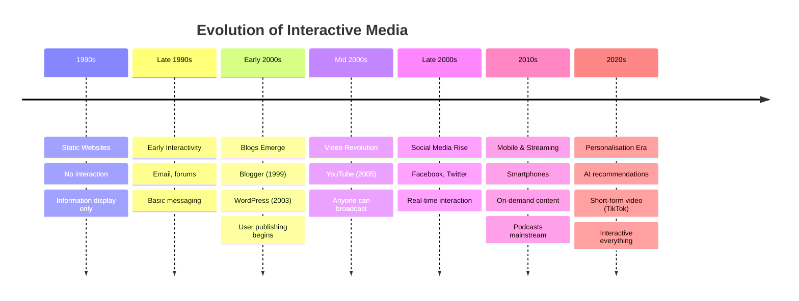
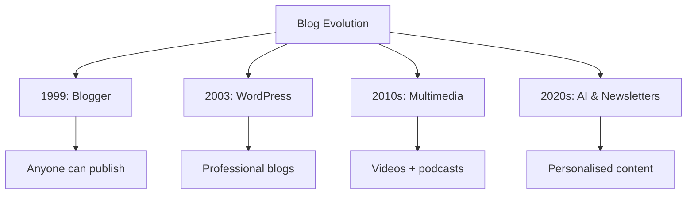

# Evolution of Interactive Media

!!! abstract "Lesson Overview"
    This lesson traces how interactive media evolved from static websites to today's dynamic platforms, focusing on blogs, online video, and digital radio.

### Part A: From Static to Interactive (30 mins)

#### The Transformation Timeline

---

#### Stage 1: Static Web (1990s)

**Characteristics:**

- Basic HTML websites
- Read-only information
- No user accounts or personalisation
- Limited multimedia (slow internet)
- One-way communication

**What you could do:**

- Read text
- View images
- Click links to other pages
- That's it

**Example:** Company websites were like online brochures - just information, no interaction.

---

#### Stage 2: Early Interactivity (Late 1990s)

**New capabilities:**

- Email integration
- Forums and message boards
- Guest books
- Basic search functions
- User registration

**What changed:**

- Users could leave messages
- Asynchronous communication (post and check back later)
- Communities forming around topics
- Still mostly text-based

**Example:** Forums where people discussed hobbies - you post a question, come back tomorrow for answers.

---

#### Stage 3: Web 2.0 - User-Generated Content (Early-Mid 2000s)

**Major shift:** From consumers to creators

**Key developments:**

- Blogs become mainstream
- Wikis (Wikipedia, 2001)
- Social networking begins (Friendster, MySpace)
- Photo sharing (Flickr)
- Faster internet enables more media

**Why this mattered:**

- Anyone could publish content
- No technical skills required
- Democratisation of media
- Voice given to millions

---

### Part B: Evolution of Blogs (25 mins)

#### The Blog Revolution

**Pre-Blog Era (Pre-1999)**

- Only tech-savvy people could create websites
- Required HTML knowledge
- Expensive hosting
- Time-consuming updates

**1999: Blogger Launches**

- Free blogging platform
- No coding required
- Simple interface
- Anyone could start a blog in minutes

**Impact:**

- Millions of people started blogging
- Personal diaries online
- Citizen journalism emerged
- New voices in media

---

**2003: WordPress Created**

- More customization options
- Better design templates
- Plugin ecosystem
- Became the dominant platform

**Impact:**

- Blogs became more professional
- Businesses started blogging
- Bloggers became influencers
- New career paths emerged

---

**Mid-Late 2000s: Blog Evolution**

- **Monetisation** - ads, sponsored content
- **Multimedia** - photos, videos embedded
- **Social integration** - share to Facebook, Twitter
- **Mobile access** - read and write on phones
- **Commenting systems** improved
- **SEO** - blogs became searchable (Search engine optimisation)

---

**2010s: Blogs Adapt**

- **Competition** from social media
- Shift to **niche topics**
- **Professional blogging** as career
- **Video blogs (vlogs)** emerge
- Integration with YouTube
- **Microblogging** (Twitter, Tumblr)

---

**Today: Blogs in 2020s**

- **Over 600 million blogs** worldwide
- **Newsletter revival** (Substack, Medium)
- **Hybrid formats** - text + video + audio
- **AI-assisted writing** tools
- Still relevant for long-form content
- SEO remains important for businesses

---

### Part C: Evolution of Online Video (25 mins)

#### The Video Revolution

**Pre-YouTube (Before 2005)**

- **Expensive equipment** needed for video production
- **Broadcasting** required TV networks
- **Distribution** was limited and costly
- Only professionals could create video content
- Video online was low quality, slow loading

---

**2005: YouTube Launches**

**What changed:**

- Upload videos from any camera
- Free hosting and distribution
- Global audience instantly
- No broadcasting license needed
- Built-in community (comments, subscriptions)

**Impact:**

- **Democratised video creation**
- Amateur creators reached millions
- New content types emerged (tutorials, vlogs, reviews)
- **"YouTuber" became a career**
- Traditional media disrupted

---

**2006-2010: Video Platforms Multiply**

- **Vimeo** (2004, grew in popularity) - higher quality, creative focus
- **Live streaming** platforms emerge
- **Mobile video** becomes possible
- HD video supported
- Monetisation for creators (ads, partnerships)

---

**2010s: Mobile Video Explosion**

**Key developments:**

- Smartphones with HD cameras
- 4G internet enables streaming
- **Instagram** (2010) adds video
- **Vine** (2013-2017) - 6-second looping videos
- **Periscope** (2015) - live streaming
- **Instagram Stories** (2016) - vertical, temporary video
- **Musical.ly** → **TikTok** (2018) - short-form, algorithm-driven

**Shift in behaviour:**

- Vertical video becomes normal
- Shorter content preferred
- Mobile-first creation and consumption
- Real-time interaction

---

**Late 2010s-2020s: Short-Form Dominance**

**TikTok changes everything:**

- 15-60 second videos
- Algorithm shows content (not just subscriptions)
- Easy editing tools built-in
- Music integration
- Duets and stitches (interactive features)

**Other platforms adapt:**

- **YouTube Shorts**
- **Instagram Reels**
- **Facebook Reels**

**Current state of online video:**

- **2.7+ billion** YouTube users
- **500 hours** uploaded to YouTube every minute
- Short-form video preferred by younger audiences
- Live streaming mainstream (Twitch, YouTube Live)
- Interactive features standard (polls, Q&A)
- AI-powered editing and recommendations

---

### Part D: Evolution of Digital Radio/Podcasts (20 mins)

#### From Radio to Podcasts

**Traditional Radio Era**

- Scheduled programming
- Listen or miss it
- Limited stations based on location
- No control over content
- Advertising interruptions

---

**Early Digital Radio (2000s)**

- **Internet radio** - streams from anywhere
- More station choices
- Still live, still scheduled
- Required constant internet connection

---

**2004-2005: Podcasting Invented**

**What is a podcast?**

- Pre-recorded audio you download or stream
- Listen anytime, anywhere
- Subscribe to series
- Named after iPod + broadcast

**2005: iTunes adds podcasts**

- Easy discovery and downloading
- Automatic updates for subscriptions
- Free content
- Simple for creators to publish

**Early podcasts:**

- Mostly hobbyists
- Tech enthusiasts
- Talk shows and commentary
- Audio quality varied

---

**2010s: Podcast Growth**

**Smartphone impact:**

- Always have podcast player with you
- Listen during commute, exercise, chores
- Easy to discover new shows
- Share episodes with friends

**Professional podcasts emerge:**

- **Serial** (2014) - 80+ million downloads
- Podcasts become mainstream
- Traditional radio hosts start podcasts
- Businesses create branded podcasts
- News organizations launch podcast versions

**Platforms multiply:**

- Apple Podcasts (formerly iTunes)
- Spotify enters podcasting (2015+)
- Google Podcasts
- Stitcher
- Many others

---

**Late 2010s-2020s: Podcast Boom**

**Growth explosion:**

- **2019**: 700,000 podcasts
- **2023**: 5+ million podcasts
- **464+ million listeners** globally
- **62% growth** in listening since 2020

**Why podcasts grew:**

- Pandemic increased audio consumption
- Commuting and driving time
- Multitasking friendly (listen while working)
- Intimate format (feels personal)
- Niche content for every interest
- Free to access

**Evolution of features:**

- **Transcripts** for accessibility and SEO
- **Chapter markers** to skip sections
- **Video podcasts** (YouTube podcasts)
- **Interactive elements** (polls, Q&A)
- **Dynamic ads** personalized by location
- **Premium content** (Spotify exclusives, Patreon)

**Current state:**

- Spotify dominates podcast listening
- Anyone can start a podcast easily
- Professional production quality expected
- Monetisation through ads, sponsorships, subscriptions
- Used for education, entertainment, marketing, storytelling

---

### 📝 Activity 2: Evolution Timeline Analysis (20 mins)

!!! tip "Research Task"
    Create your own detailed timeline for ONE type of interactive media

**Instructions:**

**Choose ONE:**

- Blogs
- Online Video
- Digital Radio/Podcasts

**Research and create a detailed timeline showing:**

| Year | Development | Impact on Users | Impact on Content Creators |
|------|-------------|----------------|---------------------------|
| Example: 2005 | YouTube launches | Can watch any video anytime | Anyone can upload and reach global audience |
| | | | |
| | | | |
| | | | |

**Include at least 6 major developments**

**Reflection Questions:**

1. **What was the most significant change in your chosen media type?**
   
   _Your answer:_

2. **How did technology improvements (internet speed, smartphones) influence evolution?**
   
   _Your answer:_

3. **How did user behavior change as the platform evolved?**
   
   _Your answer:_

---

### ✅ Self-Check Questions

!!! question "Knowledge Check"
    1. What characterised the "static web" era of the 1990s?
    2. When did blogs become mainstream and what platforms drove this?
    3. Why was YouTube's launch in 2005 revolutionary?
    4. What is the difference between traditional radio and podcasts?
    5. How did smartphones influence the evolution of interactive media?

??? success "Answers"
    1. One-way information display, no user interaction, read-only, limited multimedia
    2. Early 2000s; Blogger (1999) and WordPress (2003) made blogging accessible to everyone
    3. It allowed anyone to upload and share video globally for free, democratising video content creation
    4. Traditional radio is scheduled, live broadcasts; podcasts are on-demand, you choose when to listen
    5. Smartphones enabled mobile access, creation, and consumption of content anywhere, anytime, driving massive growth
