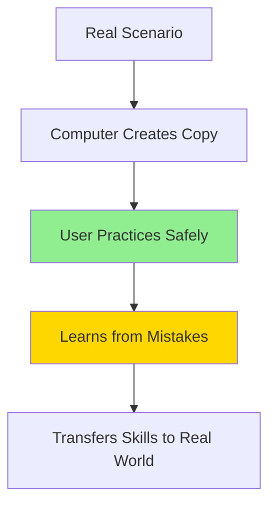
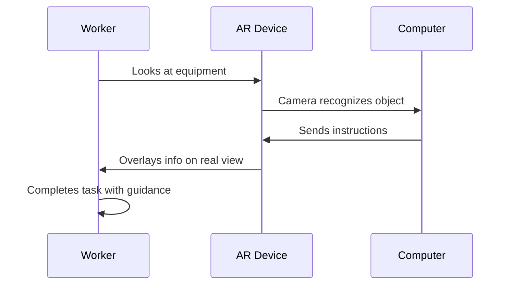
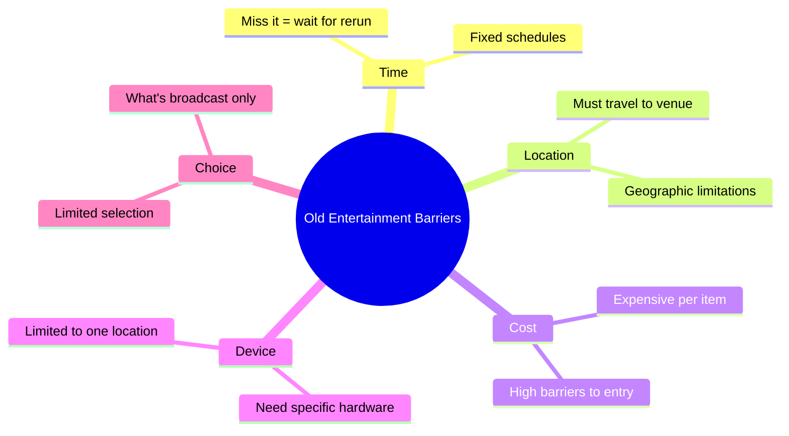

# Interactive Media in Enterprises

!!! info "Lesson Overview"
    **Duration:** 2 hours (120 minutes)  
    **Focus:** How businesses use interactive media for training, entertainment, and operations  
    **Mode:** Self-paced with structured activities  
    **Prerequisites:** 
    
    - [Understanding of what is interactive media](./what_is_interactive_media.md)
    - [Familiarity with blogs, online video, and digital radio](./prevalence.md)
    - [Knowledge of how interactive media evolved](./evolution.md)

## Learning Objectives

By the end of this lesson, you will be able to:

1. **Describe** how simulation, gamification, and AR support online training and learning in enterprises
2. **Explain** how streaming services, gaming platforms, and VR improve access to entertainment
3. **Analyse** how specialist apps support delivery tracking, advertising, and communication in businesses
4. **Evaluate** which interactive media technology best suits specific business problems

---

## Part 1: Training Technologies (20 mins)

### Introduction to Business Training Solutions

!!! question "Think About This"
    Businesses need to train employees, but traditional training has problems:
    
    - 🚫 Expensive (travel, trainers, facilities)
    - 🚫 Dangerous (can't practice risky procedures)
    - 🚫 Time-consuming (takes people away from work)
    - 🚫 Boring (low completion rates)
    
    **Question:** How could interactive media solve these problems?

---

### 1.1 Simulation

**What is it?**

Simulation creates computer-generated environments that replicate real-world scenarios for safe practice.



**Key Features:**

- ✅ Safe environment (no risk of injury or damage)
- ✅ Repeatable (practice same scenario 100 times)
- ✅ Experience rare situations
- ✅ Immediate feedback

**Business Example: Flight Simulators**

- Airlines train pilots without using real aircraft
- Practice emergencies safely
- Save millions in fuel and aircraft wear
- Required training: 40+ hours annually per pilot

**Business Example: Medical Simulators**

- Surgeons practice procedures without risk to patients
- Practice rare conditions they may never see
- Build muscle memory and confidence

!!! video "Recommended Additional Material"
    **Videos:**

    - [:simple-youtube:{ .youtube } Flight Simulator Training:](https://www.youtube.com/watch?v=rYKqVjJfMGE) 
        - Search YouTube for "Airbus A350 simulator training" or "Flight simulator cockpit"
    - Medical Simulation: 
        - Search "medical simulation training" or "surgical simulator demo"
    - Mining Equipment Simulation: 
        - Search "heavy equipment simulator training" or "excavator simulator"

    **Websites for Additional Reading:**

    - CAE: [www.cae.com](https://www.cae.com){target ="_blank"} - Aviation simulation leader, case studies and examples
    - Laerdal Medical: Medical simulation equipment and training scenarios
    - How Stuff Works - Flight Simulators: Explains the technology behind simulators
---

### 1.2 Gamification

**What is it?**

Applying game elements (points, badges, leaderboards, levels) to non-game activities to increase engagement.

!!! warning "Important Distinction"
    Gamification is NOT making a video game. It's adding game mechanics to existing tasks to make them more motivating.

**Common Game Elements:**

- 🏆 Points (earn for completing tasks)
- 🎖️ Badges (achievements for milestones)
- 📊 Leaderboards (competition with peers)
- 📈 Levels (progression system)
- 🎯 Challenges (time-limited goals)

**Why It Works:**

- Motivation (desire to progress)
- Recognition (public acknowledgement)
- Competition (drive to outperform)
- Achievement (sense of accomplishment)

**Business Example: Employee Onboarding**

- Traditional: 80-page manual, 20-30% completion
- Gamified: Badges for each section, leaderboards, unlock new content
- Result: 90%+ completion, faster onboarding, better retention

**Business Example: Sales Training**

- Points for product knowledge modules
- Team challenges and competitions
- Result: 50% increase in completion, 15% sales improvement

---

### 1.3 Augmented Reality (AR)

**What is it?**

Technology that overlays digital information onto the real world through glasses, headsets, or smartphone cameras.

!!! warning "AR vs VR - Don't Confuse These!"
    - **AR (Augmented Reality):** Real world + Digital overlay (you still see reality)
    - **VR (Virtual Reality):** Completely digital environment (real world blocked out)
    
    **Memory aid:** AR = Snapchat filters, VR = Gaming headset

**How AR Works:**



**Key Features:**

- Real-time overlay on physical objects
- Hands-free operation
- Context-aware (shows relevant info)
- Interactive

**Business Example: Boeing Aircraft Assembly**

- Workers wear AR glasses
- See which wire to connect (highlighted)
- Arrows show where it connects
- Display technical specs
- Result: 25% faster, 90% fewer errors

**Business Example: Warehouse Picking (DHL)**

- AR glasses guide workers to items
- Show optimal route
- Highlight correct product
- Result: 25% productivity increase, 40% fewer errors

https://www.youtube.com/watch?v=3RDsnMgM_yQ


---

### 🎯 Activity 1: Technology Matching (10 mins)

!!! question "Apply Your Understanding"
    Read each business problem. Decide which technology (Simulation, Gamification, or AR) would work best.

**Problem 1:**
A mining company needs to train operators on $5 million excavators. Mistakes could cause injury or equipment damage. Operators need to practice handling the machine in various conditions.

**Your answer:** _______________

**Why?** _________________________________________

---

**Problem 2:**
A retail company's online training modules have only 25% completion rate. Staff find them boring. The content is important (customer service, product knowledge) but staff aren't finishing.

**Your answer:** _______________

**Why?** _________________________________________

---

**Problem 3:**
Factory maintenance workers must repair complex machinery with 500+ components. They carry heavy manuals and often select wrong parts. Repairs take too long and errors are common.

**Your answer:** _______________

**Why?** _________________________________________

??? success "Check Your Answers"
    **Problem 1: Simulation**
    - Need safe practice environment
    - Can't risk real equipment or lives
    - Can practice various scenarios repeatedly
    
    **Problem 2: Gamification**
    - Problem is engagement, not the content itself
    - Game elements increase motivation
    - Points, badges, leaderboards drive completion
    
    **Problem 3: AR**
    - Need real-time info while working on actual equipment
    - Hands-free access to information
    - AR can identify components and show instructions overlaid on machinery

---

## Part 2: Entertainment Access (WE DO - 25 mins)

### How Interactive Media Removes Entertainment Barriers

**Traditional Entertainment Barriers:**



### 2.1 Streaming Services

**What they are:** Platforms delivering video/audio content over the internet, on-demand.

**How They Remove Barriers:**

| Barrier | Old Way | Streaming Solution |
|---------|---------|-------------------|
| **Time** | Watch at 7:30pm Thursday or miss it | Watch anytime, 24/7, pause/resume |
| **Location** | Must be near TV | Anywhere with internet |
| **Device** | Need TV set | Phone, tablet, laptop, TV, console |
| **Choice** | Limited to broadcast schedule | 1000s of titles, instant access |
| **Cost** | Cable TV $100+/month | $10-20/month unlimited |
| **Personalization** | Same for everyone | Algorithm recommends based on YOUR taste |

**Business Example: Netflix**

- 230+ million subscribers worldwide
- $16/month vs. $100/month cable
- Watch on any device
- Algorithm drives 80% of viewing choices
- Changed TV industry (binge-watching culture)

**Business Example: Spotify**

- 70+ million songs for $12/month
- Compare: 1 CD = $20-30 for ~15 songs
- Personalized playlists (Discover Weekly)
- Offline downloads
- Access music discovery impossible before

---

### 2.2 Gaming Platforms

**How Gaming Access Improved:**

**1. Cloud Gaming**

- Games run on remote servers, stream to your device
- No need for $1500 gaming PC or $500 console
- Play on phone, tablet, cheap laptop
- Examples: Xbox Cloud Gaming, GeForce Now

**2. Digital Distribution**

- Download games instead of buying physical discs
- No travel to stores, instant access
- Frequent sales (50-90% off)
- Examples: Steam, PlayStation Store

**3. Cross-Platform Play**

- Play with friends on different devices
- PlayStation, Xbox, PC, Switch, Mobile all together
- Examples: Fortnite, Minecraft, Rocket League

**4. Free-to-Play**

- No upfront cost to start playing
- Optional cosmetic purchases
- Removes financial barrier
- Examples: Fortnite, Apex Legends

**5. Accessibility Features**

- Colorblind modes
- Subtitles and audio descriptions
- Remappable controls
- Difficulty adjustments
- Opens gaming to people with disabilities

---

### 2.3 Virtual Reality (VR)

**Remember:** VR creates fully digital environments (different from AR!)

**How VR Improves Entertainment Access:**

**1. Immersive Experiences from Home**

- Attend virtual concerts (example: 12M attended Travis Scott Fortnite concert)
- Visit museums globally (tour the Louvre from Australia)
- Watch sports from unique angles (courtside VR seats $20 vs. $2000 real seats)

**2. Social VR Spaces**

- Meet people globally in virtual worlds
- Accessible for people with mobility limitations
- VRChat, Rec Room, Horizon Worlds

**3. VR Gaming**

- Physical activity (VR fitness games burn 300+ calories/hour)
- Presence (feel like you're really there)
- Examples: Beat Saber, Half-Life: Alyx

**Current Limitations:**

- Cost ($300-1500 for headsets)
- Requires physical space
- Can cause motion sickness
- Smaller content library than traditional gaming

---

### 🎯 Activity 2: Entertainment Access Analysis (15 mins)

!!! question "Investigation Task"
    Choose ONE entertainment platform you've used or know about:
    
    - Netflix, Disney+, Spotify (streaming)
    - Steam, Xbox Game Pass, PlayStation (gaming)
    - Any VR experience
    
    Complete this analysis:

**Platform chosen:** _______________________

**1. What barriers does it remove?**

Check all that apply and give a specific example for each:

- [ ] Time barrier - Example: _______________________
- [ ] Location barrier - Example: _______________________
- [ ] Cost barrier - Example: _______________________
- [ ] Device barrier - Example: _______________________
- [ ] Choice barrier - Example: _______________________

**2. Who benefits most from this platform?**

Think about: people in remote areas, people with disabilities, people on low incomes, etc.

_________________________________________

_________________________________________

**3. How does the platform make money while improving access?**

_________________________________________

**4. Compare to the old way:**

| Factor | Before This Platform | With This Platform | Better? Why? |
|--------|---------------------|-------------------|--------------|
| Cost | | | |
| Convenience | | | |
| Choice | | | |

??? success "Example Strong Answer - Netflix"
    **Barriers removed:**
    - Time: Watch "Stranger Things" at 2am if I want (wasn't possible with broadcast TV)
    - Location: Same content in Sydney as New York, released simultaneously
    - Cost: $16/month for unlimited content vs. $100/month cable for limited channels
    - Device: Start on phone during commute, finish on TV at home
    - Choice: 15,000+ titles vs. maybe 50 channels on cable
    
    **Who benefits:** People in regional Australia (same access as cities), people who work night shifts (watch anytime), families (one subscription, multiple profiles), people who travel (content travels with them)
    
    **Business model:** Monthly subscription ($16) instead of per-view charges. Keeps people subscribed by constantly adding content and using algorithm to keep them engaged.

---

## Part 3: Business Operations Apps (WE DO - 25 mins)

### 3.1 Delivery Tracking Apps

**The Business Problem:**

- Customers constantly call: "Where's my order?"
- Businesses waste time on customer service
- Inefficient delivery routes
- Missed deliveries (no one home)

**How Tracking Apps Work:**


**Key Features:**

- 📍 GPS tracking (see driver on map)
- ⏱️ Live ETA updates
- 🔔 Push notifications
- 📸 Proof of delivery
- 💬 Direct driver communication

**Business Benefits:**

- ✅ 60-70% reduction in "where's my order?" calls
- ✅ Route optimisation (15-25% faster deliveries)
- ✅ Performance data (track driver efficiency)
- ✅ Customer trust and retention

**Examples:** Uber Eats, Australia Post, DoorDash

---

### 3.2 Advertising Apps

**The Business Problem:**

Traditional advertising (TV, newspapers):
- Expensive ($1000s)
- Can't target specific audiences
- No way to measure results
- Only big businesses could afford

**How Advertising Apps Work:**

**Key Features:**

1. **Audience Targeting**
   - Choose who sees ads: age, location, interests, behaviors
   - Example: "Women 25-40, within 10km, interested in fitness"

2. **Budget Control**
   - Set daily limit (e.g., $10/day)
   - Pay only for clicks or conversions
   - Stop automatically when budget reached

3. **Performance Tracking**
   - See impressions, clicks, conversions
   - Calculate ROI (return on investment)
   - Adjust campaigns in real-time

4. **Retargeting**
   - Show ads to people who visited your website
   - Higher conversion (they already showed interest)

**Business Benefits:**

- ✅ Small businesses compete with large corporations
- ✅ Measurable results (know exactly what works)
- ✅ Cost-efficient (pay only for results)
- ✅ Quick adjustments (change ads instantly)

**Examples:** Google Ads, Meta Ads Manager (Facebook/Instagram), TikTok Ads

---

### 3.3 Communication Apps

**The Business Problem:**

Traditional communication (email, phone):
- Email is slow (hours for replies)
- Phone interrupts work
- Hard to find past information
- Meetings require everyone in same location

**How Communication Apps Work:**

**Key Features:**

1. **Instant Messaging**
   - Real-time text chat
   - See who's online
   - Faster than email (replies in minutes)

2. **Channels/Teams**
   - Organise by topic (#marketing, #project-x)
   - Keep conversations Organised
   - Easy to find information

3. **Video Conferencing**
   - Meetings without travel
   - Screen sharing
   - Recording for people who missed it

4. **File Sharing**
   - Drag and drop files
   - Everyone accesses same version
   - No "Final_v2_FINAL.doc" confusion

5. **Integrations**
   - Connect to other tools (CRM, project management)
   - Automatic notifications

**Business Benefits:**

- ✅ Decisions made 96% faster (minutes vs. days)
- ✅ Remote work enabled (work from anywhere)
- ✅ 60-70% reduction in email volume
- ✅ Searchable history (find anything instantly)

**Examples:** Slack, Microsoft Teams, Discord, Zoom

---

### 🎯 Activity 3: App Functionality Analysis (10 mins)

!!! question "Analyse Business Apps"
    Think about an app you've used for delivery, or research one quickly.
    
    Examples: Uber Eats, Menulog, Australia Post tracking, DoorDash

**App chosen:** _______________________

**Complete this table:**

| Question | Your Answer |
|----------|-------------|
| What problem does this app solve for the **business**? | |
| What problem does it solve for the **customer**? | |
| Name 3 interactive features (things you can DO in the app) | 1.<br>2.<br>3. |
| What data does the business collect from this app? | |
| How does this compare to the old way (phone calls)? | |

**Critical Thinking:**

What's ONE thing you would improve about this app? Why?

_________________________________________

_________________________________________

??? success "Example Answer - Uber Eats"
    **Business problems solved:**
    - Reduces customer service calls (customers track themselves)
    - Optimizes delivery routes automatically (saves time and fuel)
    - Collects performance data on drivers
    - Manages large fleet efficiently
    
    **Customer problems solved:**
    - Know exactly when food arrives (reduces anxiety)
    - Can track driver in real-time
    - Rate experience (accountability)
    - Don't need to call restaurant
    
    **Interactive features:**
    1. Live GPS tracking (see driver moving on map)
    2. ETA updates (countdown to arrival)
    3. Direct messaging to driver
    
    **Data collected:**
    - Delivery times, driver efficiency, customer preferences, popular restaurants, peak times
    
    **Vs. phone calls:**
    - Old way: Call restaurant, explain address, no visibility, uncertainty
    - New way: Transparent, real-time updates, visual tracking, no phone call needed
    
    **Improvement:** Add feature to schedule delivery for specific time (currently can't pre-order for tomorrow evening)

---

## Part 4: Application & Analysis (YOU DO - 30 mins)

### Business Scenario Challenge

!!! success "Demonstrate Your Learning"
    You're a technology consultant. A business needs your recommendation.
    
    **Choose ONE scenario below:**

---

#### Scenario A: Hospital Training

**Client:** Regional Hospital Network (500 nurses, 5 hospitals)

**Problem:**

- Need to train nurses on emergency procedures
- Current in-person training is expensive and inconvenient
- Must track completion (compliance)
- Procedures are dangerous to practice on real patients

**Requirements:**

- Safe practice environment
- Available 24/7 (nurses work all shifts)
- High engagement (must complete training)
- Track completion automatically

**Your Task:** Recommend ONE technology (simulation, gamification, or AR) and explain why.

---

#### Scenario B: Retail Expansion

**Client:** Australian Fashion Retailer (20 stores, want national reach)

**Problem:**

- Can't afford stores in every town
- Competing with online retailers
- Need to show how clothes look/fit
- Want to track customer preferences

**Requirements:**

- Reach customers nationwide
- Show products effectively online
- Personalized shopping experience
- Collect customer data

**Your Task:** Recommend ONE or MORE technologies (streaming platform, AR, VR, advertising apps) and explain why.

---

#### Scenario C: Field Service

**Client:** Equipment Manufacturing Company (200 technicians)

**Problem:**

- Technicians encounter unfamiliar equipment repairs
- Carrying heavy manuals impractical
- Senior experts can't travel to every site
- Equipment downtime costs customers $10,000+/hour

**Requirements:**

- Real-time access to repair information in the field
- Way to get remote expert help
- Hands-free operation
- Faster repairs

**Your Task:** Recommend ONE or MORE technologies (AR, communication apps) and explain why.

---

### Recommendation Template

Complete this analysis for your chosen scenario:

```markdown
## My Recommendation

**Scenario chosen:** _______________________

**Technology recommended:** _______________________

---

### Why This Technology Fits

Explain why this technology solves their specific problem (3-4 sentences):

_________________________________________

_________________________________________

_________________________________________

---

### How It Would Work

Describe specifically how they would implement it:

_________________________________________

_________________________________________

---

### Business Benefits

List 3 specific benefits:

1. _________________________________________

2. _________________________________________

3. _________________________________________

---

### Comparison to Current Method

| Factor | Current Method | My Solution | Why Better? |
|--------|----------------|-------------|-------------|
| Cost | | | |
| Speed | | | |
| Effectiveness | | | |

---

### One Challenge

What's one limitation or challenge? How would you address it?

Challenge: _________________________________________

Solution: _________________________________________
```

??? success "Example Strong Answer - Scenario A"
    **Technology:** Simulation + Gamification
    
    **Why it fits:**
    "The hospital needs nurses to practice dangerous procedures safely, which simulation provides. Medical simulators create realistic cardiac arrest scenarios that nurses can practice repeatedly without risk to patients. Adding gamification (badges for completing scenarios, leaderboards for accuracy) addresses the engagement requirement and drives high completion rates."
    
    **How it works:**
    - Install medical simulation software at each hospital
    - Nurses access anytime (24/7 availability for all shifts)
    - Complete emergency scenarios (cardiac arrest, trauma, etc.)
    - Earn badges and points for completion and accuracy
    - System automatically tracks completion for compliance
    
    **Benefits:**
    1. Patient safety - nurses practice before real emergencies
    2. 80% cost reduction - no travel, no trainer fees, train hundreds simultaneously
    3. 90%+ completion rate - gamification drives engagement vs. 20-30% for traditional training
    
    **Comparison:**
    | Factor | In-person training | Simulation + Gamification |
    |--------|-------------------|---------------------------|
    | Cost | $500/nurse for travel, trainer, facility | $100/nurse software license |
    | Speed | Weeks to schedule, 1 day sessions | Available immediately, complete at own pace |
    | Effectiveness | One attempt, high pressure, no mistakes allowed | Unlimited practice, learn from mistakes safely |
    
    **Challenge:** Initial software cost high ($100-150K). Solution: ROI achieved in 1 year through travel savings and improved patient outcomes.

---

## Part 5: Reflection & Synthesis (10 mins)

### Connecting the Concepts

!!! question "Big Picture Thinking"
    Answer these reflection questions:

**1. What's the common thread?**

All these technologies (simulation, streaming, tracking apps, etc.) are "interactive media." What makes them all "interactive"?

_________________________________________

_________________________________________

**2. Connection to previous learning:**

How do these business technologies connect to what you learned about blogs, YouTube, and digital radio?

_________________________________________

_________________________________________

**3. Who benefits? Who might be left out?**

Think critically: These technologies improve access for many people, but who might still face barriers?

_________________________________________

_________________________________________

??? success "Sample Answers"
    **1. Common thread:**
    They all involve user participation and choice (not passive consumption), respond to user actions in real-time, provide personalized experiences, and enable two-way communication or interaction.
    
    **2. Connection:**
    Like blogs/YouTube/digital radio removed gatekeepers and gave everyone a voice, these business technologies remove traditional barriers (location, cost, time, access). Both democratize access - blogs democratized publishing, streaming democratizes entertainment, AR democratizes expert knowledge.
    
    **3. Barriers remaining:**
    - Digital divide: People without reliable internet or devices
    - Cost: VR headsets, AR equipment still expensive for individuals
    - Accessibility: Some technologies don't work for all disabilities
    - Digital literacy: Older people or those unfamiliar with technology may struggle
    - Language barriers: Most content English-focused

---

## Syllabus Alignment

!!! info "Content Descriptors Covered"
    This lesson addresses the following syllabus content:

### Describe the contribution of interactive media systems to a range of enterprises

✅ **How simulation, gamification and augmented reality (AR) support online training and learning**

- Part 1 covers all three technologies in depth
- Activity 1 applies understanding to business training scenarios
- Activity 4 requires students to recommend training solutions

✅ **How streaming services, gaming and virtual reality (VR) improve access to entertainment**

- Part 2 Analyses how each technology removes entertainment barriers
- Activity 2 investigates specific platform accessibility features
- Comparison of old vs. new methods throughout

✅ **How specialist apps support delivery tracking, advertising and communication**

- Part 3 examines all three app types and their business functions
- Activity 3 Analyses real app functionality
- Business benefits and operational improvements explained

---

## Student Checklist

!!! success "Lesson Completion Checklist"
    Before moving on, make sure you can:
    
    **Understanding (Knowledge):**
    
    - [ ] Define simulation, gamification, and AR in my own words
    - [ ] Explain the difference between AR and VR
    - [ ] Describe how streaming services work
    - [ ] List features of delivery tracking, advertising, and communication apps
    
    **Application:**
    
    - [ ] Match business problems to appropriate technologies
    - [ ] Identify which barriers each technology removes
    - [ ] Analyse how apps support business operations
    
    **Analysis & Evaluation:**
    
    - [ ] Compare traditional methods to interactive media solutions
    - [ ] Evaluate which technology fits specific business scenarios
    - [ ] Justify technology recommendations with evidence
    
    **Activities Completed:**
    
    - [ ] Activity 1: Technology Matching
    - [ ] Activity 2: Entertainment Access Analysis
    - [ ] Activity 3: App Functionality Analysis
    - [ ] Activity 4: Business Recommendation
    - [ ] Part 5: Reflection Questions
    
    **Self-Assessment:**
    
    Rate your confidence (1=low, 5=high):
    
    - Understanding training technologies: ___ / 5
    - Understanding entertainment access: ___ / 5
    - Understanding business apps: ___ / 5
    - Applying concepts to scenarios: ___ / 5
    
    **If you rated anything 3 or below, review that section before continuing.**

---

## Teacher Notes

### Differentiation Strategies

!!! teacher "Supporting Different Learners"

**For Students Who Need Support:**

- **Vocabulary support:** Create a glossary with visual aids
  - Simulation = safe practice environment
  - Gamification = adding game elements (points, badges) to tasks
  - AR = real world + digital overlay
  - VR = completely digital world
  
- **Activity scaffolding:**
  - Provide sentence starters for Activity 4:
    - "This technology fits because..."
    - "The main benefit is..."
    - "Compared to the old method, this is better because..."
  
- **Simplified scenarios:** Offer only Scenario A (most straightforward)

- **Paired work:** Allow collaboration on Activity 4

- **Visual aids:** Provide diagram examples for each technology

**For Advanced Students:**

- **Extension questions throughout:**
  - "Could you combine multiple technologies? How?"
  - "What data could the business collect? How could they use it?"
  - "What are the ethical implications of this technology?"
  - "How might this technology evolve in 5 years?"

- **Additional challenge:** After Activity 4, ask:
  - Design a basic UI/UX wireframe for your solution
  - Calculate estimated ROI with specific numbers
  - Identify potential cybersecurity concerns
  - Research a real company using this technology and compare

- **Research task:** Investigate emerging technologies not covered:
  - Mixed Reality (MR)
  - Haptic feedback
  - AI integration with these platforms

**For EAL/D Students:**

- Glossary with definitions and translations
- Video demonstrations with captions
- Allow responses in bullet points initially
- Provide examples of completed activities
- Visual diagrams for each concept

---

### Formative Assessment Opportunities

!!! assessment "Check Understanding Throughout"

**Monitor These Key Points:**

**After Part 1 (Training Technologies):**

- ✓ Can students distinguish between simulation, gamification, and AR?
- ✓ Do they understand WHY businesses use each, not just WHAT they are?
- ✓ Activity 1 responses show application of concepts?

**Red Flags:**
- Confusing AR and VR
- Describing technologies without connecting to business problems
- Choosing technology randomly without justification

**After Part 2 (Entertainment):**

- ✓ Can students identify multiple barriers removed?
- ✓ Do they understand business models (how platforms make money)?
- ✓ Activity 2 shows critical analysis, not just description?

**Red Flags:**
- Only listing features without explaining access improvements
- Missing the "who benefits" perspective
- Surface-level analysis ("it's convenient")

**After Part 3 (Business Apps):**

- ✓ Can students explain how apps support operations?
- ✓ Do they recognize benefits for both business AND customers?
- ✓ Activity 3 shows understanding of data collection?

**Red Flags:**
- Focusing only on customer benefits, missing business perspective
- Not connecting apps to operational efficiency
- Can't explain "why" app is better than old method

**Activity 4 Assessment Rubric:**

| Criterion | Strong (3) | Adequate (2) | Needs Work (1) |
|-----------|------------|--------------|----------------|
| **Technology Choice** | Optimal fit with clear reasoning | Appropriate choice, basic reasoning | Poor fit or no justification |
| **Problem Understanding** | Identifies all key issues | Identifies main problem | Misses core problem |
| **Implementation** | Specific, realistic details | General description | Vague or unrealistic |
| **Business Benefits** | 3+ specific, measurable benefits | 3 benefits listed | Benefits unclear or missing |
| **Critical Thinking** | Considers comparison, challenges | Some analysis present | No critical analysis |

---

### Common Misconceptions

!!! warning "Watch For These Errors"

**Misconception 1: "AR and VR are the same thing"**

- **Reality:** AR overlays digital on real world (you still see reality). VR is fully digital (reality blocked out).
- **Teaching fix:** Use memorable examples students know:
  - AR = Snapchat filters, Pokémon GO (see real world + digital)
  - VR = Gaming headset, only see digital world
- **Check understanding:** "Could you use your phone to walk around and see AR? Could you do that with VR?" (Yes AR, No VR)

**Misconception 2: "Gamification means making a video game"**

- **Reality:** Gamification adds game elements to existing tasks. The task doesn't change, the motivation does.
- **Teaching fix:** "Duolingo doesn't change Spanish grammar into a game. It adds points and badges to make learning Spanish more engaging."
- **Check understanding:** "If a company gamifies their training, does the content change?" (No, just the motivation system)

**Misconception 3: "Simulation is just playing a game"**

- **Reality:** Simulations prioritize accuracy and realism for practice. Games prioritize fun.
- **Teaching fix:** "Flight simulators must replicate real physics exactly. A flying game can ignore physics for fun."
- **Check understanding:** "What's more important in a pilot simulator - fun or accuracy?" (Accuracy)

**Misconception 4: "These technologies are only for big companies"**

- **Reality:** Many are accessible to small businesses (gamification platforms, digital ads, communication apps).
- **Teaching fix:** Show examples of small business usage, free tiers, low-cost options.
- **Check understanding:** "Can a local restaurant use Google Ads?" (Yes, from $5/day)

**Misconception 5: "Interactive media always makes things better"**

- **Reality:** Technology has costs, limitations, privacy concerns, accessibility issues.
- **Teaching fix:** Always ask "What are the downsides? Who might be excluded?"
- **Check understanding:** Reflection question 3 addresses this

**Misconception 6: "You need internet for everything"**

- **Reality:** Some apps work offline (downloaded content, offline modes).
- **Clarification:** Some technologies require internet (cloud gaming, streaming), others have offline features.

---

### Extension Activities

!!! tip "For Students Who Finish Early"

**Extension 1: Technology Combination**

"Choose a business problem. Design a solution using TWO technologies together. Explain how they complement each other."

Example: AR + Communication Apps for remote maintenance
- AR shows technician repair instructions
- Communication app connects to remote expert
- Expert sees what technician sees, provides additional guidance

**Extension 2: Ethical Analysis**

"Choose one technology from the lesson. Analyse:"
- Privacy concerns (what data is collected?)
- Accessibility issues (who can't use this?)
- Job impact (does it replace human workers?)
- Environmental impact (energy use, hardware waste?)

**Extension 3: Future Prediction**

"Choose one technology. Research and predict:"
- How will it evolve in 5 years?
- What new features might emerge?
- What barriers might be further reduced?
- What new challenges might arise?

**Extension 4: Competitive Analysis**

"Research 3 real companies using the technology you recommended in Activity 4:"
- What were their results?
- What challenges did they face?
- What lessons can be learned?

**Extension 5: UI/UX Design**

"Sketch a basic interface for your Activity 4 recommendation:"
- What's on the main screen?
- What buttons/features are most important?
- How would a user navigate it?
- Why did you make these design choices?

---

### Timing Guidance

!!! clock "Recommended Pace"

**Total: 120 minutes**

- Part 1 (I DO - Training): 20 mins
- Activity 1: 10 mins
- Part 2 (WE DO - Entertainment): 15 mins
- Activity 2: 15 mins
- Part 3 (WE DO - Business Apps): 15 mins
- Activity 3: 10 mins
- Part 4 (YOU DO - Application): 30 mins
- Part 5 (Reflection): 5 mins

**Flexible timing:**
- Fast learners: 90 mins + extension activities
- Students needing support: 120-135 mins with scaffolding
- Most students: Comfortably within 120 mins

---

### Links to Other Syllabus Areas

!!! info "Cross-Curricular Connections"

**UI/UX Design (Future Lessons):**
- "Why are these apps easy to use? We'll explore UI/UX principles next."
- Activity 4 extension: Design a simple UI

**Hardware Requirements (Future Lessons):**
- "What hardware do these systems need? We'll investigate performance requirements."
- VR headsets, AR glasses, servers for cloud gaming

**Cybersecurity:**
- "What data do these apps collect? How is it protected?"
- Delivery tracking = location data, privacy concerns
- Communication apps = business data security

**Project Management:**
- "How would a business implement these solutions?"
- Planning, testing, rollout, training

**Networking:**
- "How do streaming services deliver content so fast?"
- CDNs, internet infrastructure, bandwidth

---

**End of Lesson**