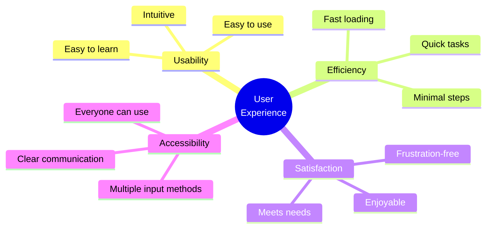
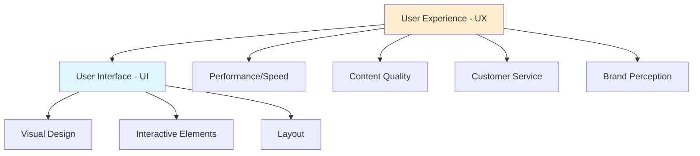

Practical UX Critique & Design (2 hours)

!!! abstract "Lesson Overview"
    This hands-on lesson has you explore various interactive media platforms, critique their user experience, and apply UX principles.

### Part A: Understanding UX in Interactive Media (30 mins)

#### What is User Experience (UX)?

**Definition:**
User Experience (UX) is how a person feels when interacting with a system - including websites, apps, and interactive media.

**UX encompasses:**
- **Usability** - how easy it is to use
- **Efficiency** - how quickly you can accomplish tasks
- **Satisfaction** - how pleasant the experience is
- **Accessibility** - whether everyone can use it
- **Value** - whether it solves your problem

---

#### User Interface (UI) vs User Experience (UX)

**User Interface (UI):**
- What you see and interact with
- Buttons, colors, fonts, layout
- Visual design
- Interactive elements

**User Experience (UX):**
- How the entire system feels
- Includes UI plus everything else
- Overall satisfaction
- Emotion and perception

**Relationship:**

**Think of it like a restaurant:**
- **UI** = How the menu looks, table setting, decor
- **UX** = The entire dining experience (food quality, service, ambiance, value, how you felt)

Good UI doesn't guarantee good UX, but bad UI usually creates bad UX.

---

#### Key UX Principles for Interactive Media

**1. Clarity**
- Users should immediately understand what they can do
- Clear labels and instructions
- Obvious calls-to-action
- No confusion

**Good:** "Watch Now" button clearly visible
**Bad:** Unclear navigation, hidden features

---

**2. Consistency**
- Similar elements work the same way throughout
- Predictable behavior
- Uniform design patterns
- Reduces learning curve

**Good:** All buttons look and behave the same
**Bad:** Every page has different navigation

---

**3. Feedback**
- System responds to user actions
- Confirmation of actions
- Loading indicators
- Error messages that help

**Good:** "Video added to playlist" confirmation
**Bad:** Click button, nothing happens, unclear if it worked

---

**4. Efficiency**
- Minimize steps to accomplish tasks
- Fast loading
- Shortcuts for frequent actions
- Autofill and smart defaults

**Good:** Streaming service remembers where you left off
**Bad:** Have to re-login every time, start video from beginning

---

**5. User Control**
- Users can undo actions
- Skip, pause, go back
- Customize settings
- Exit when desired

**Good:** Can skip podcast intro, adjust speed
**Bad:** Forced to watch ads, can't pause

---

**6. Accessibility**
- Everyone can use it, including people with disabilities
- Captions for videos
- Text alternatives for images
- Keyboard navigation
- Sufficient contrast

**Good:** YouTube videos have captions
**Bad:** Video with no captions, tiny unreadable text

---

#### How to Evaluate UX

**Ask these questions:**

**First Impressions (5 seconds):**
- What can I do here?
- Where do I start?
- Is it visually appealing?

**Usability:**
- Can I accomplish my goal easily?
- Is it intuitive?
- Do I need instructions?

**Performance:**
- Is it fast?
- Does it respond immediately?
- Any lag or freezing?

**Satisfaction:**
- Do I enjoy using this?
- Would I come back?
- Any frustrating moments?

**Accessibility:**
- Can someone with a disability use this?
- Are there alternatives for different abilities?
- Is text readable?

---

### Part B: Platform Exploration & UX Critique (60 mins)

!!! tip "Hands-On Activity"
    Explore and critically evaluate multiple interactive media platforms

#### Activity Instructions

**You will explore FOUR different platforms, one from each category:**

1. **Blog Platform** (choose one):
   - WordPress.com blog
   - Medium article
   - Personal blog
   - Substack newsletter

2. **Video Platform** (choose one):
   - YouTube
   - TikTok
   - Instagram Reels
   - Vimeo

3. **Podcast/Audio Platform** (choose one):
   - Spotify (podcast section)
   - Apple Podcasts
   - YouTube podcasts
   - Google Podcasts

4. **Social Media/Streaming** (choose one):
   - Instagram
   - Netflix
   - Twitter/X
   - LinkedIn

---

#### For EACH platform, complete this evaluation:

**Platform Name:** _________________
**Category:** _________________
**Time Spent Exploring:** _______ mins

---

**Part 1: First Impressions (2 minutes of exploring)**

When you first open the platform:

1. **What catches your attention first?**
   
   _Your answer:_

2. **Is it immediately clear what you can do here?** (Yes/No)
   
   Explain: _________________

3. **Rate the visual appeal** (1-5): _____
   
   Why this rating? _________________

---

**Part 2: Navigation & Usability (5 minutes of use)**

Try to accomplish a simple task (watch a video, read an article, find a podcast, etc.)

4. **How easy was it to find what you wanted?** (1-5): _____
   
   1 = very difficult, 5 = very easy

5. **List the steps you took:**
   
   Step 1:
   Step 2:
   Step 3:

6. **Could these steps be simplified? How?**
   
   _Your answer:_

---

**Part 3: Interactive Features (10 minutes of exploration)**

Explore the interactive capabilities:

7. **List ALL ways you can interact with content** (minimum 5):
   
   1.
   2.
   3.
   4.
   5.

8. **Which interactive feature is most useful? Why?**
   
   _Your answer:_

9. **Are there any interactive features that seem unnecessary or confusing?**
   
   _Your answer:_

---

**Part 4: UX Principles Evaluation**

Rate how well the platform implements each principle (1-5):

| UX Principle | Rating | Evidence/Example |
|--------------|--------|------------------|
| Clarity | /5 | |
| Consistency | /5 | |
| Feedback | /5 | |
| Efficiency | /5 | |
| User Control | /5 | |
| Accessibility | /5 | |

**Overall UX Score:** _____/30

---

**Part 5: Specific UX Analysis**

10. **Best UX Element:**
    
    What is it?
    Why does it work well?
    How does it improve your experience?

11. **Worst UX Element:**
    
    What is it?
    What's the problem?
    How would you fix it?

12. **How does this platform communicate information effectively?**
    
    _Your answer:_

13. **What makes this platform's UX different from traditional media?**
    
    _Your answer:_

---

**Part 6: Reflection**

14. **Would you recommend this platform to others?** (Yes/No)
    
    Why? _________________

15. **If you could change ONE thing about the UX, what would it be?**
    
    _Your answer:_

---

**REPEAT for all 4 platforms**

---

### Part C: Comparative Analysis (30 mins)

After evaluating all four platforms, complete this comparison:

#### Cross-Platform Comparison

**1. Rank your platforms by overall UX** (best to worst):

1. _________________ (Score: ___/30)
2. _________________ (Score: ___/30)
3. _________________ (Score: ___/30)
4. _________________ (Score: ___/30)

---

**2. Which platform had the best:**

| Aspect | Platform | Why? |
|--------|----------|------|
| First impression | | |
| Navigation | | |
| Interactive features | | |
| Visual design | | |
| Speed/Performance | | |
| Mobile experience | | |

---

**3. Common UX Patterns**

What UX elements did you see across multiple platforms?

Examples:
- Search bars in top right
- Profile icons in corner
- Share buttons
- Like/heart buttons

List common patterns you noticed:

1.
2.
3.
4.
5.

Why do you think these patterns are so common?

_Your answer:_

---

**4. Unique UX Features**

What unique features did each platform have that others didn't?

| Platform | Unique Feature | Why is it valuable? |
|----------|----------------|---------------------|
| | | |
| | | |
| | | |
| | | |

---

**5. UX and Information Communication**

How does good UX help communicate information more effectively?

Think about:
- Finding information quickly
- Understanding content
- Engaging with content
- Sharing information
- Remembering information

_Your answer (4-5 sentences):_

---

**6. Platform Purpose Match**

For each platform, evaluate how well the UX matches its purpose:

**Platform 1:** _________________

Purpose: _________________

Does UX support this purpose? _________________

How? _________________

---

**Repeat for remaining platforms**

---

### ✅ Self-Check Questions

!!! question "Knowledge Check"
    1. What is the difference between UI and UX?
    2. Why is consistency important in UX design?
    3. What does "feedback" mean in UX and why does it matter?
    4. How does good UX improve information communication?
    5. Name three ways to evaluate if a platform has good UX

??? success "Answers"
    1. UI = visual interface elements you interact with; UX = overall experience including UI, performance, satisfaction, and all interactions
    2. Consistency makes interfaces predictable, reduces learning time, prevents confusion, and builds user confidence
    3. Feedback = system responses to user actions (confirmations, errors, loading states); matters because users need to know their actions worked and what the system is doing
    4. Good UX helps users find information quickly, understand content clearly, engage effectively, and remember information better through intuitive design
    5. Test task completion ease, measure speed/efficiency, assess satisfaction, check accessibility, observe first impressions, get user feedback (any 3)
