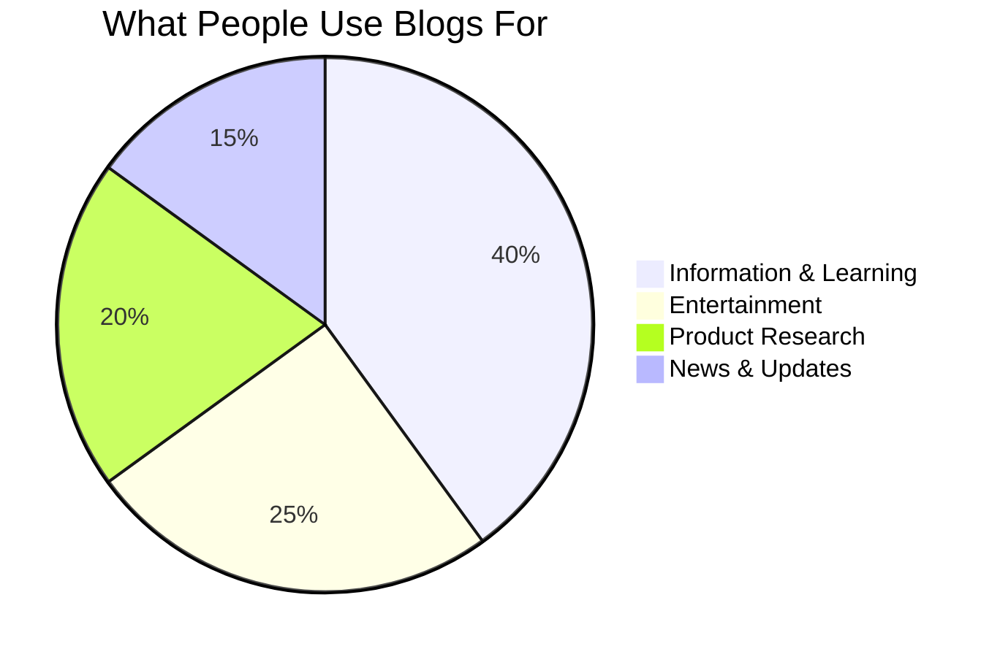
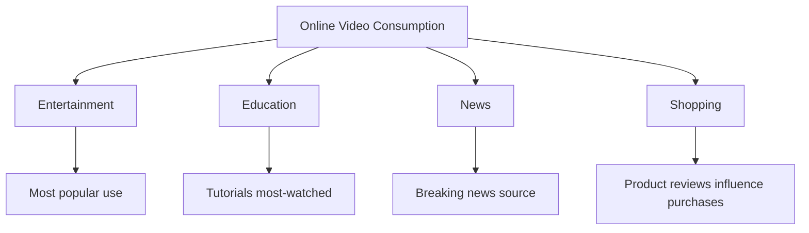

Prevalence of Interactive Media Today (1.5 hours)

!!! abstract "Lesson Overview"
    This lesson examines how widespread blogs, online video, and digital radio have become and their impact on society.

### Part A: Prevalence of Blogs (25 mins)

#### How Common Are Blogs?

**Global Statistics:**

- **600+ million blogs** exist worldwide
- **6-7 million blog posts** published daily
- **77% of internet users** read blogs regularly
- **Blog posts** drive 67% more leads than companies without blogs
- WordPress powers **43% of all websites**

---

#### Types of Blogs Today

**1. Personal Blogs**

- **Purpose:** Share experiences, thoughts, life updates
- **Audience:** Friends, family, like-minded people
- **Examples:** Travel blogs, parenting blogs, hobby blogs
- **Prevalence:** Millions, though declining with social media rise

**2. Professional/Business Blogs**

- **Purpose:** Marketing, SEO, thought leadership
- **Audience:** Potential customers, industry professionals
- **Examples:** Company news, how-to guides, industry insights
- **Prevalence:** Most businesses have blogs

**3. Niche Blogs**

- **Purpose:** Deep expertise on specific topics
- **Audience:** Enthusiasts, hobbyists, learners
- **Examples:** Coding tutorials, gardening tips, finance advice
- **Prevalence:** Huge growth in specialised content

**4. News/Media Blogs**

- **Purpose:** Journalism, commentary, analysis
- **Audience:** News consumers
- **Examples:** TechCrunch, HuffPost started as blogs
- **Prevalence:** Many major media outlets started as blogs

---

#### Why Blogs Remain Prevalent

Despite social media competition:

**Advantages of blogs:**

- **Long-form content** - detailed explanations
- **Permanent** - posts don't disappear
- **Searchable** - Google finds them years later
- **Ownership** - your content, your platform
- **Monetisation** - ads, affiliate marketing, products
- **Credibility** - professional platform

**Use cases blogs excel at:**

- Tutorials and guides
- In-depth analysis
- Documentation
- Professional portfolios
- SEO for businesses

**Modern blog features:**

- Newsletter integration (Substack, Medium)
- Social sharing
- Multimedia embedding
- Comment communities
- Mobile responsive design

---

### Part B: Prevalence of Online Video (30 mins)

#### How Dominant Is Online Video?

**Staggering Statistics:**

**YouTube:**

- **2.7+ billion users** (over 1/3 of internet users)
- **500+ hours of video** uploaded every minute
- **1 billion hours** watched daily
- **2nd most visited website** globally (after Google)
- Available in **100+ countries**, 80+ languages

**TikTok:**

- **1+ billion monthly users**
- **167 million downloads** in 2023 alone
- Average user spends **95 minutes/day** on app
- **Content creation boom** - millions of creators

**Other Platforms:**

- Instagram Reels, Facebook Videos, Snapchat
- Billions more consuming video content

---

#### Video Content Types and Prevalence

**1. Entertainment**

- **Music videos** - billions of views
- **Comedy sketches** and skits
- **Gaming content** - Let's Plays, esports
- **Vlogs** - daily life documentation

**Prevalence:** Dominates watch time

---

**2. Educational Content**

- **Tutorials** - how-to for everything
- **Courses** - Khan Academy, Crash Course
- **Explanations** - science, history, current events
- **Language learning**

**Prevalence:** Primary learning source for many students

- 86% of users watch YouTube to learn new things
- Educational channels have millions of subscribers

---

**3. Product Reviews & Unboxing**

- **Tech reviews** (phones, laptops, gadgets)
- **Beauty and fashion** (makeup, clothing)
- **Toys** (hugely popular with kids)
- **Unboxing experiences**

**Prevalence:** Influences 90% of purchase decisions

- People watch reviews before buying
- Creates new influencer economy

---

**4. News and Current Events**

- **Breaking news** posted immediately
- **Commentary and analysis**
- **Citizen journalism**
- **Live event coverage**

**Prevalence:** Primary news source for under-30 demographic

- YouTube is 2nd most popular news source

---

**5. Short-Form Video**

- **TikTok format** - 15-60 seconds
- **Instagram Reels**
- **YouTube Shorts**

**Prevalence:** Fastest growing video format

- Especially dominant with Gen Z
- Billions of views daily

---

#### Impact on Society

**How online video changed communication:**

**Information Access:**

- Learn anything free
- Visual demonstrations available
- Multiple perspectives on every topic

**Entertainment:**

- Infinite content choices
- No broadcast schedules
- Personalized recommendations

**Careers:**

- Content creation as profession
- Influencer marketing industry
- New media companies

**Attention Economy:**

- Short attention spans
- Algorithm-driven discovery
- Binge-watching culture

---

### Part C: Prevalence of Digital Radio/Podcasts (25 mins)

#### Podcast Explosion

**Global Reach:**

- **5+ million podcasts** exist
- **70+ million episodes** available
- **464+ million podcast listeners** worldwide
- **120 million listeners** in the US alone (42% of population)
- **62% growth** in listening since 2020

**Australia-specific:**
- **41% of Australians** listen to podcasts monthly
- **3+ million weekly** podcast listeners
- Growth across all age groups

---

#### Why Podcasts Are So Prevalent

**Consumption Benefits:**

- **Multitasking friendly** - listen while driving, exercising, working
- **No screen time** - audio only
- **Commute companion** - fills travel time
- **Intimate format** - feels like conversation
- **Free access** - most podcasts free

**Content Benefits:**

- **Niche topics** - podcast for every interest
- **Long-form discussion** - depth impossible on TV
- **Authentic** - less polished than traditional media
- **Diverse voices** - anyone can podcast
- **On-demand** - build up episodes, binge listen

---

#### Popular Podcast Categories

**Most Popular Genres:**

1. **News & Politics** (22% of listening)
2. **Comedy** (17%)
3. **True Crime** (15%)
4. **Education** (12%)
5. **Business** (10%)
6. **Sports** (8%)
7. **Health & Fitness** (7%)
8. **Science** (5%)
9. **Arts** (4%)

---

#### Podcast Use Cases

**1. Education & Learning**

- **Language learning** - daily lessons
- **History** - storytelling format
- **Science** - complex topics explained
- **Skills** - coding, writing, business

**Example:** "Stuff You Should Know" - 1 billion+ downloads

---

**2. News & Current Events**

- **Daily news** - morning briefings
- **Analysis** - deep dives into stories
- **Investigative** - Serial-style journalism

**Example:** "The Daily" (NY Times) - millions of daily listeners

---

**3. Entertainment**

- **Storytelling** - audio dramas
- **Comedy** - interviews and sketches
- **True crime** - mystery and investigation

**Example:** "My Favourite Murder" - huge fanbase

---

**4. Business & Professional**

- **Industry insights**
- **Interviews** with leaders
- **Career advice**
- **Marketing** for companies

**Example:** "How I Built This" - entrepreneur stories

---

#### Listening Habits

**When people listen:**

- **34%** while commuting
- **22%** while exercising
- **18%** while doing housework
- **15%** before bed
- **11%** during work

**How often:**

- **Weekly listeners**: 54%
- **Daily listeners**: 28%
- **Occasional**: 18%

**Average listening:**

- **6.4 hours** per week per listener
- **7 different podcasts** regularly
- **2.1x speed** common among regular listeners

---

### 📝 Activity 3: Prevalence Research Project (30 mins)

!!! tip "Investigation Task"
    Gather real data about the prevalence of interactive media

**Instructions:**

**Choose ONE platform to research in detail:**

- A specific blog platform (WordPress, Medium, Substack)
- A video platform (YouTube, TikTok, Instagram Reels)
- A podcast platform (Spotify, Apple Podcasts)

**Research and document:**

**Platform:** _________________

**1. User Statistics**

- Total number of users/listeners:
- Content uploaded/published (daily/monthly):
- Time spent per user:
- Geographic spread:

**Sources for your data:** (List websites you used)

---

**2. Growth Trends**

- How has this platform grown in the last 5 years?
- What age groups use it most?
- Is it growing or declining?

**Create a simple graph or chart showing growth**

---

**3. Real-World Impact**

Find and document **THREE examples** of how this platform has had real impact:

| Example | Description | Impact |
|---------|-------------|--------|
| 1. | | |
| 2. | | |
| 3. | | |

---

**4. Comparison**

How does this platform compare to traditional media (TV, radio, newspapers)?

| Factor | Traditional Media | Your Platform | Winner |
|--------|------------------|---------------|--------|
| Accessibility | | | |
| Content variety | | | |
| User control | | | |
| Barriers to entry | | | |

---

**5. Prediction**

Based on your research, will this platform become more or less prevalent in the next 5 years? Explain your reasoning.

_Your answer:_

---

### ✅ Self-Check Questions

!!! question "Knowledge Check"
    1. Approximately how many blogs exist worldwide?
    2. What percentage of internet users read blogs regularly?
    3. How many hours of video are uploaded to YouTube every minute?
    4. How many podcast listeners are there globally?
    5. What are the top three podcast genres?

??? success "Answers"
    1. 600+ million blogs
    2. 77% of internet users
    3. 500+ hours per minute
    4. 464+ million listeners
    5. News & Politics, Comedy, True Crime
