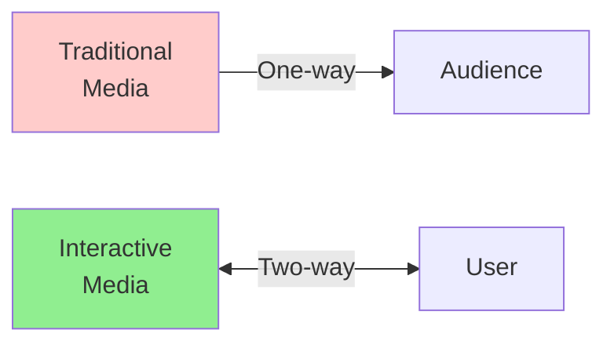
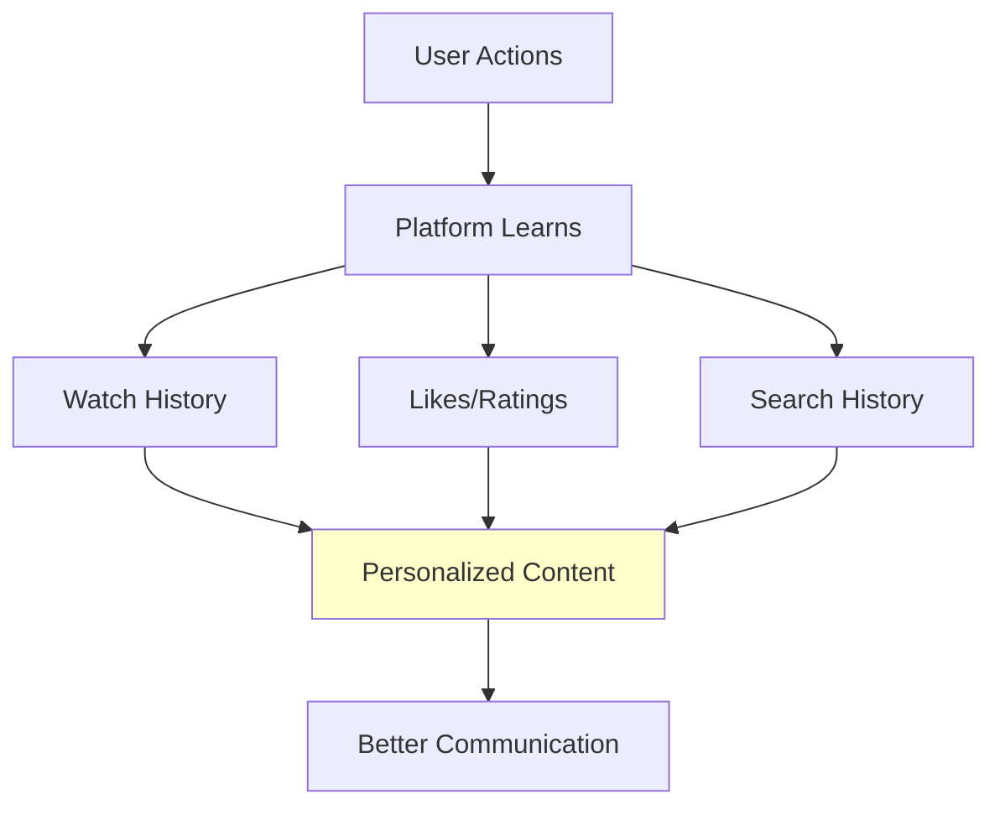

## Lesson 1: What is Interactive Media?

!!! abstract "Lesson Overview"
    This lesson introduces interactive media, explains what makes it different from traditional media, and explores the main types you use every day.

### Part A: Understanding Interactive Media (30 mins)

#### What Makes Media "Interactive"?

**Traditional Media** delivers information in one direction:

- You watch TV → can't change what happens
- You read a newspaper → can't respond directly
- You listen to radio → can't choose what plays next

**Interactive Media** creates a two-way conversation:

- You choose what to watch and when
- You can comment, like, share, create
- Content responds to your actions
- You control the experience

**Key Characteristics of Interactive Media:**

1. **User Control** - You decide what to see and when
2. **Immediate Response** - Actions produce instant results
3. **Non-linear** - Multiple paths through content
4. **Participation** - You can contribute, not just consume

---

#### Types of Interactive Media

**1. Blogs**

A blog (short for "weblog") is an online platform where people publish written content.

**Interactive Features:**

- **Author publishes** articles, thoughts, tutorials
- **Readers comment** and discuss
- **Sharing** across social media
- **Links** to related content
- **Multimedia** - images, videos, audio embedded

**How blogs communicate information:**

- Personal experiences and opinions
- Tutorials and how-to guides
- News and commentary
- Business updates and announcements
- Educational content

**Example:** A cooking blog publishes a recipe. You can comment with questions, the author responds, and other readers share their modifications.

---

**2. Online Video**

Video content delivered over the internet that users can control and interact with.

**Interactive Features:**

- **Playback control** - play, pause, skip, rewind, speed adjustment
- **Engagement** - like, dislike, comment
- **Subscribe** to creators for updates
- **Playlists** - organise videos
- **Sharing** with others
- **Captions/subtitles** - accessibility options

**How online video communicates information:**

- Visual demonstrations (tutorials, how-tos)
- Entertainment and storytelling
- Educational content
- News and documentaries
- Product reviews and unboxing
- Live streaming events

**Platforms:** YouTube, Vimeo, TikTok, Instagram Reels

**Example:** You watch a guitar tutorial on YouTube. You can pause to practice, replay difficult parts, read comments from other learners, and ask the creator questions.

---

**3. Digital Radio/Podcasts**

Audio content delivered digitally that users access on-demand.

**Interactive Features:**

- **On-demand listening** - choose when to listen
- **Playback control** - skip, replay, speed up
- **Playlists** - organise episodes
- **Subscribe** to shows
- **Download** for offline listening
- **Rate and review**
- **Chapter markers** - jump to sections

**How digital radio/podcasts communicate information:**

- In-depth discussions and interviews
- Educational content (language learning, history, science)
- News and current events
- Storytelling and narrative journalism
- Commentary and analysis

**Platforms:** Spotify, Apple Podcasts, Google Podcasts

**Example:** You subscribe to a history podcast. You can listen during your commute, skip episodes that don't interest you, speed up to 1.5x to save time, and download episodes for the plane.

---

**4. Social Media**

Platforms where users create, share, and interact with content and each other.

**Interactive Features:**

- **Create content** - posts, photos, videos
- **Engage** - like, comment, share
- **Follow** people and topics
- **Direct messaging**
- **Groups and communities**
- **Live streaming**
- **Stories** - temporary content

**How social media communicates information:**

- Personal updates and life events
- News sharing and discussion
- Business announcements and marketing
- Community building
- Customer service
- Real-time event coverage

**Platforms:** Instagram, Twitter/X, Facebook, LinkedIn, TikTok

**Example:** A company announces a new product on Twitter. Customers can ask questions in replies, share the announcement, and provide feedback directly.

---

**5. Streaming Services**

Platforms delivering video or audio content over the internet on-demand.

**Interactive Features:**

- **On-demand access** - watch/listen anytime
- **Recommendations** - personalized suggestions
- **Profiles** - multiple users, watch history
- **Playlists and queues**
- **Continue watching** from where you left off
- **Download** for offline
- **Ratings** - influence recommendations

**How streaming services communicate information:**

- Entertainment (movies, TV shows, music)
- Documentaries and educational content
- Live events
- Original productions

**Platforms:** Netflix, Disney+, Stan, Spotify

---

### Part B: How Interactive Media Communicates Information to Audiences (30 mins)

#### Communication Methods Unique to Interactive Media

**1. Personalisation**

Interactive media adapts to individual users.

**Examples:**

- Netflix recommends shows based on what you've watched
- YouTube suggests videos similar to your interests
- Spotify creates playlists matching your music taste
- News apps prioritise topics you read most

**Why this matters for communication:**

- Information reaches the right audience
- Users get relevant content
- Less information overload
- Higher engagement

---

**2. Engagement and Feedback**

Unlike traditional media, interactive media lets audiences respond.

**Two-way communication:**

- Blog comments create discussions
- YouTube comments help creators understand their audience
- Podcast reviews guide future episodes
- Social media polls gather opinions

**Real-time feedback:**

- Live stream chat during events
- Twitter reactions to news as it happens
- Instagram stories with question stickers
- Gaming platforms with voice chat

**Why this matters:**

- Creators learn what works
- Audiences feel heard
- Content evolves based on feedback
- Communities form around shared interests

---

**3. User-Generated Content (UGC)**

Audiences become creators, not just consumers.

**Examples:**

- Comments and reviews
- Social media posts
- YouTube videos
- Blog responses
- Podcast listener questions featured in episodes
- TikTok duets and stitches

**Why this matters for communication:**

- Multiple perspectives on topics
- Authentic, peer-to-peer information sharing
- Diverse voices and experiences
- Content creation democratised

---

**4. Non-linear Access**

Users choose their path through information.

**Traditional media path:**
TV broadcast → You watch in order, at scheduled time

**Interactive media path:**
Streaming service → You choose what to watch, in any order, anytime

**Examples:**

- Skip podcast episodes that don't interest you
- Watch YouTube tutorials for specific problems
- Read blog posts by topic, not chronologically
- Create custom playlists of songs or videos

**Why this matters:**

- Users access only relevant information
- Self-paced learning
- Efficient information gathering
- Better retention (interested users)

---

**5. Multimedia Integration**

Interactive media combines multiple formats in one place.

**Example blog post might include:**

- Written article
- Embedded video demonstration
- Audio interview
- Infographics
- Links to resources
- Interactive charts
- Comment discussion

**Why this matters:**

- Accommodates different learning styles
- Visual, auditory, and reading learners all served
- Complex information explained multiple ways
- Richer, more complete communication

---

### 📝 Activity 1: Interactive Media Communication Analysis (30 mins)

!!! tip "Practical Task"
    Explore how different interactive media types communicate information

**Instructions:**

**Step 1:** Choose THREE different platforms from different categories:

- One blog or blog post
- One video (YouTube, TikTok, etc.)
- One podcast or digital radio show
- One social media account (brand or creator)
- One streaming service

**Step 2:** For each platform, analyze how it communicates information:

**Platform 1: _________________** (Type: _________)

1. **What information is being communicated?**
   
_Your answer:_

2. **How can users interact with this content?** (List all ways)
   
_Your answer:_

3. **How does the platform personalise or adapt content to users?**
   
_Your answer:_

4. **What makes this more effective than traditional media for this purpose?**
   
_Your answer:_

5. **Give this platform a UX rating (1-5) and explain why:**
   
Rating: ___/5
   
Reason: _________________

---

**Repeat for Platforms 2 and 3**

---

**Step 3:** Comparison

**Which platform communicated information most effectively? Why?**

_Your answer:_

**Which had the best user experience? What made it good?**

_Your answer:_

---

### ✅ Self-Check Questions

Before moving on, ensure you can answer:

!!! question "Knowledge Check"
    1. What is the main difference between traditional media and interactive media?
    2. Name three interactive features of blogs
    3. How do streaming services use personalisation to communicate information?
    4. What is user-generated content and why is it important?
    5. Give an example of two-way communication in interactive media

??? success "Answers"
    1. Traditional media = one-way; Interactive media = two-way communication with user control
    2. Comments, sharing, links, multimedia embedding, author-reader discussion (any 3)
    3. Streaming services track viewing/listening history to recommend relevant content to each user
    4. Content created by users (comments, posts, videos); important because it democratises content creation and provides diverse perspectives
    5. Any valid example: blog comments, live stream chat, YouTube comments, social media replies
