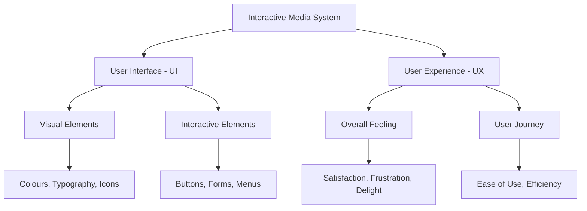
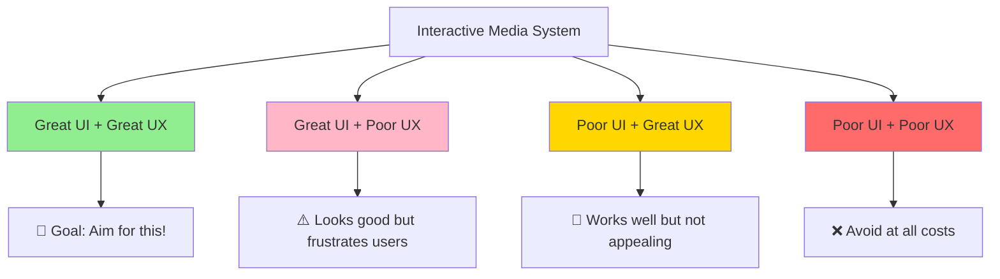
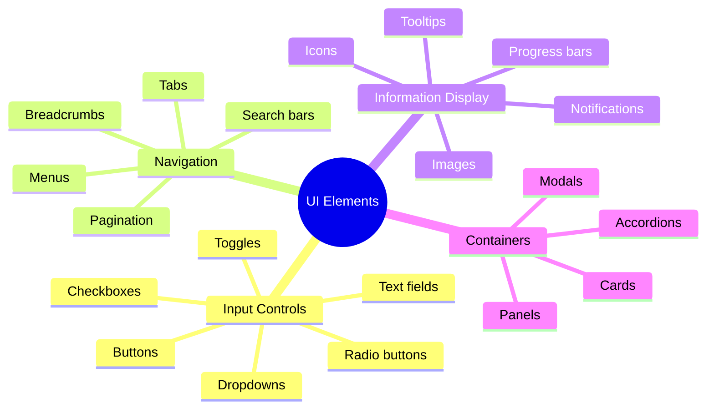
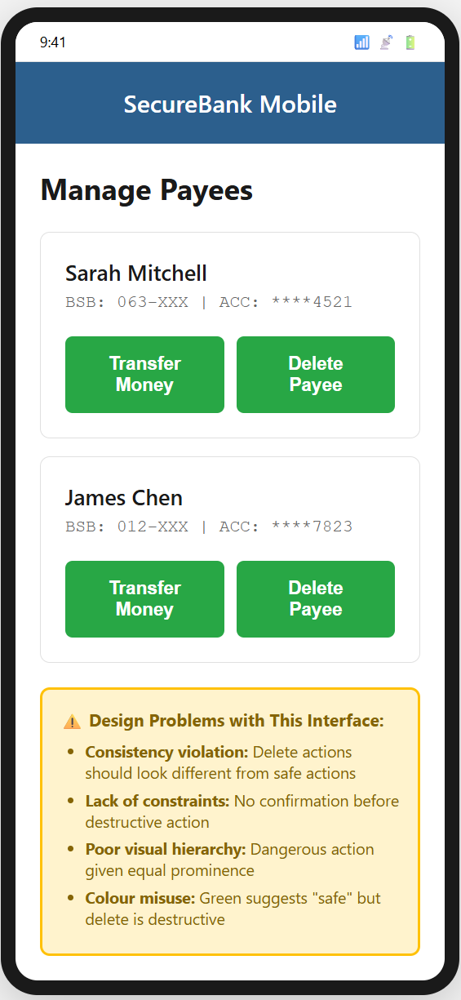
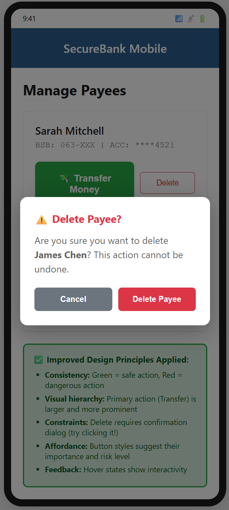
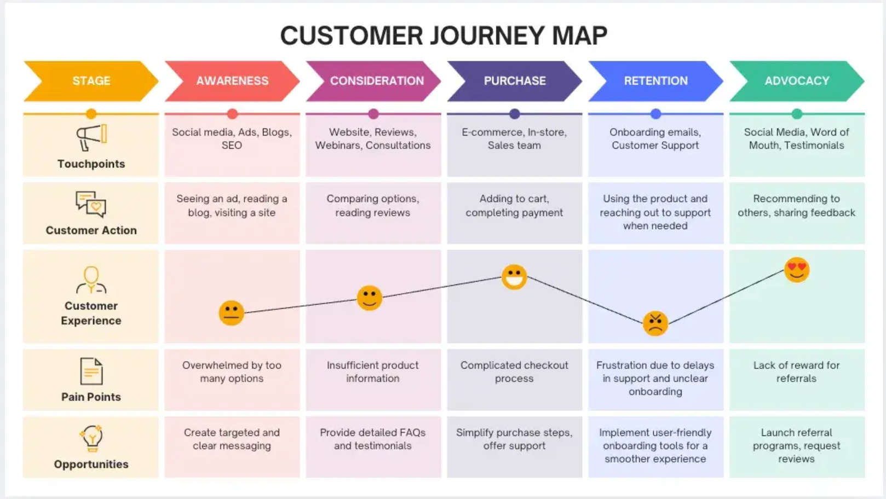
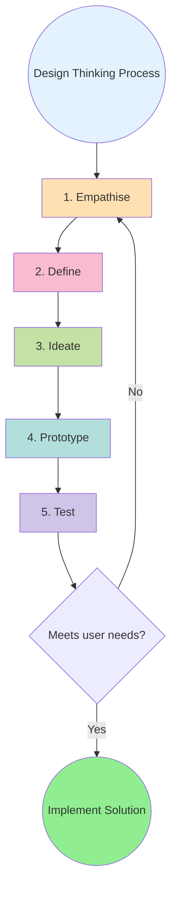
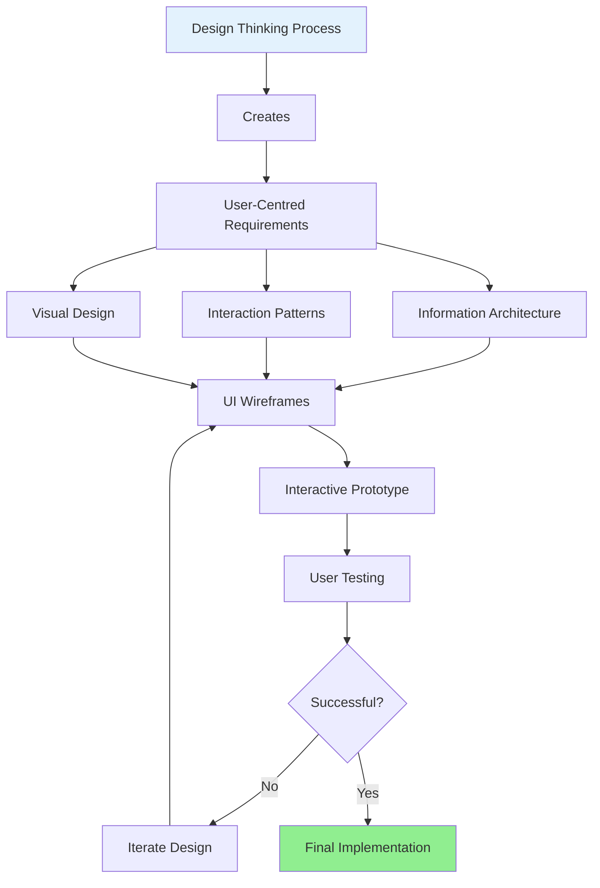
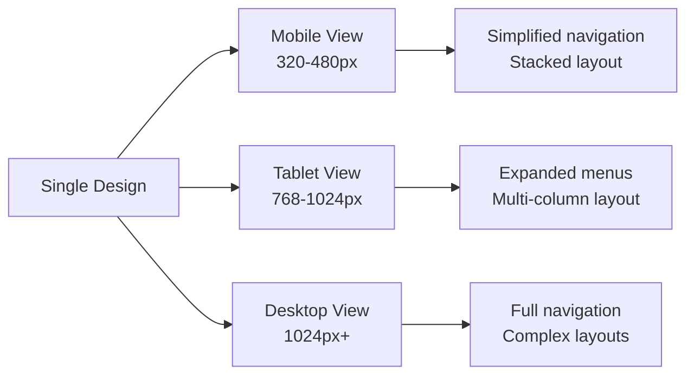

# Week 3: Understanding User Experience (UX) and User Interface (UI)

## Lesson Overview

!!! info "Lesson Details"
    **Duration:** 90-120 minutes  
    **Focus:** Understanding the distinction between UI and UX, and applying design thinking principles  
    **Mode:** Self-paced with structured activities  
    **Prerequisites:** 
    
    - Completion of Week 1: Introduction to Interactive Media
    - Completion of Week 2: Interactive Media in Enterprise
    - Access to a web browser and internet connection
    - A notebook or digital document for recording observations

---

## Learning Objectives

By the end of this lesson, you will be able to:

1. **Understand** the fundamental concepts of User Interface (UI) and User Experience (UX) and how they interact within interactive media systems
2. **Analyse** the effectiveness of UI design elements and their impact on user experience across different digital platforms
3. **Evaluate** digital products using established UX principles and design criteria
4. **Apply** the design thinking methodology to identify user needs and develop user-centred solutions
5. **Create** design critiques and improvement recommendations based on UX/UI best practices

---

## Success Criteria

!!! success "I will demonstrate my learning by..."
    
    - [ ] **Defining and distinguishing:** Writing clear definitions of UI and UX in my own words and explaining their relationship with at least 2 real-world examples
    - [ ] **Identifying UI elements:** Correctly naming and categorising at least 5 different UI elements (from different categories: input, navigation, information, containers) in any digital interface
    - [ ] **Applying design principles:** Analysing an app or website using at least 3 UI design principles (consistency, feedback, affordance, constraints, visibility) with specific evidence for each
    - [ ] **Evaluating with UX criteria:** Completing a UX evaluation of one digital product against at least 4 of the 6 principles (usability, accessibility, desirability, findability, credibility, value) with observable examples and ratings
    - [ ] **Executing design thinking:** Successfully working through all 5 stages of the design thinking process (empathise, define, ideate, prototype, test) for a given problem, including a user-focused problem statement and at least 8 solution ideas
    - [ ] **Creating justified critiques:** Producing a design critique that identifies 3 specific UI or UX issues using correct terminology, provides evidence for each, and proposes improvements based on design principles
    - [ ] **Communicating with terminology:** Using industry-standard UX/UI vocabulary accurately throughout all activities (demonstrated in my vocabulary journal with 10 terms defined in my own words with examples)

---

## Syllabus Alignment

!!! note "Syllabus Coverage: Interactive Media and User Experience"
    - ✓ Explain how the user interface (UI) impacts on the user experience (UX)
    - ✓ Apply design thinking to develop a front-end, web-based interactive media system incorporating UX and UI principles
    - ✓ Apply design tools and techniques to develop an engaging UI

---

## Content Part 1: What are UI and UX?

### Introduction to UI and UX

**User Interface (UI)** and **User Experience (UX)** are two closely related but distinct concepts in interactive media design.

!!! tip "Key Definitions"
    **User Interface (UI):** The visual and interactive elements that users see and interact with in a digital product. Think of it as the "look and feel" — buttons, menus, icons, typography, colour schemes, and layouts.
    
    **User Experience (UX):** The overall experience a user has when interacting with a product or system. It encompasses how users feel, how easy it is to accomplish tasks, and whether the product meets their needs.

### The Relationship Between UI and UX

Think of UI and UX like a restaurant:

- **UI** is the presentation of the food, the décor, the menu design, and the table settings
- **UX** is the entire dining experience — how welcoming the staff are, how long you wait for food, whether the menu is easy to understand, and whether you'd recommend the restaurant to friends

**Real-World Examples:**

- **Great UI + Great UX:** Spotify - Beautiful interface, seamless music discovery
- **Great UI + Poor UX:** Some designer portfolio sites - Stunning visuals but hard to navigate
- **Poor UI + Great UX:** Wikipedia - Plain design but information is easy to find
- **Poor UI + Poor UX:** Poorly designed government forms - Confusing and difficult to complete

!!! warning "Important Distinction"
    - You can have a beautiful UI (great visual design) but poor UX (frustrating to use)
    - You can have a simple UI but excellent UX (easy and pleasant to use)
    - The goal is to achieve both good UI **and** good UX

### 📝 Activity 1.1: UI vs UX Identification

!!! note "Explore and Analyse UI and UX"
    **Duration:** 10 minutes

    **Learning Goal:** Distinguish between UI elements and UX aspects in real applications

    Open your favourite app or website (suggestions: Instagram, YouTube, Spotify, Netflix).

    In your notebook, create a two-column table:

    | UI Elements I Can See | UX Aspects I Experience |
    |----------------------|------------------------|
    | Example: Search icon at the top | Example: I can quickly find what I'm looking for |
    | | |
    | | |
    | | |

    List at least **5 UI elements** and **5 UX aspects** from your chosen platform.

    **Success Check:** You've completed this when you have 5 entries in each column AND your UI column contains only things you can see/click, while your UX column describes feelings or experiences.

    !!! question "Reflection Questions"
        1. Which matters more to you as a user — how the app looks or how it works?
        2. Can you think of a time when a beautiful app frustrated you? Why?
        3. Did any UI elements you identified directly contribute to the UX aspects you listed?

### 📝 Activity 1.2: The Bad UI/UX Hall of Fame

!!! note "Identify Bad UI/UX"
    **Duration:** 10 minutes

    **Learning Goal:** Recognise what makes UI/UX ineffective and articulate improvements

    Search online for "bad UI design examples" or "UX fails".

    Find **3 examples** and for each one, create this analysis:

    | Element | Your Analysis |
    |---------|---------------|
    | Screenshot/URL | [Link or description] |
    | Is this a UI or UX problem? | [Identify which] |
    | Specific issue | [What exactly is wrong?] |
    | Why it's problematic | [Impact on the user] |
    | How to improve it | [Your solution] |

    **Success Check:** You've completed this when each analysis clearly identifies whether it's a UI or UX issue AND provides a specific, actionable improvement.

    !!! example "Example Analysis"
        **Problem:** A website with white text on a yellow background  
        **UI or UX?** This is primarily a UI issue (visual design)  
        **Specific issue:** Insufficient colour contrast making text illegible  
        **Why problematic:** Users struggle to read content, causing eye strain and frustration (leading to UX problems)  
        **Solution:** Use dark grey (#333333) text on white background to meet WCAG AA contrast standards (4.5:1 ratio)

---

## Content Part 2: UI Elements and Design Principles

### Common UI Elements

User interfaces are built from various components. Understanding these helps you analyse and create effective designs. These may also be called **components** in some UI frameworks.

!!! info "UI Element Categories"
    1. **Input Controls:** Allow users to input information (buttons, text fields, checkboxes)
    2. **Navigation Components:** Help users move around (menus, tabs, search bars)
    3. **Informational Components:** Communicate information (icons, tooltips, progress bars)
    4. **Containers:** Organise content (cards, panels, modals)

### Key UI Design Principles

#### 1. **Consistency**
Elements should look and behave similarly throughout the interface.

- Same colours for similar actions (e.g., all "delete" buttons are red)
- Same button styles across all pages
- Consistent terminology (don't call it "cart" on one page and "basket" on another)
- Users learn patterns once

#### 2. **Feedback**
The system should inform users about what's happening.

- Loading spinners when processing
- Success messages after completing actions
- Error messages when something goes wrong
- Visual changes when hovering over clickable elements
- Users know what's happening

#### 3. **Affordance**
Design should suggest how to use elements.

- Buttons should look clickable (raised appearance, cursor changes)
- Text fields should look like you can type in them
- Sliders should look draggable
- Users know how to interact

#### 4. **Constraints**
Prevent errors by limiting options.

- Disable "Submit" button until form is complete
- Greyed-out unavailable options
- Date pickers that only allow future dates for bookings
- Users make fewer errors

#### 5. **Visibility**
Important information and actions should be easily discoverable.

- Primary actions are prominent (larger, brighter colours)
- Key information is above the fold (visible without scrolling)
- Search functions are easily found
Users find what they need

### 📝 Activity 2.1: UI Element Scavenger Hunt

!!! note "UI Elements"
    **Duration:** 15 minutes

    **Learning Goal:** Identify UI elements in context and evaluate their effectiveness using design principles

    Visit **three different websites** (e.g., a news site, an e-commerce site, a social media platform).

    For each site, create a table documenting:

    | UI Element Type | Specific Example | Design Principle Used | Effective? (Y/N) | Justification |
    |----------------|------------------|----------------------|------------------|---------------|
    | Button | "Add to Cart" button | Affordance | Y | Raised appearance with shadow, changes to darker blue on hover, cursor becomes pointer |
    | | | | | |
    | | | | | |
    | | | | | |
    | | | | | |
    | | | | | |
    | | | | | |
    | | | | | |
    | | | | | |

    Find at least **8 different UI elements** across the three sites.

    **Success Check:** You've completed this when you have:

    - 8 different element/component types (don't repeat "button" 8 times)
    - At least 3 different design principles referenced
    - Specific justifications (not just "looks good" or "works well")

    !!! tip "Sites to Consider"
        - News: ABC News, BBC, The Guardian
        - E-commerce: Amazon, eBay, local shopping sites
        - Social Media: Twitter/X, Reddit, LinkedIn
        - Look at UI Frameworks to help you understand components (e.g., [Material Design](https://m3.material.io/components), [Bootstrap](https://getbootstrap.com/docs/5.3/components), [Quasar](https://quasar.dev/components))

### 📝 Activity 2.2: Design Principle Violations

!!! note "Identify Problems and Propose Solutions"
    **Duration:** 10 minutes

    **Learning Goal:** Apply design principles to identify problems and propose solutions

    Look at this scenario:

    > A banking app has a "Transfer Money" button in green and a "Delete Payee" button also in green. Both buttons are the same size and placed next to each other.

    **Your task:**

    Create a table with this analysis:

    | Question | Your Answer |
    |----------|-------------|
    | Which design principle(s) are violated? | |
    | Why is this dangerous for users? | |
    | What could realistically happen? | |
    | Redesign: What colour should each button be? | |
    | Redesign: What size should each button be? | |
    | Redesign: What other changes would help? | |

    **Success Check:** You've completed this when you:

    - Identify at least 2 violated principles
    - Explain a realistic negative consequence
    - Propose a complete redesign addressing all identified issues

    !!! question "Think About"
        - What could happen if a user makes a mistake?
        - How could colour, size, position, and confirmation dialogs be used better?
        - Which action is more common? Which is more dangerous?

    ??? example "UI Design"
        **Poor UI Design**

        {width="400"}

        **Better UI Design**

        {width="400"}
---

## Content Part 3: UX Principles and User-Centred Design

### The Core UX Principles

User Experience design focuses on making products that are valuable and pleasant to use. Six key principles guide UX design:

### The Six Core UX Principles

All user-centred design should address these six principles:

| UX Principle | Definition | Key Questions to Ask |
|--------------|------------|---------------------|
| **Usability** | How easy and intuitive the product is to use | • Can users complete tasks efficiently? • Are there clear pathways to goals? • Is the learning curve reasonable? |
| **Accessibility** | Whether the product can be used by people with diverse abilities | • Can people with visual impairments use it? (screen readers, high contrast) • Can people with motor disabilities navigate it? (keyboard navigation, large click targets) • Is it usable by people with cognitive differences? |
| **Desirability** | The emotional appeal and aesthetic quality | • Does the design evoke positive emotions? • Is it visually appealing? • Does it create brand connection? |
| **Findability** | How easily users can locate information and features | • Is navigation logical? • Is search functionality effective? • Is information architecture clear? |
| **Credibility** | Whether users trust the product | • Does it look professional? • Is information accurate and sourced? • Are there trust signals (security badges, testimonials)? |
| **Value** | Whether the product delivers meaningful benefits | • Does it solve a real problem? • Is it worth the user's time and effort? • Does it deliver on its promises? |

!!! tip "Remember"
    A product needs to address **all six principles** to provide excellent UX. Strength in one area cannot fully compensate for weakness in another.

### The User Journey

UX designers think about the complete path a user takes, from discovering a product to achieving their goal.

!!! tip "Understanding Pain Points"
    In the journey above, notice the rating drops with customer retention. The pain points show:
    
    - Unclear onboarding
    - Delays in support
    
    Good UX design identifies and fixes these "pain points."

### 📝 Activity 3.1: UX Principle Analysis

!!! note "Evaluate UI Principles"
    **Duration:** 15 minutes

    **Learning Goal:** Evaluate digital products systematically using all UX principles with evidence-based reasoning

    Choose an app or website you use regularly. Evaluate it against all **6 UX principles**.

    Create a rating table:

    | UX Principle | Rating (1-5) | Specific Evidence/Example | Improvement Suggestion |
    |-------------|-------------|---------------------------|------------------------|
    | Usability | 4 | Main tasks completed in 2-3 clicks, but checkout requires 5 separate pages | Combine shipping and payment on one page with clear progress indicator |
    | Accessibility | 3 | Images have alt text, but colour contrast on grey buttons is only 2.8:1 (fails WCAG) | Change button colour to darker shade to achieve 4.5:1 contrast ratio |
    | | | | |
    | | | | |
    | | | | |
    | | | | |
    | | | | |

    **Success Check:** You've completed this when you:

    - Have rated all 6 principles
    - Provided specific, observable evidence (not opinions like "I like it")
    - Given concrete improvement suggestions for any principle rated 3 or below
    - Can explain your rating to someone else using only the evidence you've documented

    !!! note "Rating Guide"
        - 5 = Excellent (industry-leading, no noticeable issues)
        - 4 = Good (works well with minor issues)
        - 3 = Acceptable (functional but clear room for improvement)
        - 2 = Needs improvement (significant problems impacting use)
        - 1 = Poor (fundamental failures, nearly unusable)

### 📝 Activity 3.2: Mapping a User Journey

!!! note "User Experience Analysis"
    **Duration:** 15 minutes

    **Learning Goal:** Analyse the complete user experience by documenting and evaluating each step of a common task

    Think about a task you do regularly online (examples: ordering food delivery, booking a movie ticket, creating a social media post).

    **Map out your user journey:**

    1. List each step from start to finish (aim for 6-10 steps)
    2. Rate your satisfaction at each step (1-5, where 5 is very satisfied)
    3. Identify your biggest "pain point" (lowest satisfaction)
    4. Explain why it's problematic
    5. Propose one specific improvement

    Create your journey map like this:

    | Step # | Action | Satisfaction (1-5) | Issues Noted | Emotional Impact |
    |--------|--------|-------------------|--------------|------------------|
    | 1 | Open app | 5 | None | Confident, ready to order |
    | 2 | Search for restaurant | 2 | Search is slow (8+ seconds), returns irrelevant results, no filters available | Frustrated, impatient |
    | 3 | Select restaurant | 4 | Works well once I find it | Relieved |

    **Success Check:** You've completed this when you:

    - Have documented the complete journey from start to finish
    - Identified which step has the lowest satisfaction score
    - Explained the root cause of the problem (not just "it's bad")
    - Proposed a testable improvement (something measurable)

---

## Content Part 4: Introduction to Design Thinking

### What is Design Thinking?

**Design thinking** is a problem-solving approach that puts the user at the centre of the process. It's used by designers, engineers, and entrepreneurs to create innovative solutions.

### The Five Stages of Design Thinking

#### Stage 1: Empathise

!!! info ""
    **Goal:** Understand the user's needs, experiences, and motivations

    **Methods:**

    - Observe users in their natural environment
    - Conduct interviews
    - Experience the problem yourself
    - Gather data about user behaviour

    **Example:** Before redesigning a school canteen app, watch students during lunch. Notice where they struggle, what frustrates them, and what they say they want.

#### Stage 2: Define

!!! info ""
    **Goal:** Clearly articulate the problem you're trying to solve
    
    **Methods:**
    
    - Analyse research from empathise stage
    - Identify patterns and insights
    - Create a problem statement
    - Focus on user needs, not solutions
    
    **Example Problem Statement:** "Students need a faster way to order food during their 30-minute lunch break because the current queue system means they often miss out on eating or socialising."

#### Stage 3: Ideate
!!! info ""
    **Goal:** Generate a wide range of possible solutions
    
    **Methods:**
    
    - Brainstorming sessions
    - Mind mapping
    - "How might we..." questions
    - Challenge assumptions
    - Encourage wild ideas
    
    **Key Rule:** Quantity over quality at this stage. Don't judge ideas yet!
    
    **Example Ideas:**
    
    - Pre-order from home room
    - QR code ordering at tables
    - Express queue for grab-and-go items
    - Dedicated app with loyalty points
    - AI-powered menu suggestions

#### Stage 4: Prototype
!!! info ""
    **Goal:** Build quick, low-cost versions of potential solutions
    
    **Methods:**
    
    - Paper sketches
    - Wireframes
    - Clickable mockups
    - Physical models
    - Role-playing scenarios
    
    **Remember:** Prototypes should be quick and cheap! You're testing ideas, not building the final product.
    
    **Example:** Draw a paper version of the app screens. Include buttons, menus, and basic layout.

#### Stage 5: Test
!!! info ""
    **Goal:** Get feedback from real users on your prototypes
    
    **Methods:**
    
    - User testing sessions
    - Observe users interacting with prototype
    - Ask questions and gather feedback
    - Identify what works and what doesn't
    
    **Important:** Testing often reveals new insights, sending you back to earlier stages. This is normal and valuable!
    
    **Example:** Show the paper prototype to 5 students. Watch them try to complete an order. Note where they get confused.

### Why Design Thinking Matters for UX/UI

Design thinking ensures that:

1. Solutions are based on real user needs, not assumptions
2. Multiple ideas are explored before committing to one
3. Solutions are tested and refined based on feedback
4. The final product genuinely improves the user experience

### 📝 Activity 4.1: Mini Design Thinking Challenge

!!! note "Real World Problem"
    **Duration:** 25 minutes

    **Learning Goal:** Apply all five stages of design thinking to solve a real problem with user-centred solutions

    **Scenario:** Your school library has a problem — students can't find books easily because the catalogue system is confusing.

    Work through the **5 stages of design thinking** to solve this problem. Document each stage clearly.

    **1. Empathise (5 minutes)**

    Create a list answering these questions:

    - What are 3 specific frustrations students might have? (Be specific: "unclear search results" not just "it's confusing")
    - Who are the different types of users? (Consider: casual readers, students doing research, students with disabilities, international students, etc.)
    - What do these different users need from a library catalogue?

    **Success Check:** You have at least 3 specific frustrations AND considered at least 3 different user types.

    **2. Define (3 minutes)**

    Write a problem statement following this formula:

    **[User type] needs [need] because [insight].**

    Example: "Year 11 students need to quickly find relevant research materials because they have limited time between classes and assignments are often due within days."

    **Success Check:** Your problem statement focuses on the user's need, not on a solution, and explains why this matters.

    **3. Ideate (7 minutes)**

    Brainstorm at least **10 different solutions**. Use these prompts to help:

    - What if we completely removed the current system?
    - What if we used technology that doesn't exist yet?
    - What do other libraries do?
    - How would a 5-year-old solve this?
    - What's the most expensive solution? The cheapest?

    **Success Check:** You have 10+ ideas, including at least 2 that seem unrealistic or "wild."

    **4. Prototype (5 minutes)**

    Choose your **best idea** (most likely to solve the problem AND feasible to implement).

    Create a sketch or detailed description including:

    - Main features (list at least 3)
    - How students would interact with it (step-by-step)
    - What information it would show
    - What makes this better than the current system

    **Success Check:** Someone else could understand and test your prototype based on your description/sketch.

    **5. Test (5 minutes)**

    Write down:

    - 3 questions you would ask students to test if your solution works
    - 2 tasks you would ask them to complete
    - What you would observe to determine success

    Example: "Can you show me how you would find a book about the Industrial Revolution? I'll watch to see if you can complete this in under 2 minutes without asking for help."

    **Success Check:** Your test plan would reveal whether users can actually use your solution successfully.

    !!! success "Reflection"
        After completing all stages, answer:
        
        1. Which stage was hardest? Why?
        2. Which was most valuable? Why?
        3. Did this process lead you to a different solution than you would have chosen immediately?
        4. What would you do differently next time?

---

## Content Part 5: Applying Design Thinking to UX/UI Projects

### From Design Thinking to UI/UX Implementation

Now that you understand design thinking, let's see how it specifically applies to creating user interfaces and experiences.

### Design Tools and Techniques for Engaging UI

When creating user interfaces, designers use various tools and techniques:

!!! example "Common Design Tools"
    **Wireframing Tools:**
    
    - Figma (free, browser-based)
    - Adobe XD
    - Sketch
    - Balsamiq
    - Even pen and paper!
    
    **Prototyping Tools:**
    
    - Figma (interactive prototypes)
    - InVision
    - Marvel
    - Axure
    
    **Design Systems:**
    
    - Material Design (Google)
    - Human Interface Guidelines (Apple)
    - Fluent Design (Microsoft)

### Key Design Techniques

#### 1. **Visual Hierarchy**

Guide users' attention to the most important elements first.

**Techniques:**

- Size: Larger elements attract attention
- Colour: Bright or contrasting colours stand out
- Position: Top-left is typically scanned first
- Whitespace: Space around elements makes them prominent

#### 2. **Responsive Design**

Ensure the interface works well on different screen sizes.

#### 3. **Progressive Disclosure**

Only show information when users need it, avoiding overwhelming them.

**Example:** An advanced search that starts with one text box, but reveals additional filters when clicked.

#### 4. **White Space (Negative Space)**

Empty space isn't wasted space — it improves readability and focus.

#### 5. **Colour Psychology**

Choose colours that convey the right message:

- **Blue:** Trust, professionalism (banks, social media)
- **Red:** Urgency, importance (errors, sales, delete actions)
- **Green:** Success, positivity (confirmations, eco-friendly)
- **Yellow/Orange:** Warmth, friendliness (warnings, highlights)

### 📝 Activity 5.1: Critique and Redesign

!!! info "UI/UX Improvements"
    **Duration:** 20 minutes

    **Learning Goal:** Synthesise UX/UI knowledge to perform professional-level critiques and propose evidence-based improvements

    **Part A: Critical Analysis (10 minutes)**

    Visit a website or app that you find frustrating to use. Perform a comprehensive analysis:

    Create two tables:

    **UI Issues Table:**

    | Issue # | UI Element | Design Principle Violated | Specific Problem | Evidence |
    |---------|------------|---------------------------|------------------|----------|
    | 1 | Submit button | Visibility | Button is grey on grey background, hard to see | Contrast ratio is only 1.8:1 |

    **UX Issues Table:**

    | Issue # | UX Principle | Specific Problem | Impact on User | Evidence |
    |---------|--------------|------------------|----------------|----------|
    | 1 | Usability | Checkout requires 7 separate pages | Users abandon cart, takes 5+ minutes | Average time to complete: 5 min 43 sec |

    **Success Check:** You have:

    - 3 UI issues with specific principles named
    - 3 UX issues with specific principles named
    - Evidence for each (not just opinions)
    - Clear explanation of user impact

    **Part B: Redesign (10 minutes)**

    Choose the **most critical problem** from your analysis.

    Create a redesign proposal including:

    | Element | Your Redesign |
    |---------|---------------|
    | Problem being solved | [State clearly] |
    | Current design sketch/description | [What it looks like now] |
    | New design sketch/description | [What your solution looks like] |
    | Design principles applied | [List at least 2] |
    | How this improves UX | [Specific improvements] |
    | How you would test this works | [Specific test method] |

    **Success Check:** You've completed this when:

    - Your redesign directly addresses the identified problem
    - You've applied at least 2 specific design principles
    - You can explain exactly how the user experience improves
    - Your test method would provide measurable results

    !!! tip "Sketching Tips"
        - Use boxes and simple shapes
        - Label everything clearly
        - Use arrows to show interactions
        - Don't worry about artistic skill — clarity matters more!
        - Include annotations explaining what elements do

### 📝 Activity 5.2: Design Thinking Vocabulary Journal

!!! info "Industry Vocabulary"
    **Duration:** 15 minutes

    **Learning Goal:** Build personal reference material demonstrating deep understanding of key concepts

    Create a **Design Thinking Vocabulary Journal** that you'll use throughout the term.

    For each term below, create an entry with:

    | Term | My Definition | Real-World Example | Why It Matters |
    |------|---------------|-------------------|----------------|
    | Affordance | Visual or physical cues that suggest how to use something | A door handle shaped like a bar suggests "pull" | Helps users understand interfaces without instructions |

    **Terms to define:**

    1. User Interface (UI)
    2. User Experience (UX)
    3. Empathy (in design context)
    4. Prototype
    5. Iteration
    6. Affordance
    7. Usability
    8. Accessibility
    9. User Journey
    10. Pain Point

    **Success Check:** You've completed this when:

    - All 10 terms have entries
    - Definitions are in your own words (not copied)
    - Examples are specific and observable
    - "Why it matters" explains value to users or designers

    !!! note "Why This Matters"
        This journal demonstrates your understanding AND gives you a resource for:
        
        - Future projects
        - Explaining concepts to others
        - Quick reference during assessments
        - Portfolio/evidence of learning

---

## Understanding Check

Before moving forward, ensure you can answer these questions:

!!! question "Self-Assessment Checklist"
    **Foundational Understanding:**
    
    - [ ] Can I explain the difference between UI and UX to someone who's never heard these terms, without using jargon?
    - [ ] Can I give 3 real-world examples showing how UI impacts UX?
    
    **UI Analysis Skills:**
    
    - [ ] Can I correctly identify and name at least 5 different UI elements when looking at any app or website?
    - [ ] Can I explain all 5 UI design principles (consistency, feedback, affordance, constraints, visibility) with examples?
    - [ ] Can I look at an interface and identify which principles are being used well or poorly?
    
    **UX Evaluation Skills:**
    
    - [ ] Can I describe all 6 UX principles and explain why each matters?
    - [ ] Can I evaluate an app/website against these principles with specific evidence?
    - [ ] Can I identify pain points in a user journey and explain their impact?
    
    **Design Thinking Application:**
    
    - [ ] Can I name all 5 stages of design thinking in order?
    - [ ] Can I explain what happens at each stage?
    - [ ] Can I apply the complete design thinking process to a simple problem?
    - [ ] Do I understand why iteration (going back to earlier stages) is valuable?
    
    **Critical Analysis:**
    
    - [ ] Can I critique an interface using correct UX/UI terminology?
    - [ ] Can I support my critiques with specific, observable evidence?
    - [ ] Can I propose improvements that apply appropriate design principles?
    - [ ] Can I explain how my proposed changes would improve the user experience?

**If you answered "no" to any of these:**

1. Note which section it relates to
2. Review that content section
3. Redo the relevant activity
4. Test yourself again

---

<quiz>
**Question 1: What is the main difference between UI and UX?**

- [ ] UI is for mobile apps, UX is for websites
- [ ] UI focuses on colours, UX focuses on buttons
- [x] UI is the visual and interactive elements users see, UX is the overall experience users have
- [ ] UI and UX are two different names for the same thing

---

**Explanation**

UI (User Interface) refers to the specific visual and interactive elements that users see and interact with—buttons, menus, icons, typography, and layouts. UX (User Experience) encompasses the entire experience a user has when interacting with a product, including how they feel, how easy it is to accomplish tasks, and whether the product meets their needs.

- Option A is incorrect - Both UI and UX apply to all digital platforms
- Option B is incorrect - This oversimplifies both concepts; UI includes all visual elements, not just colours, and UX is about the complete experience, not just buttons
- Option D is incorrect - UI and UX are related but distinct concepts that work together

</quiz>

<quiz>
**Question 2: Which UI design principle is violated when a website has a "Submit" button that looks exactly the same as a "Cancel" button?**

- [ ] Feedback
- [x] Consistency
- [ ] Affordance
- [ ] Visibility

---

**Explanation**

Consistency means that similar actions should look similar, and different actions should look different. When "Submit" and "Cancel" buttons look identical, users cannot distinguish between a safe action and a potentially destructive one, violating the principle of consistency. Different actions with different consequences should have distinct visual treatments.

- Option A (Feedback) is incorrect - Feedback relates to the system informing users about what's happening, not about visual differentiation
- Option C (Affordance) is incorrect - Affordance is about design suggesting how to use an element (e.g., buttons looking clickable)
- Option D (Visibility) is incorrect - Visibility is about important information being easily discoverable, not about distinguishing between different actions

</quiz>

<quiz>
**Question 3: A student is evaluating a shopping app and notes: "The search function is hard to find, buried in a menu. Product categories have confusing names. The checkout process is easy once you find products." Which UX principle is MOST problematic?**

- [ ] Usability
- [ ] Accessibility
- [x] Findability
- [ ] Value

---

**Explanation**

Findability concerns how easily users can locate information and features. The key issues described—hidden search function and confusing category names—directly prevent users from finding what they need. While the checkout works well (good usability), users struggle to navigate and locate products (poor findability).

- Option A (Usability) is partially correct but not the primary issue - The checkout process actually demonstrates good usability once users reach it
- Option B (Accessibility) is incorrect - The scenario doesn't mention issues related to users with diverse abilities
- Option D (Value) is incorrect - There's no indication the app fails to deliver meaningful benefits; the problem is users can't find what they're looking for

</quiz>

<quiz>
**Question 4: During the Empathise stage of design thinking for a library app redesign, which activity would be MOST valuable?**

- [ ] Creating three different colour schemes for the interface
- [ ] Writing a detailed list of all features the app should have
- [x] Observing students using the current library system and noting where they struggle
- [ ] Sketching wireframes of potential solutions

---

**Explanation**

The Empathise stage focuses on understanding user needs, experiences, and motivations through observation and research, not creating solutions. Watching students interact with the current system reveals actual pain points and behaviours that inform later design decisions.

- Option A is incorrect - Choosing colour schemes happens during the Prototype stage after you've defined the problem and generated ideas
- Option B is incorrect - Listing features is jumping to solutions before understanding user needs; this might happen during Ideate, but only after proper empathy research
- Option D is incorrect - Sketching wireframes occurs during the Prototype stage, which comes after Empathise, Define, and Ideate

</quiz>

<quiz>
**Question 5: A designer creates a food delivery app with these features:**

1. bright red "Order Now" buttons
2. greyed-out restaurant options that are closed
3. a loading spinner when processing payment
4. form fields that won't accept invalid postcodes. 

**Analyse which design principles are demonstrated:**

- [x] Visibility, Constraints, and Feedback are all demonstrated
- [ ] Only Visibility and Feedback are demonstrated
- [ ] Only Constraints and Affordance are demonstrated  
- [ ] All five design principles are demonstrated

---

**Explanation**

Let's analyse each feature:

1. Bright red buttons = **Visibility** (important actions are prominent)
2. Greyed-out closed restaurants = **Constraints** (preventing users from selecting unavailable options)
3. Loading spinner during payment = **Feedback** (system informs users what's happening)
4. Form validation on postcodes = **Constraints** (preventing errors)

The scenario demonstrates Visibility, Constraints, and Feedback. However, there's no evidence of Consistency (similar actions looking similar across the app) or Affordance (elements suggesting how to use them).

- Option A is incorrect - Constraints are also demonstrated through the greyed-out options and form validation
- Option B is incorrect - Visibility is also demonstrated through the prominent red buttons, and Feedback through the loading spinner
- Option D is incorrect - There's no mention of Consistency or Affordance in the examples given

</quiz>

<quiz>
**Question 6: A team is redesigning a school canteen ordering system. After empathising with students, they created this problem statement: "Students want a mobile app with QR codes, touchscreen menus, and Apple Pay because technology is modern and convenient." Evaluate this problem statement and propose how to improve it:**

- [ ] This is a good problem statement because it identifies specific solutions students want (e.g., "Students want pre-ordering capability, visual menu displays, and multiple payment options because waiting in queues is frustrating")
- [ ] This problem statement should focus more on which payment methods to support (e.g., "Students need support for Apple Pay, Google Pay, cash, and card payments because different students have different payment preferences")
- [x] This problem statement is solution-focused rather than need-focused; it should identify the underlying user need (e.g., "Students need a faster ordering process during 30-minute lunch breaks because current queues mean they miss out on eating")
- [ ] This problem statement needs more technical details about how the QR codes will work (e.g., "Students need a QR code system using Code 128 format that generates unique order IDs and integrates with the existing POS system")

---

**Explanation**

The Define stage of design thinking requires creating problem statements that focus on **user needs**, not solutions. The given statement jumps straight to specific technologies (app, QR codes, Apple Pay) without articulating the actual problem students face. A proper problem statement follows the format: "[User] needs [need] because [insight]."

The improved version identifies:

- **Who**: Students
- **Need**: Faster ordering process
- **Why it matters**: Limited lunch time means they currently miss out

This format keeps the team focused on solving the real problem (speed) rather than being locked into specific solutions (QR codes, apps) that may or may not address the underlying need.

- Option A is incorrect - Problem statements should focus on needs, not solutions. Listing specific technologies constrains the Ideate stage
- Option B is incorrect - Payment methods are implementation details (solutions), not the core user need
- Option D is incorrect - Technical details belong in the Prototype stage, not in the problem statement

</quiz>

---

## Teacher Notes

??? note "Differentiation Strategies"

    **Simplified Activities:**
    
    - **Activity Templates:** Provide pre-formatted tables with column headers and one example row completed
    - **Curated Examples:** Give a list of 5 pre-selected websites with clear good/bad examples to analyse
    - **Visual Supports:** Create a one-page visual reference guide showing all UI elements and design principles with icons
    - **Reduced Scope:** Allow analysis of 1-2 principles instead of all 5/6 for initial attempts
    - **Buddy System:** Pair with a peer for collaborative analysis activities
    
    **Scaffolding Strategies:**
    
    - **UX/UI Detective Checklist:** 
        - "Can I see this element clearly?" (Visibility)
        - "Does it look clickable/interactive?" (Affordance)
        - "Does the same action look the same everywhere?" (Consistency)
    - **Sentence Starters:**
        - "This UI is effective because it uses [principle] by [specific example]..."
        - "This creates a poor UX when users [action] because [problem]..."
        - "I would improve this by [solution] which would help users [benefit]..."
    - **Step-by-Step Design Thinking Guide:** Break each stage into 3-4 sub-steps with checkboxes
    - **Worked Examples:** Provide complete examples of good critiques before students attempt their own

??? warning "Common Misconceptions"

    1. **UI and UX are the same thing**

        **Reality:** UI is one component that contributes to overall UX. You can have great UI with poor UX (beautiful but unusable), or simple UI with excellent UX (plain but highly functional).
        
        **Teaching Strategy:** 
        
        - Use the restaurant analogy consistently throughout
        - Show side-by-side examples: Apple (great UI + UX) vs. Craigslist (poor UI but acceptable UX for experienced users)
        - Activity: Have students list aspects of their favourite app—sort into UI vs. UX columns
        
        **Assessment:** Ask students to find one example of each scenario (good UI/poor UX and poor UI/good UX)

    2. **Design thinking is linear**

        **Reality:** It's an iterative, cyclical process. Testing often reveals new user needs, sending you back to empathise or define. Professional projects cycle through stages multiple times.
        
        **Teaching Strategy:** 
        
        - Emphasise arrows going backwards in all diagrams
        - Share real case studies: Airbnb's redesign took 3 major iterations; Instagram removed features after testing
        - During activities, deliberately introduce "test failure" scenarios requiring students to revisit earlier stages
        - Use language: "Let's cycle back" rather than "go backwards"
        
        **Assessment:** Ask "What would you do if users couldn't complete tasks with your prototype?" (Answer should involve returning to earlier stages, not just tweaking the prototype)

    3. **Good design is purely aesthetic/subjective**

        **Reality:** While aesthetics matter, good design is primarily about solving problems and meeting user needs. Effectiveness can be measured objectively (task completion rates, time on task, error rates, user satisfaction scores).
        
        **Teaching Strategy:** 
        
        - Show data: "Beautiful homepage increased bounce rate by 40% because users couldn't find the search function"
        - Introduce metrics: "Good UX means 90%+ users complete checkout in under 3 minutes"
        - Compare: Modern art (subjective) vs. UX design (objective measures of success)
        - Activity: Rate interfaces on aesthetics AND functionality separately—discuss disconnects
        
        **Assessment:** Require students to include measurable criteria in their redesigns ("This will reduce clicks from 5 to 2" not "This looks better")

    4. **Users know what they want**

        **Reality:** Users can describe their problems ("finding information takes too long") but often can't envision solutions. They're also influenced by what they know already. Observation reveals needs users can't articulate.
        
        **Teaching Strategy:** 
        
        - Henry Ford quote: "If I had asked people what they wanted, they would have said faster horses"
        - Example: iPhone—users didn't ask for touchscreen phones, but it solved problems they had
        - Empathise stage focuses on observing behaviour, not just asking "what do you want?"
        - Activity: Show students a problem, ask for solutions, then show the innovative solution nobody suggested
        
        **Assessment:** In design thinking activities, problem statements should focus on observed behaviours/needs, not requested features

    5. **Accessibility is only for people with disabilities**

        **Reality:** Accessible design benefits everyone in different contexts. Captions help in noisy environments, good contrast helps in bright sunlight, keyboard navigation helps when trackpads fail, simple language helps non-native speakers.
        
        **Teaching Strategy:** 
        
        - Demonstrate: Turn off all sound—can you still use YouTube? (captions needed)
        - Curb cut effect: Ramps help wheelchair users, parents with prams, delivery workers, travelers with luggage
        - Situational disabilities: Broken arm = temporary motor impairment, bright sun = temporary vision impairment
        - Activity: Try navigating a website with only keyboard (no mouse)—note difficulties
        
        **Assessment:** When students discuss accessibility, they should mention benefits beyond disability access

    6. **More features = better UX**

        **Reality:** Feature bloat overwhelms users. Simple, focused designs often provide better UX. Every added feature increases cognitive load and complexity.
        
        **Teaching Strategy:** 
        
        - Compare: WhatsApp (does one thing excellently) vs. Facebook (tries to do everything)
        - Hick's Law: Decision time increases with number of options
        - Progressive disclosure: Hide advanced features until needed
        - Activity: Find examples of apps that removed features and improved (Google homepage, Instagram removing IGTV button)
        
        **Assessment:** Students should justify every feature in their designs ("Users need this because..." not "It would be cool to have...")

    7. **Design thinking is just brainstorming**

        **Reality:** Ideation (brainstorming) is only stage 3 of 5. Design thinking is a complete methodology requiring user research, problem definition, prototyping, and testing. The research stages are just as important as idea generation.
        
        **Teaching Strategy:** 
        
        - Show time allocation in professional projects: Empathise + Define = 40%, Ideate = 20%, Prototype + Test = 40%
        - "Ideas without research = random guessing; Research without prototyping = analysis paralysis"
        - Emphasise that bad problem definition leads to solving the wrong problem brilliantly
        
        **Assessment:** Require documentation of all 5 stages with evidence of completing each one

??? info "Formative Assessment Opportunities"

    !!! tip "Assessment Strategy 1: Observation During Activities"
        **What to observe:**
        
        - **Terminology Use:** Are students using "UI," "UX," "affordance," "usability" correctly in discussions?
        - **Specificity:** Are examples specific ("The submit button lacks visual feedback") or vague ("The button is bad")?
        - **Principle Application:** Can students connect observations to learned principles?
        - **Critical Thinking:** Do they question design choices or just accept them?
        
        **Recording Method:**
        
        - Quick checklist with student names and key skills
        - Anecdotal notes on standout observations (positive and concerning)
        - Voice record reflections immediately after activity
        
        **Intervention Triggers:**
        
        - Student uses wrong terminology after multiple corrections → Provide reference sheet
        - Can't find examples → Guide to clearer examples (e.g., gov.uk for good design)
        - Only surface-level observations → Model deeper analysis with think-aloud
        
        **Sample Observation Checklist:**
        
        | Student | Correct Terms | Specific Examples | Applies Principles | Needs Support |
        |---------|--------------|-------------------|-------------------|---------------|
        | Student A | ✓ | ✓ | Partial | Consistency principle |
        | Student B | ✓ | Vague | ✗ | Finding evidence |

    !!! tip "Assessment Strategy 2: Activity Artifact Analysis"
        **Review student work for quality indicators:**
        
        **UI/UX Analysis Tables (Activities 2.1, 3.1):**
        
        - ✓ **Excellent:** Specific observations with correct principle names, measurable evidence, actionable improvements
        - ~ **Developing:** General observations, some principle confusion, vague improvements
        - ✗ **Needs Work:** Opinions without evidence, incorrect principles, no improvements suggested
        
        **Design Thinking Challenge (Activity 4.1):**
        
        - ✓ **Excellent:** All 5 stages completed, problem statement focuses on users, 10+ diverse ideas, testable prototype, specific test plan
        - ~ **Developing:** Rushed stages, solution-focused problem statement, <10 ideas, unclear prototype, vague testing
        - ✗ **Needs Work:** Missing stages, no clear problem, few/similar ideas, no prototype detail
        
        **Critique and Redesign (Activity 5.1):**
        
        - ✓ **Excellent:** Identifies UI and UX issues with evidence, redesign addresses root cause, applies 2+ principles, includes test method
        - ~ **Developing:** Identifies issues but limited evidence, redesign addresses symptoms not cause, 1 principle, no testing plan
        - ✗ **Needs Work:** Vague issues, no evidence, redesign doesn't solve problem, no principles applied
        
        **Feedback Approach:**
        
        - **Inline comments:** Specific praise ("Great use of contrast ratio data!") and targeted questions ("How could you test if this improvement works?")
        - **Rubric with examples:** Show what excellent/developing/needs work looks like for each criterion
        - **Feed-forward:** Don't just identify gaps—provide next steps ("Try analysing one more website focusing specifically on consistency")

    !!! tip "Assessment Strategy 3: Self-Assessment Checklist Reflection"
        **Using the Understanding Check section formatively:**
        
        **Implementation:**
        
        1. Students complete checklist honestly
        2. For any "no" responses, they note the section and attempt one more activity from that section
        3. Students write brief reflection: "I struggled with [X] because [reason]. I improved by [action]."
        
        **Teacher Review:**
        
        - Students with 0-2 unchecked: Ready to progress
        - Students with 3-5 unchecked: Targeted review needed
        - Students with 6+ unchecked: Significant gaps—consider 1:1 conferencing
        
        **Adaptive Teaching Based on Results:**
        
        - **Common gaps (>50% of class):** Re-teach that concept whole-class with different approach
        - **Small group gaps (3-5 students):** Pull-out session or small group activity
        - **Individual gaps:** Provide additional resources, extension examples, or peer tutoring
        
        **Self-Assessment Metacognition:**
        
        - Students track their own progress over time
        - Builds awareness of their learning process
        - Develops self-regulation skills

    !!! tip "Assessment Strategy 4: Exit Ticket (End of Lesson)"
        **3-2-1 Exit Ticket Format:**
        
        Students respond to:
        
        1. **3 things:** List 3 new terms you learned and can now explain
        2. **2 connections:** Describe 2 ways UI and UX connect or influence each other
        3. **1 question:** What's 1 thing you're still unsure about?
        
        **Alternative Exit Ticket (Choose Your Demonstration):**
        
        Students choose ONE way to demonstrate learning:
        
        - Sketch a UI element that demonstrates 2+ design principles (label them)
        - Write a problem statement for a real school issue using design thinking format
        - Explain why a specific app has good/poor UX in 3-4 sentences
        - Create a mini user journey (5 steps) for an everyday task with satisfaction ratings
        
        **Using Exit Ticket Data:**
        
        - **Common questions (>5 students):** Address at start of next lesson
        - **Misconceptions evident:** Plan corrective mini-lesson
        - **Strong understanding shown:** Ready to apply in next project
        - **Individual confusion:** Follow up personally or via written feedback
        
        **Efficiency Tips:**
        
        - Use Google Forms for digital submission and instant analysis
        - Create word cloud from responses to identify patterns
        - Share anonymised excellent responses as models

    !!! tip "Assessment Strategy 5: Peer Review Activity"
        **Structure:**
        
        1. Students exchange completed analyses (e.g., Activity 3.1 or 5.1)
        2. Use provided rubric to assess peer work
        3. Write 2 stars (strengths) and 1 wish (improvement suggestion)
        4. Discuss feedback with partner
        
        **Benefits:**
        
        - Students learn from seeing others' work
        - Develops evaluation skills by applying criteria
        - Creates accountability for quality work
        - Provides additional feedback beyond teacher
        
        **Sample Peer Review Prompts:**
        
        - "Did my partner provide specific evidence for each claim? Give an example."
        - "Which part of my partner's analysis was strongest? Why?"
        - "What's one question I have about my partner's redesign?"
        - "Did my partner use UX/UI terminology correctly? Circle any terms that seem wrong."

??? tip "Extension Activities"
    **Deep Dive Challenges:**
    
    - **Design System Research:** Study Material Design or iOS guidelines; create a 10-minute presentation on key principles with live demonstrations
    - **Full Design Cycle:** Complete entire design thinking process for a real school problem, from research through to working prototype, including user testing with 5+ students
    - **Accessibility Audit:** Learn WCAG 2.1 standards; conduct comprehensive accessibility audit of school website using automated tools (WAVE, axe) and manual testing; present findings with priority recommendations
    - **Comparative Analysis:** Research how UX/UI differs across cultures (e.g., Chinese vs. Western apps); create visual presentation showing design pattern differences and cultural reasons
    - **Historical Evolution:** Track UI/UX evolution of a major platform (Facebook, YouTube, Twitter) over 10+ years; analyse what changed and why
    - **Prototype Development:** Learn Figma or Adobe XD; create fully interactive prototype with multiple screens and user flows
    
    **Career Exploration:**
    
    - Research UX/UI career paths (UX Researcher, UI Designer, Interaction Designer, etc.)
    - Interview a professional designer (via email or video call)
    - Complete online UX course (Google UX Design Certificate has free options)
    - Build portfolio of 3-5 redesign projects with full documentation
    
    **Advanced Technical Tasks:**
    
    - Implement responsive design using HTML/CSS media queries
    - Conduct A/B testing on design variations
    - Learn about eye-tracking studies and heat maps
    - Study cognitive psychology principles underlying UX (Hick's Law, Fitts's Law, Miller's Law)

### Links to Prior Learning

??? info "Connecting to Week 1: Introduction to Interactive Media"
    **Activation Strategies:**
    
    - **Opening Hook:** "In Week 1, we explored different types of interactive media—blogs, videos, gaming. Today we'll learn why some are more engaging than others: UX and UI design."
    - **Recall Activity:** "List 3 interactive media platforms you use. Which is easiest to use? Which is most frustrating? What makes the difference?"
    - **Bridge Concept:** Every interactive media form has an interface (how you interact) and an experience (how it feels)
    
    **Application Throughout Lesson:**
    
    - When analysing apps, reference: "Remember how we discussed blogs communicating information? The UI makes that communication clear or confusing."
    - UI/UX examples drawn from interactive media types already familiar
    - Design thinking can improve any interactive media project
    
    **Explicit Connections:**
    
    - Blogs: UI = layout, typography, navigation; UX = readability, findability
    - Online video: UI = play button, timeline, volume; UX = buffering experience, recommendation quality
    - Gaming: UI = controls, HUD; UX = difficulty curve, feedback systems

??? info "Connecting to Week 2: Interactive Media in Enterprise"
    **Activation Strategies:**
    
    - **Opening Hook:** "Last week we saw how enterprises use interactive media for training, communication, and tracking. But what happens when the training app is frustrating to use?"
    - **Recall Activity:** "What enterprise interactive media did we discuss? (Simulation, AR/VR training, delivery tracking, communication apps) How important is ease of use in these contexts?"
    - **Real Consequence:** Poor UX in enterprise = lost productivity, training failures, safety issues
    
    **Application Throughout Lesson:**
    
    - Enterprise examples for UX principles: "Delivery drivers need high usability—they use apps while moving, in varying light, often with gloves"
    - Design thinking in enterprise: "Companies use this process to design internal tools that employees actually want to use"
    - ROI connection: "Good UX saves enterprises money—less training time, fewer errors, higher adoption"
    
    **Explicit Connections:**
    
    - AR training apps need intuitive UI (workers can't read manuals mid-task)
    - Delivery tracking requires high visibility and feedback (customers checking status repeatedly)
    - Communication platforms need excellent findability (can't waste time searching for information)
    - Gamification in training requires careful UX balance (engaging but not distracting)

## Next Steps

!!! success "Congratulations!"
    You've completed Week 3: Understanding User Experience (UX) and User Interface (UI).
    
    **You have developed the ability to:**
    
    - Analyse digital interfaces using professional UX/UI frameworks
    - Apply design thinking methodology to solve user-centred problems
    - Critique existing designs with evidence-based reasoning
    - Propose improvements grounded in established design principles
    - Communicate using industry-standard UX/UI terminology

!!! tip "Continue Building Your Skills"
    **Daily Practice:**
    
    - Notice UI/UX in every app and website you use—what works well? What frustrates you?
    - Take screenshots of good and bad examples to build a personal reference library
    - Add to your vocabulary journal when you encounter new terms
    - Try sketching improved versions of poorly designed interfaces
    
    **Mindset Shift:**
    
    - Before solving problems, ask "What do users actually need?" (Empathise first)
    - Question your assumptions—test with real users when possible
    - Remember: Beautiful ≠ Usable. Both matter.
    - Every design decision should serve the user, not just look good

---

## Additional Resources

!!! info "Want to Learn More?"
    **Articles and Websites:**
    
    - [Nielsen Norman Group](https://www.nngroup.com/articles/) - Industry-leading UX research and articles
    - [Laws of UX](https://lawsofux.com/) - Visual guide to psychological principles in UX
    - [Material Design Guidelines](https://material.io/design) - Google's comprehensive design system
    - [A List Apart](https://alistapart.com/) - Articles on web design and UX
    - [Smashing Magazine UX](https://www.smashingmagazine.com/category/ux/) - Tutorials and case studies
    
    **Books (Available in many school libraries):**
    
    - "Don't Make Me Think" by Steve Krug - UX fundamentals
    - "The Design of Everyday Things" by Don Norman - Psychology of design
    - "Sprint" by Jake Knapp - Design thinking in practice
    
    **Videos and Courses:**
    
    - Search YouTube: "What is UX Design" for beginner explanations
    - Google UX Design Certificate (Coursera) - First module is free
    - Interaction Design Foundation - Student discounts available
    
    **Practice Challenges:**
    
    - [Daily UI Challenge](https://www.dailyui.co/) - Daily design prompts (100 days)
    - [UX Challenge](https://uxchallenge.co/) - Practice UX problems with solutions
    - [Sharpen Design Challenges](https://sharpen.design/) - Timed design exercises
    
    **Tools to Explore:**
    
    - [Figma](https://www.figma.com/) - Free design and prototyping (student accounts)
    - [Coolors](https://coolors.co/) - Colour palette generator
    - [WebAIM Contrast Checker](https://webaim.org/resources/contrastchecker/) - Test colour accessibility
    - [Can I Use](https://caniuse.com/) - Check browser support for web features
    
    **Inspiration:**
    
    - [Dribbble](https://dribbble.com/) - Design showcase
    - [Behance](https://www.behance.net/) - Creative portfolios
    - [Awwwards](https://www.awwwards.com/) - Award-winning web design
    - [Good UI](https://goodui.org/) - Evidence-based design patterns

**Coming Up Next:** In Week 4, we'll apply these principles hands-on by designing and prototyping our own interactive media system using wireframing tools and conducting user testing!
